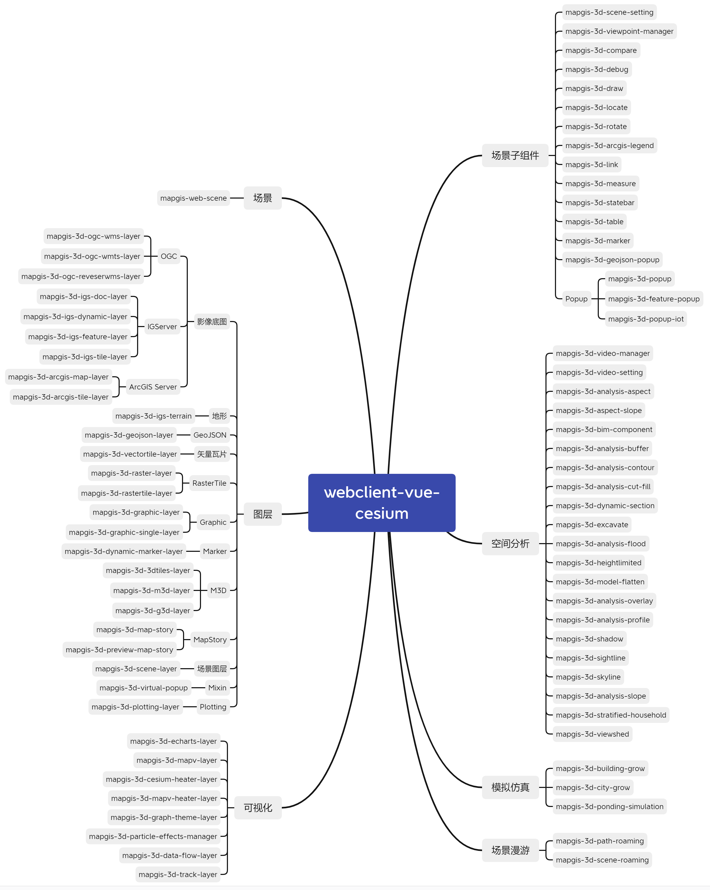

# Webclient-Vue-Cesium

---

## 简介

webclient-vue-cesium 是基于 Cesium 的 vue 组件开发库，提供构建 Web 三维 GIS 应用的常用 vue 组件。

### 模块说明



### 特点

- 组件式风格

通过 Vue 的组件方式调用 layers, markers, popups， 并且使用同步 props `synchronized props` 来控制状态

- Vue 控制

`面向对象编程`：地图元素拥有 Vue 的生命周期，将原生地图事件封装成 Vue 的事件

---

## 安装

```bash
npm install --save @mapgis/webclient-vue-cesium
# 或者
yarn add @mapgis/webclient-vue-cesium
```

在 main.js 中全局引入组件

```js
import "@mapgis/webclient-vue-ui/dist-libs/webclient-vue-ui.css";
import "@mapgis/webclient-vue-cesium/dist-libs/webclient-vue-cesium.css";

import MapgisUi from "@mapgis/webclient-vue-ui";
import Mapgis3d from "@mapgis/webclient-vue-cesium";

Vue.use(MapgisUi);
Vue.use(Mapgis3d);
```

---

## cesium 库引入

> webclient-vue-cesium 依赖 `@mapgis/cesium`，安装`@mapgis/webclient-vue-cesium`的时候会自动安装依赖`@mapgis/cesium`，`@mapgis/cesium`的包结构展示如下：
>
> 

请将上述 cesium 目录拷贝到你的 vue 工程的 public 静态资源文件夹中，记录以下两个文件的路径：

```sh
# 主Cesium主体路径
public/cesium/dist/Cesium.js
# Cesium拓展插件路径
public/cesium/dist/webclient-cesium-plugin.min.js
```

通过在浏览器中 访问 `http://localhost:xxxx/cesium/dist/Cesium.js` 成功即可。

WebClient-Vue-Cesium 组件使用以上两个文件的方式如下所示:

```vue
<template>
  <mapgis-web-scene
    ref="webgloberef"
    libPath="cesium/dist/Cesium.js"
    pluginPath="cesium/dist/webclient-cesium-plugin.min.js"
  >
    <mapgis-3d-igs-tile-layer />
  </mapgis-web-scene>
</template>
```

这里在 mapgis-web-scene 组件初始化的时候就需要传入`libPath`以及`pluginPath` 如果不传入则从司马云上自动下载对应的网络地址，没有互联网则无法下载。

---

## 相关链接

- [基本示例](http://develop.smaryun.com:8899/#/gallery/vue-cesium)
- [参考文档](http://120.78.82.242:8892/)
- [项目源码](https://github.com/MapGIS/WebClient-Vue/tree/main/cesium)

---

## 项目依赖

- [Vue.js 2.5+](https://github.com/vuejs/vue)
- [MapGIS/Cesium 1.0+](https://www.npmjs.com/package/@mapgis/cesium)

[comment]: <> (::: tip 目的)

[comment]: <> (> 用于开发 Vue 版本的一张图 `Vue-OneMap`)

[comment]: <> (>)

[comment]: <> (> 用于开发 Vue 版本的工作空间 `Vue-WorkSpace`)

[comment]: <> (:::)

[comment]: <> (```vue)

[comment]: <> (<template>)

[comment]: <> ( <cesium-web-globe)

[comment]: <> ( libPath="statics/cesium/Cesium.js")

[comment]: <> ( pluginPath="statics/cesium/webclient-cesium-plugin.min.js")

[comment]: <> ( class="onemap-cesium-map")

[comment]: <> ( >)

[comment]: <> ( <cesium-igs-tile-layer)

[comment]: <> ( :url="layer.url")

[comment]: <> ( />)

[comment]: <> ( <cesium-igs-doc-layer)

[comment]: <> ( :show="l.show")

[comment]: <> ( :url="layer.url")

[comment]: <> ( />)

[comment]: <> ( </cesium-web-globe>)

[comment]: <> (</template>)

[comment]: <> (<script>)

[comment]: <> (import {)

[comment]: <> ( CesiumWebGlobe,)

[comment]: <> ( CesiumIgsDocLayer,)

[comment]: <> ( CesiumIgsTileLayer,)

[comment]: <> (} from '@mapgis/webclient-vue-cesium';)

[comment]: <> (export default {)

[comment]: <> ( name: 'App',)

[comment]: <> ( data&#40;&#41; {)

[comment]: <> ( return {)

[comment]: <> ( layer: {)

[comment]: <> ( url: "http://localhost:6163/igs/rest/mrms/docs/EPSG_4326_WORLD",)

[comment]: <> ( show: true,)

[comment]: <> ( })

[comment]: <> ( })

[comment]: <> ( },)

[comment]: <> ( components: {)

[comment]: <> ( CesiumWebGlobe,)

[comment]: <> ( CesiumIgsDocLayer,)

[comment]: <> ( CesiumIgsTileLayer,)

[comment]: <> ( },)

[comment]: <> (})

[comment]: <> (</script>)

[comment]: <> (```)
