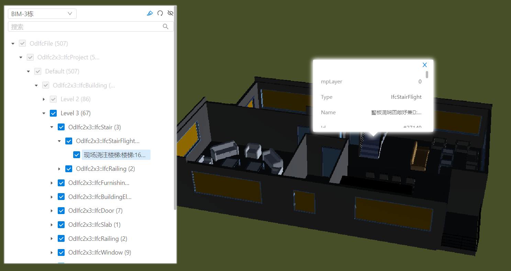
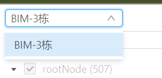
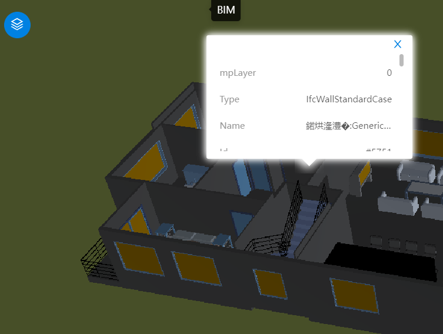
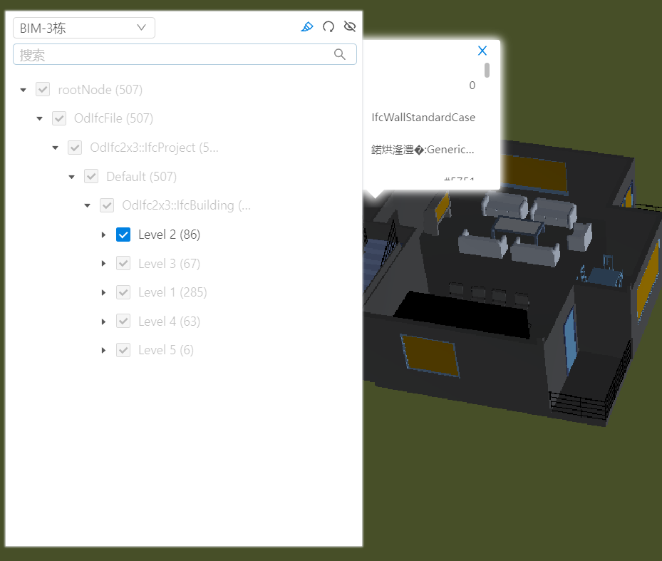
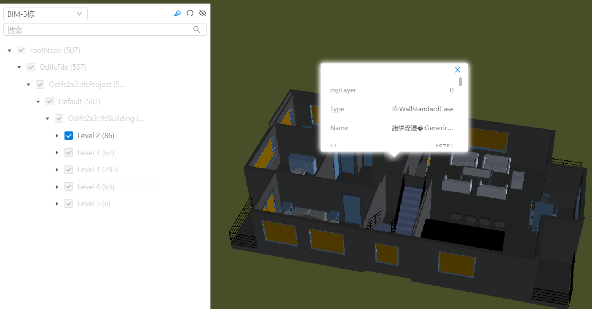
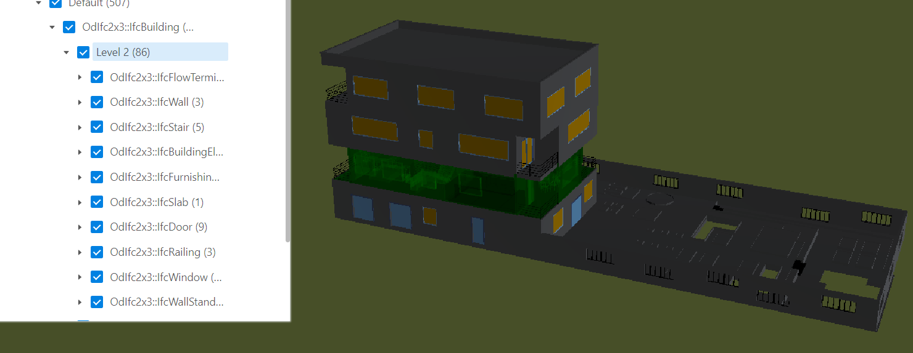

# BIM 构件树

> mapgis-3d-bim-component



## 属性

### `vueKey`

- **类型:** `String`
- **可选**
- **非侦听属性**
- **默认值:** `default`
- **描述:** mapgis-web-scene 组件的 ID，当使用多个 mapgis-web-scene 组件时，需要指定该值，来唯一标识 mapgis-web-scene 组件，同时 mapgis-web-scene 插槽中的组件也需要传入相同的 vueKey，让组件知道应该作用于哪一个 mapgis-web-scene。

### `vueIndex`

- **类型:** `Number`
- **可选**
- **非侦听属性**
- **默认值:** `(Math.random() * 100000000).toFixed(0)`随机计算值
- **描述:** 当 mapgis-web-scene 插槽中使用了多个相同组件时，例如多个 mapgis-3d-igs-doc-layer 组件，用来区分组件的标识符。

### `outStyle`

- **类型:** `Object`
- **可选**
- **非侦听属性**
- **默认值:**
  ```json
  {
    "position": "absolute",
    "zIndex": 1000,
    "padding": "0px",
    "margin": "0px",
    "height": "600px",
    "width": "400px",
    "top": "0px",
    "left": "0px"
  }
  ```
- **描述:** 自定义对应的包裹样式。

### `type`

- **类型:** `String`
- **可选**
- **非侦听属性**
- **默认值:** `ModelLoaded` 等待数据加载完毕后再请求对应的 bim 结构树
- **描述:**
- - 1. **ModelLoaded**,必须等视图中的数据加载完毕后才能主动获取 bim 构件树
- - 2. **ModelUrl**,向网络异步请求 bim 构件树数据，目前需要做同步等待处理

### `layers`

- **类型:** `Array`
- **可选**
- **非侦听属性**
- **默认值:** `[]`
- **描述:** 分层分户的图层列表, 每个内部结构是{title, vueIndex}

```json
[
  {
    "title": "BIM-3栋",
    "vueIndex": "test_bim_layer1"
  }
]
```

- 

### `enablePopup`

- **类型:** `Boolean`
- **非侦听属性**
- **描述:** 是否开启 popup 弹窗
- **默认值:** `false`

### `popupOptions`

- **类型:** `Object`
- **非侦听属性**
- **描述:** popup 样式，详情请见[Popup 样式](../ui/popupfeature.html#popupOptions)
- **默认值:** `{ popupType: "card" }`

### `enableCollapse`

- **类型:** `Boolean`
- **非侦听属性**
- **描述:** 是否允许交互面板收缩隐藏
- **默认值:** `true`

| 收缩                               | 展开                             |
| :--------------------------------- | :------------------------------- |
|  |  |

### `enableBim`

- **类型:** `Boolean`
- **非侦听属性**
- **描述:** 是否允许激活 BIM 的隔离面板的能力，特别说明，如果数据是通过 BIM 工具来构件的，此处设置为 true,否则只有高亮功能，没有隔离面板的能力。
- **默认值:** `false`

| 激活                                 | 不激活                                  |
| :----------------------------------- | :-------------------------------------- |
|  |  |

### `enableDynamicQuery`

- **类型:** `Boolean`
- **非侦听属性**
- **描述:** 是否允许动态查询,目前走 m3d 的都不支持动态查询 只有 g3d 支持动态查询，因此该参数设置无效，后续待支持
- **默认值:** `false`

## 示例

```vue
<template>
  <mapgis-web-scene>
    <mapgis-3d-m3d-layer v-bind="m3d" vueIndex="test_bim_layer1" />
    <mapgis-3d-bim-component v-bind="bim" />
  </mapgis-web-scene>
</template>

<script>
import { Style } from "@mapgis/webclient-es6-service";
const { LineStyle, PointStyle, FillStyle, Shadow } = Style;

export default {
  name: "HelloWorld",
  data() {
    return {
      m3d: {
        enablePopup: true,
        url: "http://192.168.88.204:8089/M3D/2.0/高级住所模型/高级住所模型.mcj",
      },
      bim: {
        enableBim: true,
        enablePopup: true,
        outStyle: {
          position: "absolute",
          zIndex: 1000,
          padding: "0px",
          margin: "0px",
          height: "600px",
          width: "400px",
          top: "10px",
        },
        layers: [
          {
            title: "BIM-3栋",
            vueIndex: "test_bim_layer1",
          },
        ],
      },
    };
  },
};
</script>
```
