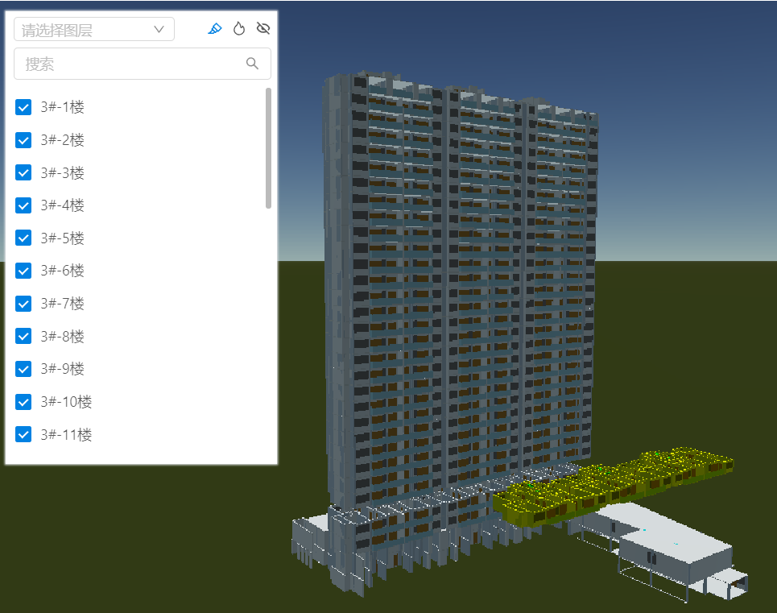
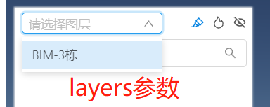
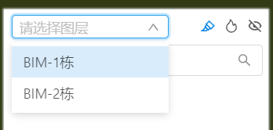
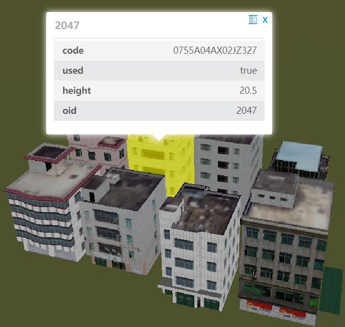
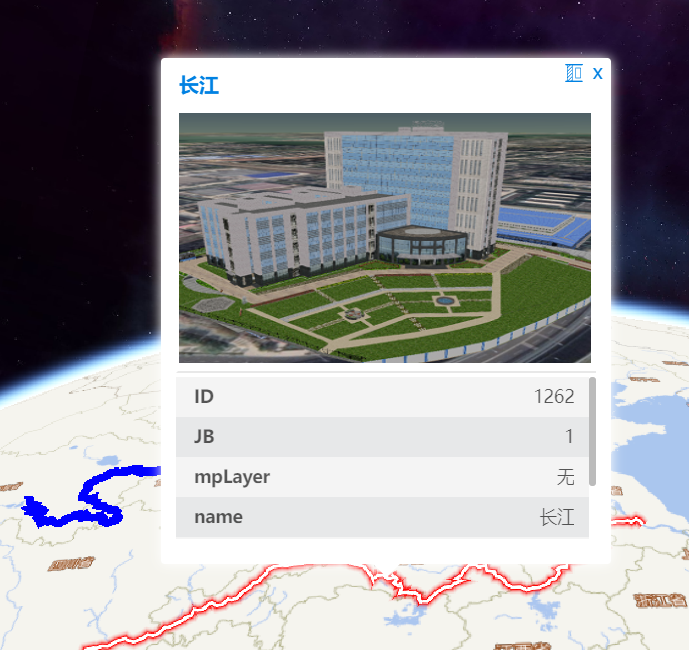
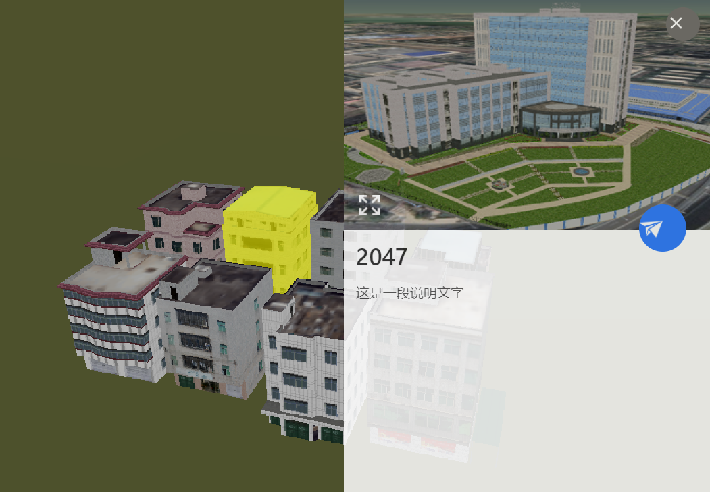
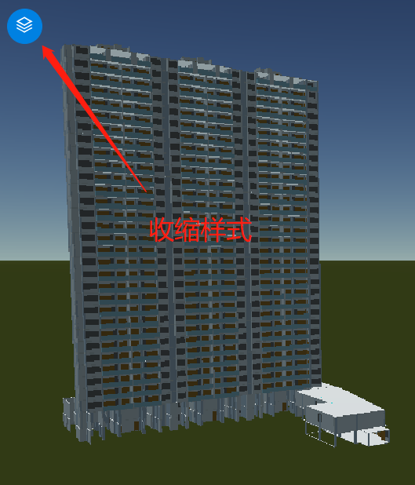
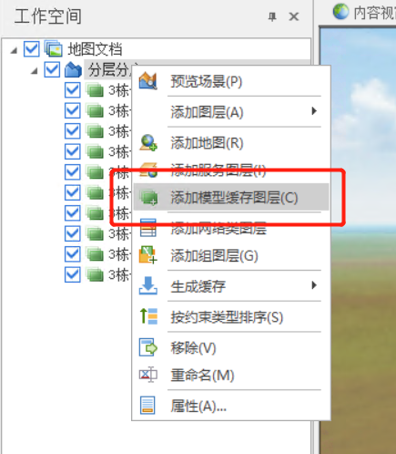
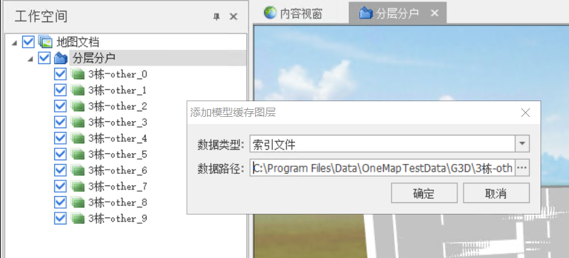
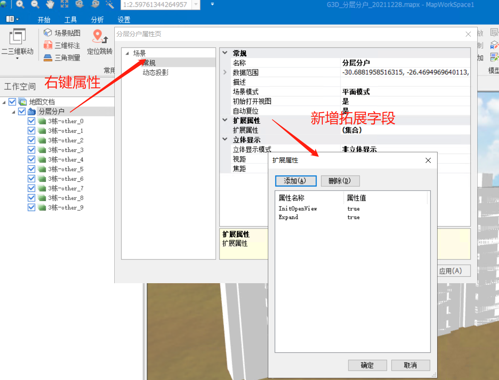

# 分层分户

> mapgis-3d-stratified-household



## 属性

### `vueKey`

- **类型:** `String`
- **可选**
- **非侦听属性**
- **默认值:** `default`
- **描述:** mapgis-web-scene 组件的 ID，当使用多个 mapgis-web-scene 组件时，需要指定该值，来唯一标识 mapgis-web-scene 组件，同时 mapgis-web-scene 插槽中的组件也需要传入相同的 vueKey，让组件知道应该作用于哪一个 mapgis-web-scene。

### `vueIndex`

- **类型:** `Number`
- **可选**
- **非侦听属性**
- **默认值:** `(Math.random() * 100000000).toFixed(0)`随机计算值
- **描述:** 当 mapgis-web-scene 插槽中使用了多个相同组件时，例如多个 mapgis-3d-igs-doc-layer 组件，用来区分组件的标识符。

::: tip 高级用法

1. 当 vueIndex 的传入值为一个已经存在的 g3d 的图层的 vueIndex 的时候，则默认采取该 g3d 图层作为分层分户组件的数据源
2. 如果参数 layers 传入并且有值，则下拉列表中手动选择对应的数据源执行分层分户


:::

### `outStyle`

- **类型:** `Object`
- **可选**
- **非侦听属性**
- **描述:** 分层分户组件外部 class 的样式
- **默认值:**

```js
{
   position: "absolute",
   zIndex: 1000,
   padding: "0px",
   margin: "0px",
   height: "450px",
   width: "270px",
   top: "0px",
   left: "0px"
}
```

### `layers`

- **类型:** `Array`
- **可选**
- **非侦听属性**
- **描述:** 分层分户的图层列表, 每个子项内部 { title, vueIndex }
- **默认值:** `[]`
  ::: tip

1. 当前数据如下所示:
   ```vue
   <template>
     <mapgis-web-scene>
       <mapgis-3d-g3d-layer vueIndex="test_g3d_layer_1" />
       <mapgis-3d-g3d-layer vueIndex="test_g3d_layer_2" />
       <mapgis-3d-stratified-household :layers="layers" />
       <mapgis-3d-statebar />
     </mapgis-web-scene>
   </template>
   ```
2. 当前传参如下所示:
   ```js
   [
     {
       title: "BIM-1栋",
       vueIndex: "test_g3d_layer_1",
     },
     {
       title: "BIM-2栋",
       vueIndex: "test_g3d_layer_2",
     },
   ];
   ```
3. 界面候选如下所示


:::

### `enablePopup`

- **类型:** `Boolean`
- **可选**
- **非侦听属性**
- **描述:** 是否激活查询弹窗
- **默认值:** `false`

### `popupOptions`

- **\*类型**: `Object`
- **描述** popup 可选样式

```json
{
  "title": "name", //主标题字段名称
  "popupType": "table", // table card rich-text
  "fullHeight": 400 // rich-text全屏高度
}
```

| 属性表格 (table)                | 卡片 (card)                | 图文关联 (rich-text)                |
| :------------------------------ | :------------------------- | :---------------------------------- |
|  |  |  |

### `enableCollapse`

- **类型:** `Boolean`
- **可选**
- **非侦听属性**
- **描述:** 是否允许收缩隐藏到一个小的圆型样式
- **默认值:** `true`
  

### `enableStratifiedHouse`

- **类型:** `Boolean`
- **可选**
- **非侦听属性**
- **描述:** 是否激活分层分户
- **默认值:** `false`

### `enableDynamicQuery`

- **类型:** `Boolean`
- **可选**
- **非侦听属性**
- **描述:** 是否激活动态单体化查询
- **默认值:** `false`

## 事件

### `@loaded`

- **Description:** 在 分层分户 **数据加载完毕**并且**图层选择后** 发送该事件
- **Payload** { component }
- 1. component 组件的 this 环境，this 句柄

## 数据制作要求

1. 数据必须是静态单体化且提前多层实现

   
   

2. 必须针对地图场景添加拓展字段

   
   ::: tip 拓展字段
   拓展字段必须前后端保持一致，默认的是 **IsStratified**
   :::

3. 前端必须获取到对应的拓展字段

```js
import { G3D } from "@mapgis/webclient-es6-service";
const { G3DMapDoc } = G3D;
let result;

let g3dService = new G3DMapDoc({
  ip: "192.168.199.71",
  port: "8089",
  docName: "G3D_分层分户",
  extendedPropKeys: "IsStratified,Expand", // 逗号分割， *表示显示全部拓展字段
});

g3dService.GetDocInfo((res) => {
  result = res;
});

// 结果展示
const result = {
  docName: "G3D_分层分户",
  sceneInfos: [
    {
      extendedProps: {
        Expand: "true", // 注意此处是字符串，而不是布尔型，需要主动转换处理
        IsStratified: "true", // 注意此处是字符串，而不是布尔型，需要主动转换处理
      },
      layerCount: 10,
      layers: [],
      sceneName: "G3D_分层分户",
    },
  ],
};
```
