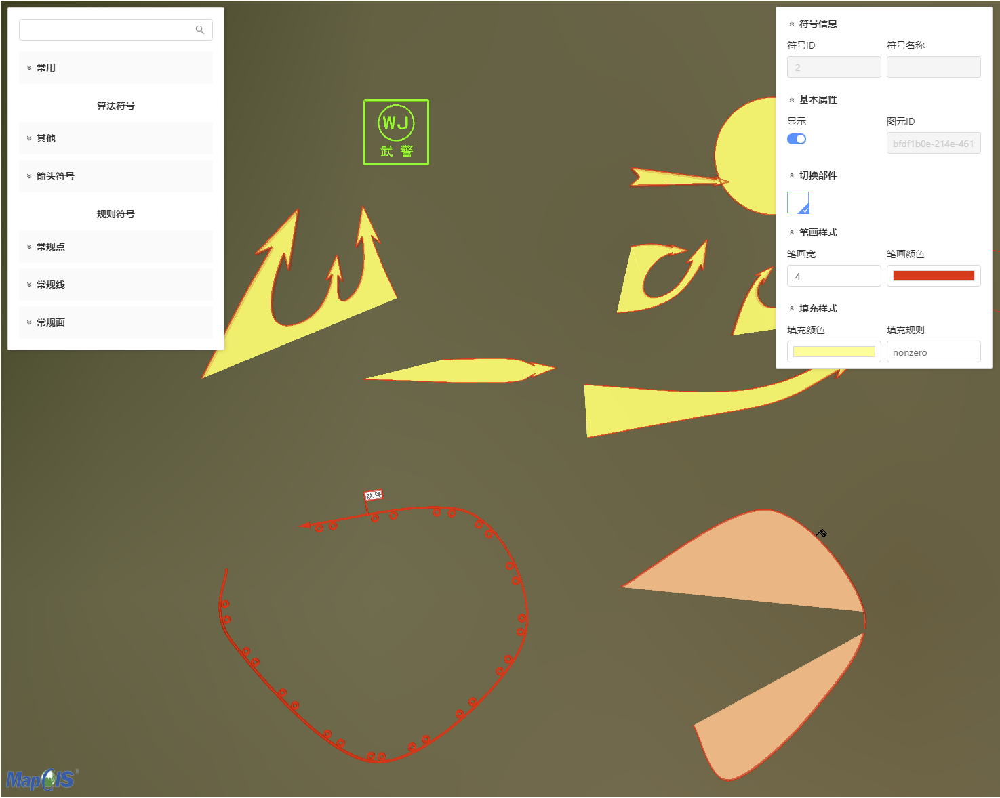

# PlotLayer

> mapgis-3d-plot <br>
> 行业标绘的编辑和绘制组件
> [点此跳转到示例](#example)

## 缩略图


## 属性

| 名称                      | 类型               | 默认值 | 描述                                         | 是否监听 |
| ------------------------- |------------------| ------ |--------------------------------------------|------|
| vueIndex        | String or Number | 随机数   | plotLayer 的唯一标识，随机生成的数字或字符串，不传则自动生成        | 否    |
| vueKey              | String           | 'default'  | cesium 球体的唯一标识，默认值 default，当分屏时使用此对象标识多个球体 | 否    |

## <span id="example">示例</span>

```vue

<template>
  <mapgis-web-scene style="height:95vh">
    <!--当图层加载完毕时，才显示，该组件依赖行业标绘图层组件-->
    <mapgis-3d-plot :vueIndex="vueIndex" :vueKey="vueKey" v-if="vueIndex && vueKey"/>
    <mapgis-3d-plot-layer @loaded="handleLoaded"
                          :dataSource="dataSource"
                          :vueIndex="vueIndex"
                          :vueKey="vueKey"
    ></mapgis-3d-plot-layer>
  </mapgis-web-scene>
</template>
<script>
export default {
  data() {
    return {
      //行业标绘图层数据源
      dataSource: "",
      //vueIndex，用来获取标绘图层
      vueIndex: undefined,
      //vueKey，用来获取标绘图层
      vueKey: undefined
    };
  },
  methods: {
    //图层加载完毕事件
    handleLoaded(e) {
      //返回vueIndex以及vueKey
      this.vueIndex = e.vueIndex;
      this.vueKey = e.vueKey;
    }
  }
};
</script>
<style lang="css"></style>
```
