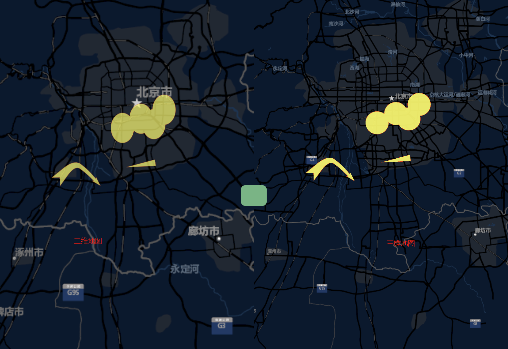

# PlotLink

> 该功能没有组件，是以纯 js 的方式实现
> [点此跳转到示例](#example)

## 缩略图



## <span id="example">示例</span>

```vue
<template>
  <div class="mapgis-link-test">
    //二维地图文档
    <div class="mapbox-item top-left">
      <mapgis-web-map crs="EPSG:3857" @load="handle2dLoad">
        <mapgis-rastertile-layer :url="url" layerId="raster_tdt" />
      </mapgis-web-map>
    </div>
    //三维地图文档
    <div class="cesium-item top-right">
      <mapgis-web-scene @load="handle3dLoad">
        <mapgis-3d-raster-layer :url="url"> </mapgis-3d-raster-layer>
        <mapgis-3d-link :enable="link"></mapgis-3d-link>
      </mapgis-web-scene>
    </div>
    //中间的绿色链接按钮
    <div
      :class="{ 'control-2d-3d': true, 'link-active': link }"
      v-on:click="changeMode"
    ></div>
  </div>
</template>
<script>
import Mapgis3dLink from "../../cesium/src/components/UI/Controls/Link/Link.vue";
import "../style/link.css";
import {
  SymbolManager,
  PlotLayer3D,
  PlotLayer3DGroup,
  PlotLayer2D,
  PlotLayer2DGroup,
  DrawTool,
  LinkTool
} from "@mapgis/webclient-es6-service";
import { FabricLayer } from "@mapgis/webclient-es6-mapboxgl";

export default {
  data() {
    return {
      //是否默认联动
      link: true,
      //地图文档的url
      url:
        "https://map.geoq.cn/arcgis/rest/services/ChinaOnlineStreetPurplishBlue/MapServer/tile/{z}/{y}/{x}",
      //联动对象
      rect: {}
    };
  },
  mounted() {
    //轮训，确保二三维地图文档对象全部获取
    let interval = setInterval(function() {
      if (window.canvas && window.cesium) {
        clearInterval(interval);
        //初始化一个符号管理器
        window.manager = new SymbolManager(
          `${window.domain}/标绘/symbols.json`
        );
        //获取符号信息
        window.manager.getSymbols().then(function() {
          //获取你的标绘数据，也可为空
          let layerJSON = {
            type: "FeatureCollection",
            features: []
          };
          //创建一个二维或三维图层
          // window.layer1 = new PlotLayer3D(Cesium, viewer);
          // window.layer1.fromJSON(ttt);
          window.layer1 = new PlotLayer2D(fabricCanvas);
          //导入图层数据
          window.layer1.fromJSON(layerJSON);
          //如果是二维，则必须加入fabricCanvas中
          let fabricCanvas = window.canvas.getFabricCanvas();
          fabricCanvas.addLayer(window.layer1);
          //初始化二三维联动工具即可
          window.linkTool = new LinkTool(window.layer1, [
            window.viewer,
            window.canvas
          ]);
        });
      }
    }, 100);
  },
  methods: {
    //是否联动
    changeMode() {
      this.link = !this.link;
    },
    //获取到cesium对象
    handle3dLoad(e) {
      window.cesium = e.Cesium;
      window.viewer = e.component.viewer;
    },
    //获取到mapbox对象
    handle2dLoad(e) {
      window.map = this.map = e.map;
      //新建一个fabric对象并保存
      const canvas = new FabricLayer(window.map, PlotLayer2DGroup);
      const fabricCanvas = canvas.getFabricCanvas();
      window.canvas = canvas;
    }
  }
};
</script>
<style lang="css"></style>
```
