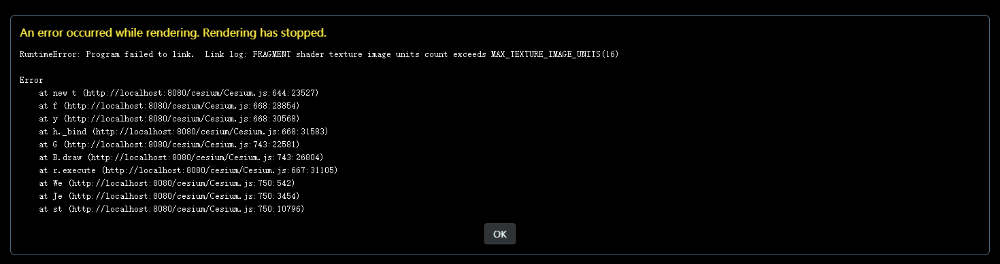

# IGServer 瓦片服务

> mapgis-3d-igs-tile-layer

## 属性

### `baseUrl`

- **类型:** `String`
- **可选**
- **非侦听属性**
- **描述:** Igsever 发布的瓦片服务基地址
  > 例如：http://develop.smaryun.com:6163/igs/rest/mrms/tile/北京市

### `tilingScheme`

- **类型:** `String`
- **必传**
- **侦听属性**
- **描述:** Cesium 的瓦片切图方式，目前支持如下值：
  > 经纬度方式请填写:EPSG:4326 <br/>
  > web 墨卡托方式请填写:EPSG:3857

### `id`

- **类型:** `String`
- **可选**
- **侦听属性**
- **描述:** 图层唯一标识符，如果不传，以 vueIndex 代替

### `vueKey`

- **类型:** `String`
- **可选**
- **非侦听属性**
- **默认值:** `default`
- **描述:**
  > mapgis-web-scene 组件的 ID，当使用多个 mapgis-web-scene 组件时，需要指定该值，来唯一标识 mapgis-web-scene 组件， <br/>
  > 同时 mapgis-web-scene 插槽中的组件也需要传入相同的 vueKey，让组件知道应该作用于哪一个 mapgis-web-scene。

### `vueIndex`

- **类型:** `Number`
- **可选**
- **非侦听属性**
- **描述:**
  > 当 mapgis-web-scene 插槽中使用了多个相同组件时，例如多个 mapgis-3d-igs-doc-layer 组件，用来区分组件的标识符。

### `options` Cesium 原生高级参数

- **类型:** `Object`
- **可选**
- **非侦听属性**
- **描述:** Cesium 的进阶参数
- **参考:** <br>
  `MapGISTile参数` in [appendMapGISTile](http://develop.smaryun.com/docs/cesium/module-%25E5%25AE%25A2%25E6%2588%25B7%25E7%25AB%25AF%25E6%2595%25B0%25E6%258D%25AE%25E6%259C%258D%25E5%258A%25A1.TilesLayer.html#appendMapGISTile)

  1. `tileWidth`

     - **类型:** `Number`
     - **可选**
     - **非侦听属性**
     - **默认值** `256`
     - **描述:** 瓦片宽度

  2. `tileHeight`

     - **类型:** `Number`
     - **可选**
     - **非侦听属性**
     - **默认值** `256`
     - **描述:** 瓦片高度

  3. `minimumLevel`

     - **类型:** `Number`
     - **可选**
     - **非侦听属性**
     - **默认值** `0`
     - **描述:** 瓦片最小级别,目前 ceisum 本身的机制不支持设置大于 0 的值，否则会触发渲染错误
     - 

  4. `maximumLevel`
     - **类型:** `Number`
     - **可选**
     - **非侦听属性**
     - **默认值** `20`
     - **描述:** 瓦片最大级别

## 示例

```vue
<template>
  <mapgis-web-scene
    libPath="cesium/Cesium.js"
    pluginPath="cesium/webclient-cesium-plugin.min.js"
  >
    <mapgis-3d-igs-tile-layer :id="id" :baseUrl="baseUrl" :srs="srs" />
  </mapgis-web-scene>
</template>

<script>
export default {
  data() {
    return {
      id: "IGServer-瓦片图层",
      baseUrl: "http://develop.smaryun.com:6163/igs/rest/mrms/tile/北京市",
      srs: "EPSG:4326"
    };
  }
};
</script>
```
