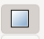

# 符号制作说明

## 一、版本说明
inkscape版本为1.1
## 二、点符号制作
### 1）复制模板文件 
复制一份点模板文件，使用inkscape打开该文件
### 2）绘制示例
在左边工具栏选择想要的符号，绘制在画布上，示例如下： 
先绘制一个文字 
选择左侧的文字图标 
  
在画布上任意位置点击鼠标左键，输入文字 
 
点击第左侧第一个按钮（选择按钮） 
 
之后点击中地数码文字，进行大小缩放和移动位置操作，移动到适当位置 
 
之后点击左侧的创建矩形按钮，在文字下方绘制一个矩形 
 
在下方颜色条处可选择矩形颜色 
 
最后选择直线工具绘制一个矩形框 
 
此时会发现矩形框不规则，点击节点编辑工具编辑路径节点 
 
此时界面上会出现可编辑的节点 
 
可以手动调节，也支持数值修改，推荐最好用数值修改的方式 
选择某个节点，在上方工具栏中可以修改节点的x、y坐标 
 
调整完成后如图所示 
 
点击工具栏的文件，选择保存即可 
### 3）注意事项
a)请在SVG点模板的基础上进行绘制，否则会出现版本、格式不一致等问题 
b)符号与画布的比例不要太小，否则在地图引擎上会显示的比较小 
c)画布单位不要修改，默认为200*200，单位为像素 
### 3）地图引擎效果

## 三、线符号制作
### 1）复制模板文件
复制一份线模板文件，使用inkscape打开该文件
### 2）绘制示例
在左边工具栏选择想要的符号，绘制在画布上，示例如下： 
使用绘制线工具绘制一条直线 
 
通过节点编辑工具调整线条形状 
 
可以手动调整大致形状，之后通过数值修改，来精确修改几何形状 
选择某个节点，在上方工具栏中可以修改节点的x、y坐标 
 
此时想在线上添加一个带文字的矩形框部件 
选择绘制矩形工具，在线的上方绘制一个矩形，并设置其颜色为蓝色 
 
 
之后在矩形中添加一个文字 
 
此时要把这个文字和矩形框组成一个组 
点击矩形或文字，之后按住shift点击另外一个，此时就同时勾选了两个图形，之后使用ctrl+g快捷键将两个绘制元素组成一个组 
再在线的右侧加一个箭头 
 
如果想修改SVG的样式，可以打开XML编辑器进行修改 
点击上方工具栏的编辑按钮，选择XML编辑器，或者使用shift+ctrl+x组合键打开右侧XML编辑器 
 
选择线元素修改其宽度，并点击确定按钮进行保存 
 
依次可以修改其他样式 
最终效果如如图 
 
绘制完成，保存为SVG即可 
### 3）注意事项
a)绘制线后，请给线设置宽度，默认宽度为1px，如果不修改默认宽度，最终在地图引擎上绘制的线会比较细 
b)如果希望在线上天假一个点符号，并且该点符号包含多个元素，请将这些点符号组成一个组（G元素），否则折线元素最终呈现在地图上可能会不一样 
### 4）地图引擎效果 
 
## 四、区符号制作
### 1)复制模板文件
复制一份区模板文件，使用inkscape打开该文件
### 2)绘制示例
使用线工具绘制一个矩形框 
 
如果想要绘制一个四方的矩形或者正方形，请按住ctrl键进行绘制 
之后对形状进行微调 
 
可以在中间填充团或文字 
 
也可在边框处绘图案 
 
绘制完成后保存文件 
### 3)注意事项
a)区符号必须有一个外边框 
b)元素请尽量画在外边框内，否则可能出现绘制错误 
### 4）地图引擎效果
