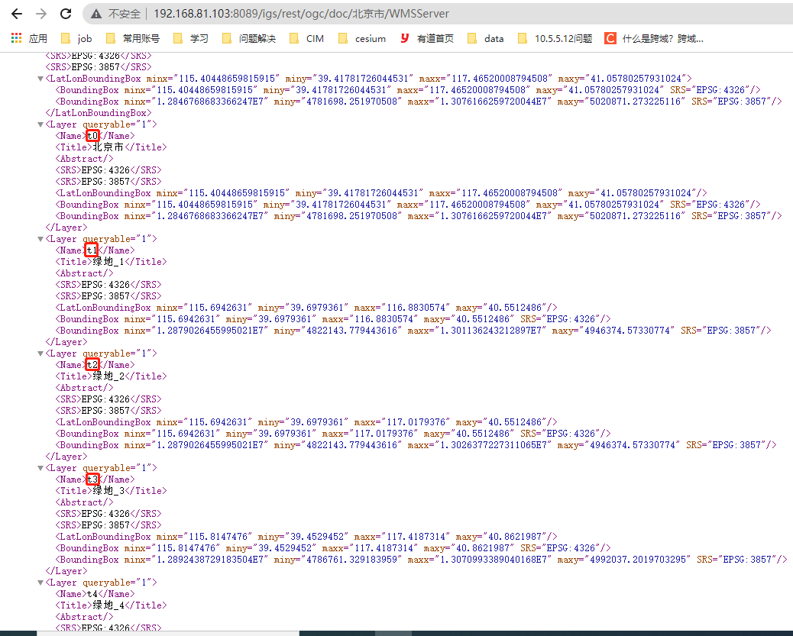

# OGC WMS

> mapgis-3d-ogc-wms-layer

## 属性

### `baseUrl`

- **类型:** `String`
- **必传**
- **非侦听属性**
- **描述:** 服务基地址
- **示例:** <br/>
  > 请求 igs 时： <br/> > http://{ip}:{port}/igs/rest/ogc/doc/{mapName}/WMSServer <br/>
  > 请求 arcgis 时： <br/> > http://219.142.81.85/arcgis/services/矿产地数据库2019/ferrous_metal/MapServer/WmsServer <br/>

### `layers`

- **类型:** `String`
- **必传**
- **侦听属性**
- **描述:** 图层名称或 Id
  > 图层名称或 Id，多个值以逗号分隔，不传时不显示地图 <br/>
  > igs 使用地图名称,即为通过图层的基地址（如`http://192.168.81.103:8089/igs/rest/ogc/doc/北京市/WMSServer`）查询的地图图层信息中的 `Name` 字段 <br/>
  > 
  > arcgis 根据版本不同，可使用 id 或名称，具体请看 arcgis 的 wms 服务的 xml 文档，例如： <br/> > http://219.142.81.85/arcgis/services/矿产地数据库2019/ferrous_metal/MapServer/WMSServer?request=GetCapabilities&service=WMS <br/>
  > ... <br/> > \<Layer queryable="1"\> <br/> > \<Name>0\</Name> <br/>
  > ... <br/> > \</Layer\> <br/>
  > ... <br/>
  > 在此文档中找到 Layer 下面的\<Name\>0\</Name\>属性，这里指定图层名称为 0，因此按 id 来查询，若指定名称为英文或汉字则按名称查询

### `srs`

- **类型:** `String`
- **必传**
- **侦听属性**
- **描述:** WMS 标准中的 srs(1.1.0 版本)或 crs(1.3.0 版本)，即坐标参考系，可通过改变 srs 的值(4326 与 3857 切换)，来实现动态投影，目前支持如下值：
  > 经纬度方式请填写:EPSG:4326 <br/>
  > web 墨卡托方式请填写:EPSG:3857

### `styles`

- **类型:** `Number`
- **可选**
- **侦听属性**
- **描述:** WMS 标准中的 styles，即图层样式

### `layerStyle`

- **类型:** `Object`
- **可选**
- **侦听属性**
- **描述:** 控制地图的显隐、透明度以及顺序，有如下值：
  > visible Boolean 控制图层显示或隐藏，不会重新加载图层，true：显示图层、fales：隐藏图层 <br/>
  > opacity Number 控制图层透明度，会重新加载图层，0 - 1 之间的数字，0：隐藏，1：显示 <br/>
  > zIndex Number 控制图层顺序，会重新加载图层，类似 css 里面的 z-index，从 1 开始的数字 <br/>

### `id`

- **类型:** `String`
- **可选**
- **侦听属性**
- **描述:** 图层唯一标识符，如果不传，以 vueIndex 代替

### `options`

- **类型:** `Object`
- **可选**
- **侦听属性**
- **描述:** Cesium 的进阶参数，另外不属于 cesium 的如下参数也在 options 中：
  > vueKey String 默认值 default 该 key 的主要作用市用来记录 Cesium 的 Source,primitive, entity 的内存中的引用数组的引用，从而避免 vue 对 cesium 的内存劫持 <br/>
  > vueIndex String 默认值(Math.random() \* 100000000).toFixed(0) 该 key 的主要作用市用来记录 Cesium 的 Source,primitive, entity 的内存中的引用数组的引用，从而避免 vue 对 cesium 的内存劫持
- **参考:** <br>
  `Cesium的WMS参数` in [WebMapTileServiceImageryProvider](http://develop.smaryun.com:8899/docs/other/mapgis-cesium/WebMapServiceImageryProvider.html?classFilter=web)

### `vueKey`

- **类型:** `String`
- **可选**
- **非侦听属性**
- **默认值:** `default`
- **描述:**
  > mapgis-web-scene 组件的 ID，当使用多个 mapgis-web-scene 组件时，需要指定该值，来唯一标识 mapgis-web-scene 组件， <br/>
  > 同时 mapgis-web-scene 插槽中的组件也需要传入相同的 vueKey，让组件知道应该作用于哪一个 mapgis-web-scene。

### `vueIndex`

- **类型:** `Number`
- **可选**
- **非侦听属性**
- **描述:**
  > 当 mapgis-web-scene 插槽中使用了多个相同组件时，例如多个 mapgis-3d-igs-doc-layer 组件，用来区分组件的标识符。

### `token`

- **类型:** `Object`
- **可选**
- **非侦听属性**
- **描述:** token 信息
  > 要传 token 时，请以如下方式传递 <br/>
  > token:{ <br/>
  > key: "token", <br/>
  > value: "9c157e9585486c02edf817d2ecbc7752" <br/>
  > }

## 事件

All common layer [events](/zh/api/Layers/#events)

### `@load`

- **描述:** 图层加载完成事件
- **返回值** `{ layer,vue }` <br>
  `layer` 图层对象 <br>
  `vue` vue 对象 <br>

### `@unload`

- **描述:** 图层注销事件
- **返回值** `{ vue }` <br>
  `vue` vue 对象 <br>

## 示例

### 加载 WMS 地图 - IGS - 4326

::: demo

```vue
<template>
  <mapgis-web-scene @load="handleLoad">
    <mapgis-3d-ogc-wms-layer :baseUrl="baseUrl" :layers="layers" :srs="srs" />
  </mapgis-web-scene>
</template>

<script>
export default {
  data() {
    return {
      //服务基地址
      baseUrl:
        "http://develop.smaryun.com:6163/igs/rest/ogc/doc/北京市/WMSServer",
      //要显示的图层名称
      layers:
        "北京市,绿地_1,绿地_2,绿地_3,绿地_4,水域_3,水域_2,水域_1,大学,学校,动物园,高尔夫,观光胜地,果园,住宅用地,医院,商业用地,建筑物,铁路_1,铁路_2,铁路_3,主干道,主干道,高速公路_1,高速公路_1_9-10,三级道路_链接,三级道路,二级道路_链接,二级道路,一级道路_链接,一级道路,主干道_链接,主干道,主干道,高速公路_链接,高速公路_2,高速公路_2,三级道路_链接,三级道路,二级道路_链接,二级道路,一级道路_链接,一级道路,地铁,主干道_链接,主干道,主干道,高速公路_链接,高速公路_2,高速公路_2,地铁站POI,山顶,果园poi,汽车站点POI,大学poi,学校poi,中小学POI,幼儿园POI,医院POI,口腔医院POI,派出所POI,检察院POI,银行POI,邮局POI,体育馆POI,纪念碑POI,博物馆POI,名胜古迹点,动物园poi,观光胜地poi,主题公园POI,宾馆POI,百货店POI,便利店POI,书店POI,快餐POI,咖啡馆POI,电影院POI,高尔夫poi,村庄点,市镇点,区县点,首都点",
      //坐标参考系
      srs: "EPSG:4326"
    };
  },
  methods: {
    handleLoad(e) {
      const webGlobe = e.component.webGlobe;
      var sceneManager = new CesiumZondy.Manager.SceneManager({
        viewer: webGlobe.viewer
      });
      //视点跳转（经度，纬度，视角高度，跳转持续时间）
      sceneManager.flyTo(116.348, 40.236, 300000);
    }
  }
};
</script>

<style lang="css">
.main {
  height: 600px;
  width: 100%;
}
</style>
```

:::

### 加载 WMS 地图 - ArcGis - 3857

```vue
<template>
  <mapgis-web-scene>
    <mapgis-3d-ogc-wms-layer :baseUrl="baseUrl" :srs="srs" :layers="layers" />
  </mapgis-web-scene>
</template>

<script>
export default {
  data() {
    return {
      //服务基地址
      baseUrl:
        "http://219.142.81.85/arcgis/services/矿产地数据库2019/ferrous_metal/MapServer/WmsServer",
      //要显示的图层Id
      layers: "0",
      //坐标参考系
      srs: "EPSG:3857"
    };
  }
};
</script>

<style lang="css">
.main {
  height: 600px;
  width: 100%;
}
</style>
```

### 动态投影

```vue
<template>
  <mapgis-web-globe>
    <mapgis-3d-ogc-wms-layer :baseUrl="baseUrl" :layers="layers" :srs="srs" />
  </mapgis-web-globe>
  <button @click="changeProjection">动态投影</button>
</template>

<script>
export default {
  data() {
    return {
      //服务基地址
      baseUrl:
        "http://develop.smaryun.com:6163/igs/rest/ogc/doc/北京市/WMSServer",
      //要显示的图层名称
      layers:
        "北京市,绿地_1,绿地_2,绿地_3,绿地_4,水域_3,水域_2,水域_1,大学,学校,动物园,高尔夫,观光胜地,果园,住宅用地,医院,商业用地,建筑物,铁路_1,铁路_2,铁路_3,主干道,主干道,高速公路_1,高速公路_1_9-10,三级道路_链接,三级道路,二级道路_链接,二级道路,一级道路_链接,一级道路,主干道_链接,主干道,主干道,高速公路_链接,高速公路_2,高速公路_2,三级道路_链接,三级道路,二级道路_链接,二级道路,一级道路_链接,一级道路,地铁,主干道_链接,主干道,主干道,高速公路_链接,高速公路_2,高速公路_2,地铁站POI,山顶,果园poi,汽车站点POI,大学poi,学校poi,中小学POI,幼儿园POI,医院POI,口腔医院POI,派出所POI,检察院POI,银行POI,邮局POI,体育馆POI,纪念碑POI,博物馆POI,名胜古迹点,动物园poi,观光胜地poi,主题公园POI,宾馆POI,百货店POI,便利店POI,书店POI,快餐POI,咖啡馆POI,电影院POI,高尔夫poi,村庄点,市镇点,区县点,首都点",
      //坐标参考系
      srs: "EPSG:4326"
    };
  },
  methods: {
    changeProjection() {
      //动态投影功能
      if (this.srs === "EPSG:4326") {
        this.srs = "EPSG:3857";
      } else {
        this.srs = "EPSG:4326";
      }
    }
  }
};
</script>

<style lang="css">
.main {
  height: 600px;
  width: 100%;
}
</style>
```

### 控制可见性，控制透明度，以及改变图层顺序

```vue
<template>
  <mapgis-web-scene>
    <mapgis-3d-ogc-wmts-layer
      :baseUrl="baseUrl"
      :wmtsLayer="layer"
      :tileMatrixSet="tileMatrixSet"
      :tilingScheme="tilingScheme"
      :format="format"
      :layerStyle="layerStyle"
    />
    <mapgis-3d-ogc-wms-layer
      v-if="show"
      :baseUrl="baseUrl2"
      :layers="layers"
      :srs="srs"
      :layerStyle="layerStyle2"
    />
  </mapgis-web-scene>
  <button @click="add">添加地图</button>
  <button @click="isShow">是否可见</button>
  <button @click="changeOpacity">改变透明度</button>
  <button @click="changeIndex">改变图层顺序</button>
</template>

<script>
export default {
  data() {
    return {
      //服务基地址
      baseUrl:
        "http://develop.smaryun.com:6163/igs/rest/ogc/WORLDMKTTILE2/WMTSServer",
      //地图文档名称
      layer: "WORLDMKTTILE2",
      //地图比例尺
      tileMatrixSet: "GoogleMapsCompatible_GB",
      //Cesium的瓦片切图方式
      tilingScheme: "EPSG:4326",
      //返回格式
      format: "image/png",
      //样式信息
      layerStyle: {
        visible: true,
        opacity: 1,
        zIndex: 105
      },
      //服务基地址
      baseUrl2:
        "http://develop.smaryun.com:6163/igs/rest/ogc/doc/北京市/WMSServer",
      //要显示的图层名称
      layers:
        "北京市,绿地_1,绿地_2,绿地_3,绿地_4,水域_3,水域_2,水域_1,大学,学校,动物园,高尔夫,观光胜地,果园,住宅用地,医院,商业用地,建筑物,铁路_1,铁路_2,铁路_3,主干道,主干道,高速公路_1,高速公路_1_9-10,三级道路_链接,三级道路,二级道路_链接,二级道路,一级道路_链接,一级道路,主干道_链接,主干道,主干道,高速公路_链接,高速公路_2,高速公路_2,三级道路_链接,三级道路,二级道路_链接,二级道路,一级道路_链接,一级道路,地铁,主干道_链接,主干道,主干道,高速公路_链接,高速公路_2,高速公路_2,地铁站POI,山顶,果园poi,汽车站点POI,大学poi,学校poi,中小学POI,幼儿园POI,医院POI,口腔医院POI,派出所POI,检察院POI,银行POI,邮局POI,体育馆POI,纪念碑POI,博物馆POI,名胜古迹点,动物园poi,观光胜地poi,主题公园POI,宾馆POI,百货店POI,便利店POI,书店POI,快餐POI,咖啡馆POI,电影院POI,高尔夫poi,村庄点,市镇点,区县点,首都点",
      //坐标参考系
      srs: "EPSG:4326",
      //样式信息
      layerStyle2: {
        zIndex: 50
      },
      show: false
    };
  },
  methods: {
    add() {
      //通过v-if方式添加一个地图
      this.show = !this.show;
    },
    isShow() {
      //地图的显示或隐藏，会重新加载地图
      this.layerStyle.visible = !this.layerStyle.visible;
    },
    changeOpacity() {
      //地图的透明度选项，不会重新加载地图
      this.layerStyle.opacity = 0.5;
    },
    changeIndex() {
      //更改地图顺序
      if (this.layerStyle.zIndex === 105) {
        this.layerStyle.zIndex = 10;
      } else {
        this.layerStyle.zIndex = 105;
      }
    }
  }
};
</script>

<style lang="css">
.main {
  height: 600px;
  width: 100%;
}
</style>
```

### 多个 mapgis-web-scene

```vue
<template>
  <mapgis-web-scene :vueKey="vueKey">
    <mapgis-3d-ogc-wms-layer
      :baseUrl="baseUrlWms"
      :layers="layersWms"
      :srs="srs"
      :vueKey="vueKey"
    />
    <mapgis-3d-igs-doc-layer
      :baseUrl="baseUrlDoc"
      :layers="layers"
      :layerStyle="layerStyleDoc"
      :vueKey="vueKey"
    />
    <button @click="changeIndex">改变图层顺序</button>
  </mapgis-web-scene>
  <mapgis-web-scene :vueKey="vueKey2" />
</template>

<script>
export default {
  data() {
    return {
      //服务地址
      baseUrlWms: "http://localhost:6163/igs/rest/ogc/doc/wuhan_3860/WMSServer",
      //要显示的图层
      layersWms: "武汉市_3857,武汉市_医疗服务_3857",
      //坐标参考系
      srs: "EPSG:4326",
      layerStyleWms: {
        zIndex: 100
      },
      //要加载的url
      baseUrlDoc: "http://localhost:6163/igs/rest/mrms/docs/武汉_专题图_4328",
      //要显示的子图层
      layers: "show:1,2",
      //mapgis-web-scene的Id，组件唯一标识，多个图层时用来查找webGlobe
      vueKey: "webSceneOne",
      vueKey2: "webSceneTwo",
      layerStyleDoc: {
        zIndex: 1000
      }
    };
  },
  methods: {
    changeIndex() {
      if (this.layerStyleDoc.zIndex === 1000) {
        this.layerStyleDoc.zIndex = 50;
      } else {
        this.layerStyleDoc.zIndex = 1000;
      }
    }
  }
};
</script>
```
