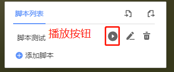

# 态势推演操作手册
## 一、导入脚本
点击导入脚本按钮，导入本地脚本文件 

## 二、导出脚本
点击导出脚本按钮，导出所有脚本数据 

## 三、播放态势推演动画
点击播放按钮，即可播放当前态势推演脚本 

## 四、修改脚本名称
 

## 五、删除脚本

## 六、编辑脚本
点击某一个脚本，即可进行编辑 
 
进入动画列表界面 
 
编辑某个动画 
 
动画编辑界面 
 
点击添加动画可以新增一个动画 
 
选择一个动画进行添加 
