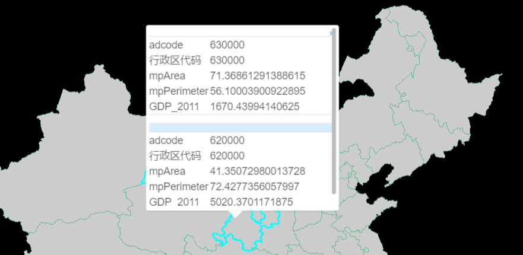
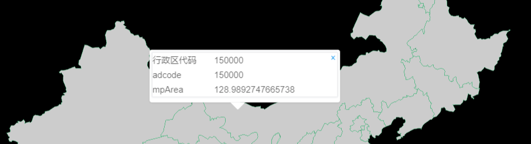

# 图层拾取

> mapgis-3d-popup-mixin

## 行为

[详细请看章节-图文关联](popup.html#popupoptions)

| 卡片                | 图文关联                    |
| :------------------ | :-------------------------- |
|  |  |

## 属性

### `enablePopup`

- **类型:** `Boolean`
- **非侦听属性**
- **描述:** 是否开启 popup 弹窗

### `popupOptions`

- **类型:** `Object`
- **非侦听属性**
- **描述:** popup 弹窗时的配置参数,popupOptions 对象中 title 指弹窗的标题，展示 geojson 数据中的某一个字段属性，fields 展示列表，由传参者决定展示哪些字段值
- **格式:**
  ```bash
  eg:
  popupOptions: {
    popupType: 'table',  // table, card, rich-text
    title: "name",
    fields: ["acroutes", "adcode"]
  }
  ```
| 属性表格   (table)       | 卡片   (card)       | 图文关联    (rich-text)      |
| :----------------------- | :------------------ | :-------------------------- |
|  |  |  |

::: tip 图文关联
---------------
> 要素格式
当需要使用图文关联的能力的时候，中间交换格式如下
1. 标准的GeoJSON-Feature { geometry: {}, `properties`: {} }  [格式参考](http://develop.smaryun.com/#/standard/geojson)
2. 包含属性的对象 {`properties`: {}}
---------------
> 属性约定 `properties` 必须针对一下类型的字段约定
1. 文本 `description` 文字或者富文本格式
   1. 文字 String 类型字符串
   2. 富文本类型 字符串
   ``` json
   {
     "description": "这是一段文字（富文本）说明"
   }
   ``` 
2. 图片 `images`  
   1. 单张图片用字符串`String`表示, 如: "http://develop.smaryun.com/static/assets/gallery/m3d.png"
   2. 多张图片用数组`Array<String>`表示, 如: ['m3d.png', 'm3d.png']
   ``` json
   {
     "images" : "http://develop.smaryun.com/static/assets/gallery/m3d.png"
   }
   ``` 
3. 媒体 `media` 
   1. media.type 媒体类型 `mp4` `flv` `m3u8`
   2. media.uri `http://develop.smaryun.com/static/data/client-analysis/媒体2.mp4`
   ``` json
   {
     "media" : {
        "type" :"mp4",
        "uri": "http://develop.smaryun.com/static/data/client-analysis/媒体2.mp4"
      }
   }
   ``` 
4. 表格 `chart` 待实现
:::


### `enableTips`

- **类型:** `Boolean`
- **非侦听属性**
- **描述:** 是否开启 tooltip 弹窗

### `tipsOptions`

- **类型:** `Object`
- **非侦听属性**
- **描述:** tooltip 弹窗时的配置参数，tipsOptions 对象中 title 指弹窗的标题，展示 geojson 数据中的某一个字段属性，fields 展示列表，由传参者决定展示哪些字段值
- **格式:**

  ```bash
  eg:
  tipsOptions: {
  title: "name",
  fields: ["acroutes", "adcode"]
  }
  ```  

### `customPopup`

- 
- **类型:** `Function`
- **描述:** JSX 风格的自定义 popup 样式内容, (features) => {}, features 为选中或者点击的样式
- 详情请看下面的示例
- **示例**

```vue
<template>
  <mapgis-web-scene>
    <mapgis-geojson-layer v-bind="{ ...geojson }" />
  </mapgis-web-map>
</template>

<script>
export default {
  name: "custom-popup",
  props: {
    msg: String
  },
  watch: {
    center: function(next) {
      this.rightmap && this.rightmap.setCenter(next);
    }
  },
  data() {
    return {
      geojson: {
        baseUrl: `http://develop.smaryun.com/static/data/geojson/省会城市.geojson`,
        enablePopup: true,
        enableTips: true,
        layerStyle: new PointStyle({
          radius: 25000,
          color: "#ffff00",
          outlineColor: "#ff0000",
          outlineWidth: 2.5,
        }),
        highlightStyle: {
          point: new PointStyle({
            radius: 45000,
            color: "#ff0000",
            outlineColor: "#ffffff",
            outlineWidth: 2.5,
          }),
          line: new LineStyle({
            width: 6,
            color: "#000000",
            shadow: new Shadow({ blur: 6, color: "#ff0000" }),
            outlineColor: "#ff0000",
            outlineWidth: 8,
          }),
          polygon: new FillStyle({ color: "#ff0000", opacity: 0.7 }),
        },
        customPopup: (features) => (
          <mapgis-ui-list class="jsx-custom-popup" item-layout="horizontal">
            {features.map((feature) => {
              return (
                <mapgis-ui-list-item>
                  <mapgis-ui-div
                    title={feature.title}
                    style={{ width: "100%" }}
                  >
                    {Object.keys(feature.properties).map((p) => {
                      return (
                        <mapgis-ui-row>
                          <mapgis-ui-col span={8}>{p}</mapgis-ui-col>
                          <mapgis-ui-col span={16}>
                            {feature.properties[p]}
                          </mapgis-ui-col>
                        </mapgis-ui-row>
                      );
                    })}
                  </mapgis-ui-div>
                </mapgis-ui-list-item>
              );
            })}
          </mapgis-ui-list>
        ),
        customTips: features => {
          if (features.length <= 0) {
            return <div class="custom-tips">未选中</div>;
          } else {
            return (
              <mapgis-ui-div class="custom-tips" title={features[0]}>
                {Object.keys(features[0].properties).map(p => {
                  return (
                    <mapgis-ui-row>
                      <mapgis-ui-col span={8}>{p}</mapgis-ui-col>
                      <mapgis-ui-col span={16}>
                        {features[0].properties[p]}
                      </mapgis-ui-col>
                    </mapgis-ui-row>
                  );
                })}
              </mapgis-ui-div>
            );
          }
        }
      }
    };
  },
  methods: {
    handleRightMap(e) {
      console.log("e", e);
      this.rightmap = e.map;
    }
  }
};
</script>

<style>
.map {
  height: 100vh;
  width: 100vw;
}
.custom-popup {
  position: absolute;
  z-index: 2000;
  height: 240px;
  overflow-y: scroll;
}
</style>
```

### `customTips`

- 
- **类型:** `Function`
- **描述:** JSX 风格的自定义 tips 样式内容, (features) => {}, features 为选中或者点击的样式
- 详情请看下面的示例
- **示例**
  
```vue
<template>
  <mapgis-web-scene>
    <mapgis-geojson-layer v-bind="{ ...geojson }" />
  </mapgis-web-map>
</template>

<script>
export default {
  name: "custom-popup",
  props: {
    msg: String
  },
  watch: {
    center: function(next) {
      this.rightmap && this.rightmap.setCenter(next);
    }
  },
  data() {
    return {
      geojson: {
        baseUrl: `http://develop.smaryun.com/static/data/geojson/省会城市.geojson`,
        enablePopup: true,
        enableTips: true,
        layerStyle: new PointStyle({
          radius: 25000,
          color: "#ffff00",
          outlineColor: "#ff0000",
          outlineWidth: 2.5,
        }),
        highlightStyle: {
          point: new PointStyle({
            radius: 45000,
            color: "#ff0000",
            outlineColor: "#ffffff",
            outlineWidth: 2.5,
          }),
          line: new LineStyle({
            width: 6,
            color: "#000000",
            shadow: new Shadow({ blur: 6, color: "#ff0000" }),
            outlineColor: "#ff0000",
            outlineWidth: 8,
          }),
          polygon: new FillStyle({ color: "#ff0000", opacity: 0.7 }),
        },
        customPopup: (features) => (
          <mapgis-ui-list class="jsx-custom-popup" item-layout="horizontal">
            {features.map((feature) => {
              return (
                <mapgis-ui-list-item>
                  <mapgis-ui-div
                    title={feature.title}
                    style={{ width: "100%" }}
                  >
                    {Object.keys(feature.properties).map((p) => {
                      return (
                        <mapgis-ui-row>
                          <mapgis-ui-col span={8}>{p}</mapgis-ui-col>
                          <mapgis-ui-col span={16}>
                            {feature.properties[p]}
                          </mapgis-ui-col>
                        </mapgis-ui-row>
                      );
                    })}
                  </mapgis-ui-div>
                </mapgis-ui-list-item>
              );
            })}
          </mapgis-ui-list>
        ),
        customTips: features => {
          if (features.length <= 0) {
            return <div class="custom-tips">未选中</div>;
          } else {
            return (
              <mapgis-ui-div class="custom-tips" title={features[0]}>
                {Object.keys(features[0].properties).map(p => {
                  return (
                    <mapgis-ui-row>
                      <mapgis-ui-col span={8}>{p}</mapgis-ui-col>
                      <mapgis-ui-col span={16}>
                        {features[0].properties[p]}
                      </mapgis-ui-col>
                    </mapgis-ui-row>
                  );
                })}
              </mapgis-ui-div>
            );
          }
        }
      }
    };
  },
  methods: {
    handleRightMap(e) {
      console.log("e", e);
      this.rightmap = e.map;
    }
  }
};
</script>

<style>
.map {
  height: 100vh;
  width: 100vw;
}
.custom-popup {
  position: absolute;
  z-index: 2000;
  height: 240px;
  overflow-y: scroll;
}
</style>
```