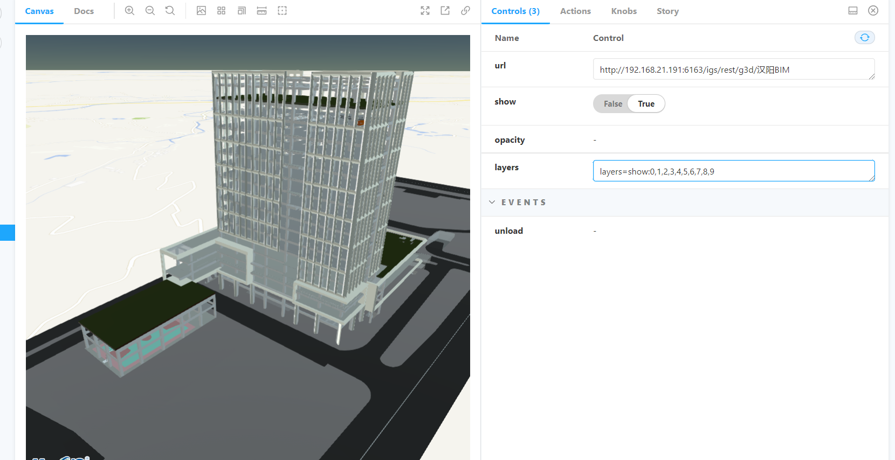
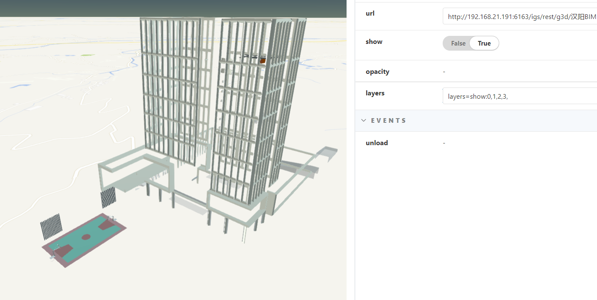
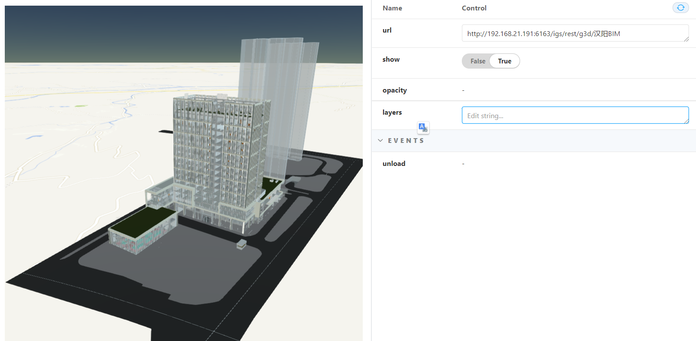

# M3D 模型

> mapgis-3d-m3d-layer

## 特别注意

::: tip M3D 2.0 版本 已经妥善解决
2.0 版本 Cesium 1.84 + M3D 2.0 的 mcj 格式没有该类问题
:::

::: warning M3D 0.0 1.0 版本
1.0 版本 Cesium 1.59 + M3D 0.0/1.0 的 M3D

1. 不支持点云格式的透明度修改
2. 不支持元数据查询图层的类型，只能通过数据加载后得知数据的类型
   :::

## 属性

### `vueKey`

- **类型:** `String`
- **可选**
- **非侦听属性**
- **默认值:** `default`
- **描述:**
  > mapgis-web-scene 组件的 ID，当使用多个 mapgis-web-scene 组件时，需要指定该值，来唯一标识 mapgis-web-scene 组件，<br/>
  > 同时 mapgis-web-scene 插槽中的组件也需要传入相同的 vueKey，让组件知道应该作用于哪一个 mapgis-web-scene。

### `vueIndex`

- **类型:** `Number`
- **可选**
- **非侦听属性**
- **描述:**
  > 当 mapgis-web-scene 插槽中使用了多个相同组件时，例如多个 mapgis-3d-igs-doc-layer 组件，用来区分组件的标识符。

### `headers`

- **类型**: `Cesium.Resource.headers`
- **非侦听属性** 非-watch 属性
- **描述** M3D 的验证头信息文件
- - **示例**
  ```json
  {
    "szvsud-license-key": "3AE2IROq5nGn5K/+zQlUxSoHoNdjCoS1l5567rK5SKjHfRbQIvhtbInd7S9X6bFl"
  }
  ```

### `url`

- **类型**: `Object`
- **必传**
- **侦听属性** watch 属性
- **描述** M3D 的 IGServer 的服务地址 Url

<!-- ### `layers`

- **类型**: `String`
- **必传**
- **侦听属性** watch 属性
- **描述** M3D 的子图层可见性控制，undefined 表示全部显示

| 图层控制 1                            | 图层控制 2                            | 全图层显示                            |
| :------------------------------------ | :------------------------------------ | :------------------------------------ |
|  |  |  | -->

### `show`

- **类型**: `Boolean`
- **伪侦听属性** 伪 watch 属性
- **默认值** `true`
- **描述** 是否显示，这里很特别，其他一般的图层的 show 是来控制改图层的显示的，但是这个地方的 show 不论怎么设置在初始化的时候都是不`实际生效`的, 因为实际的 js 版本的 m3d 的加载时候是通过先解析 mapx 里面发布的 m3d 缓存模型数组来判断，如果如下所示，实际上 js 层的显示效果是只显示图层 1 的，如果后面触发了 watch 变化，则 Vue 组件这边是遍历该数组统改整体显示或者隐藏，因此这里的实现细节和 js 层面稍微有所不同。
  ```sh
    mapx
      |--- m3d-layer-1  勾选状态
      |--- m3d-layer-2  非勾选状态
  ```

### `highlightStyle`

- **类型:** `Object`
- **非侦听属性**
- **描述:** 当前图层的点击高亮显示样式
- **默认值**
  ```javascript
  import { Style } from "@mapgis/webclient-es6-service";
  const { ModelStyle } = Style;
  let highlightStyle = new ModelStyle();
  ```

### `offset`

- **类型**: `Object`
- **非侦听属性** 非 watch 属性
- **默认值** `{ longitude: 0, latitude: 0, height: 0 }`
- **描述** 模型的偏移方向，主要用来抬高/降低模型

```json
{
  "longitude": 0,
  "latitude": 0,
  "height": 0
}
```

### `scale`

- **类型**: `Object`
- **非侦听属性** 非 watch 属性
- **默认值** `{ x: 1.0, y: 1.0, z: 1.0 }`
- **描述** 模型的缩放比例，用来缩放模型

```json
{
  "x": 1.0,
  "y": 1.0,
  "z": 1.0
}
```

### `opacity`

- **类型**: `Number`
- **非侦听属性** 非 watch 属性
- **描述** 模型的透明度，内部通过 Cesium3DTileStyle 实现，`不推荐使用`

### `autoReset`

- **类型**: `Boolean`
- **非侦听属性** 非-watch 属性
- **默认值** `true`
- **描述** 加载完毕后是否飞到对应的范围

### `maximumScreenSpaceError`

- **类型**: `Number`
- **非侦听属性** 非-watch 属性
- **默认值** `16`
- **描述** 这个最大屏幕几何异常 [英文原文](https://prismic-io.s3.amazonaws.com/cesium/5f705923-8ff1-410e-990a-0018157e8086_3d-tiles-overview.pdf)， [中文链接](https://www.cnblogs.com/onsummer/p/13357226.html)
- 

### `maximumMemoryUsage`

- **类型**: `Number`
- **非侦听属性** 非-watch 属性
- **默认值** `512`
- **描述** 最大内存使用

### 其他 3d-tileset 通用属性

| 名称                                      | 类型    | 默认值  |
| :---------------------------------------- | :------ | :------ |
| cullWithChildrenBounds                    | Boolean | true    |
| cullRequestsWhileMoving                   | Boolean | true    |
| cullRequestsWhileMovingMultiplier         | Number  | 60.0    |
| preloadWhenHidden                         | Boolean | false   |
| preloadFlightDestinations                 | Boolean | true    |
| preferLeaves                              | Boolean | false   |
| dynamicScreenSpaceError                   | Boolean | false   |
| dynamicScreenSpaceErrorDensity            | Number  | 0.00278 |
| dynamicScreenSpaceErrorFactor             | Number  | 4.0     |
| dynamicScreenSpaceErrorHeightFalloff      | Number  | 0.25    |
| progressiveResolutionHeightFraction       | Number  | 0.3     |
| foveatedScreenSpaceError                  | Boolean | true    |
| foveatedConeSize                          | Number  | 0.1     |
| foveatedMinimumScreenSpaceErrorRelaxation | Number  | 0.0     |
| foveatedTimeDelay                         | Number  | 0.2     |
| skipLevelOfDetail                         | Boolean | false   |
| baseScreenSpaceError                      | Number  | 1024    |
| skipScreenSpaceErrorFactor                | Number  | 16      |
| skipLevels                                | Number  | 1       |
| immediatelyLoadDesiredLevelOfDetail       | Boolean | false   |
| loadSiblings                              | Boolean | false   |
| luminanceAtZenith                         | Number  | 0.2     |
| specularEnvironmentMaps                   | String  | ""      |
| debugHeatmapTilePropertyName              | String  | ""      |
| debugFreezeFrame                          | Boolean | false   |
| debugColorizeTiles                        | Boolean | false   |
| debugWireframe                            | Boolean | false   |
| debugShowBoundingVolume                   | Boolean | false   |
| debugShowContentBoundingVolume            | Boolean | false   |
| debugShowViewerRequestVolume              | Boolean | false   |
| debugShowGeometricError                   | Boolean | false   |
| debugShowRenderingStatistics              | Boolean | false   |
| debugShowMemoryUsage                      | Boolean | false   |
| debugShowUrl                              | Boolean | false   |

## 事件

### `@loaded`

- **描述** 在 M3D 加载完毕后发送该事件
- **Payload** `{ component }`
- - `component` 组件对象

### `@unload`

- **描述** 在 M3D 卸载完毕后发送该事件
- **Payload** `{ component }`
- - `component` 组件对象
