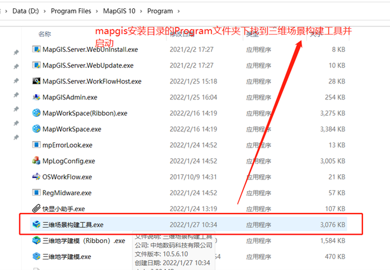
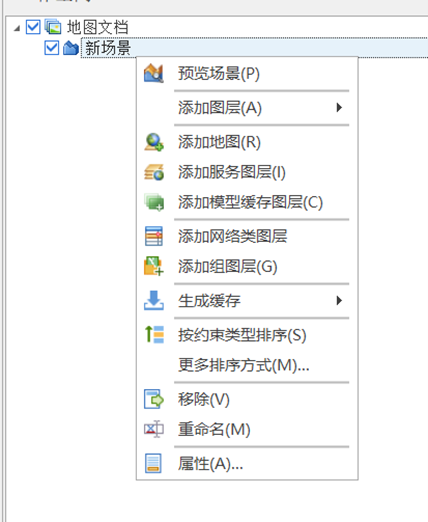
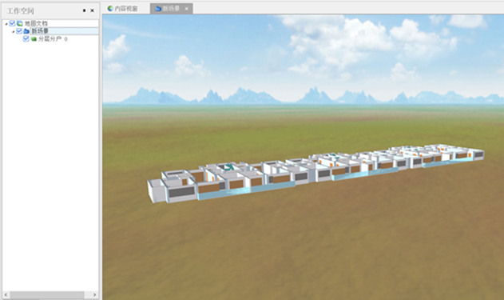
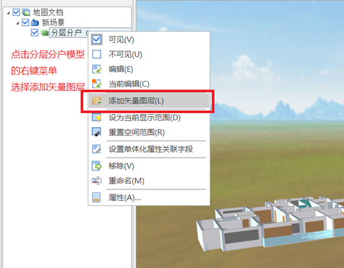
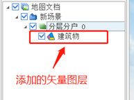
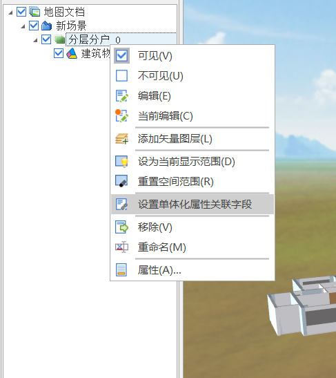
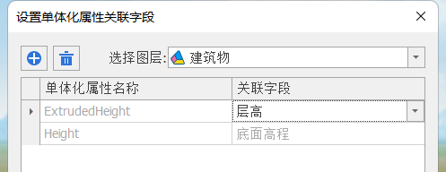

# Scene 场景

> mapgis-3d-scene-layer
> [点此跳转到示例](#example)

## 属性

| 名称                    | 类型    | 默认值                                                                                           | 描述                                                                                                                                                                                                                          | 是否监听 |
| ----------------------- | ------- | ------------------------------------------------------------------------------------------------ | ----------------------------------------------------------------------------------------------------------------------------------------------------------------------------------------------------------------------------- | -------- |
| vueKey                  | String  | default                                                                                          | mapgis-web-scene 组件的 ID，当使用多个 mapgis-web-scene 组件时，需要指定该值，来唯一标识 mapgis-web-scene 组件 <br/> 同时 mapgis-web-scene 插槽中的组件也需要传入相同的 vueKey，让组件知道应该作用于哪一个 mapgis-web-scene。 | 否       |
| vueIndex                | Number  |                                                                                                  | 当 mapgis-web-scene 插槽中使用了多个相同组件时，例如多个 mapgis-3d-scene-layer 组件，用来区分组件的标识符。                                                                                                                   | 否       |
| url**必传**             | String  |                                                                                                  | 场景服务 g3d 网络请求地址                                                                                                                                                                                                     | 否       |
| layerId                 | String  |                                                                                                  | 图层过滤功能:**'show:0,1'**表示显示第 0,1 个图层，**'hide:0,2'**表示隐藏第 0,2 个图层                                                                                                                                         | 是       |
| opacity                 | Number  | 1                                                                                                | 透明度                                                                                                                                                                                                                        | 是       |
| autoReset               | Boolean | true                                                                                             | 自动跳跃到对应的空间范围                                                                                                                                                                                                      | 否       |
| synchronous             | Boolean | true                                                                                             | 是否为异步发送网络请求                                                                                                                                                                                                        | 否       |
| showBoundingVolume      | Boolean | false                                                                                            | 是否显示包围盒                                                                                                                                                                                                                | 否       |
| maximumScreenSpaceError | Number  | 16                                                                                               | 用于控制模型显示细节 值较大将会渲染更少的贴图,进而可以提高性能,而较低的值将提高视觉质量                                                                                                                                       | 否       |
| useIDB                  | Boolean | false                                                                                            | 是否使用前端缓存                                                                                                                                                                                                              | 否       |
| maxCacheLevel           | Number  | 3                                                                                                | 前端最大缓存级别                                                                                                                                                                                                              | 否       |
| tileFeaturesCount       | Number  | 400                                                                                              | 矢量图层单个瓦片加载的矢量要素数量                                                                                                                                                                                            | 否       |
| duration                | Number  | 0                                                                                                | 跳转时间，以秒为单位                                                                                                                                                                                                          | 否       |
| requestVertexNormals    | Boolean | false                                                                                            | 是否激活地形法向量                                                                                                                                                                                                            | 否       |
| enablePopup             | Boolean | false                                                                                            | 是否激活查询弹窗                                                                                                                                                                                                              | 否       |
| enableControl           | Boolean | false                                                                                            | 是否激活默认 UI                                                                                                                                                                                                               | 否       |
| outStyle                | Object  | { position: "absolute", zIndex: 1000, height: "450px", width: "270px", top: "0px", left: "0px" } | 当上面的 enableControl=true 时，可以自定义对应的包裹样式                                                                                                                                                                      | 否       |

## 事件

### `@loaded`

- **描述** 在 场景图层 的所有的子图层加载完毕后发送该事件
- **Payload** `{ g3d, component }`
- - `g3d` 组件对象 this
- - `component` 组件对象 this

### `@unload`

- **描述** 在 M3D 卸载完毕后发送该事件
- **Payload** `{ component }`
- - `component` 组件对象 this

<span id="example">## 示例</span>

```vue
<template>
  <mapgis-web-scene style="height:95vh">
    <mapgis-3d-scene-layer
      url="http://192.168.199.71:8089/igs/rest/services/CIMyanshi/倾斜临时/SceneServer"
    />
  </mapgis-web-scene>
</template>
<script>
export default {
  data() {
    return {};
  },
  methods: {},
};
</script>
<style lang="css"></style>
```

## 动态单体化数据制作教程

1. 启动三维场景构建工具。<br/>
   

2. 添加三维模型，右击新场景-添加模型缓存图层。<br/>
   

添加完成后如下图所示。<br/>


3. 添加模型数据对应的矢量图层。（要求模型数据与矢量数据的位置能够匹配）<br/>
   

添加矢量图层后如下图所示。<br/>


4. 点击三维模型右键菜单-设置单体化属性关联字段。<br/>
   > 注意上一步添加矢量图层时要点击三维模型右键添加矢量图层，不要点击新场景的右键菜单添加矢量图层，否则此步骤会出现`该图层没有可以关联的三维矢量图层`的错误提示。<br/>



ExtrudedHeight 关联每层楼的层高字段，Height 关联距离地面的高程字段。<br/>


5. 保存地图文档并发布。
