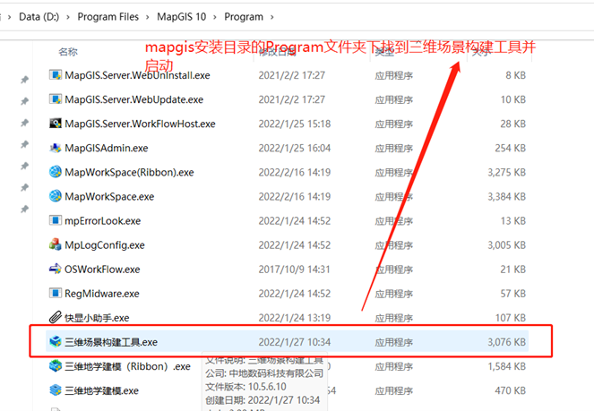
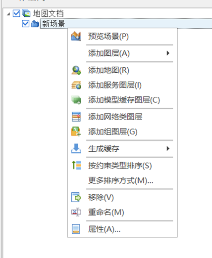
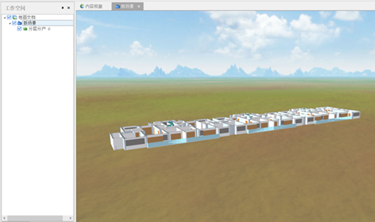
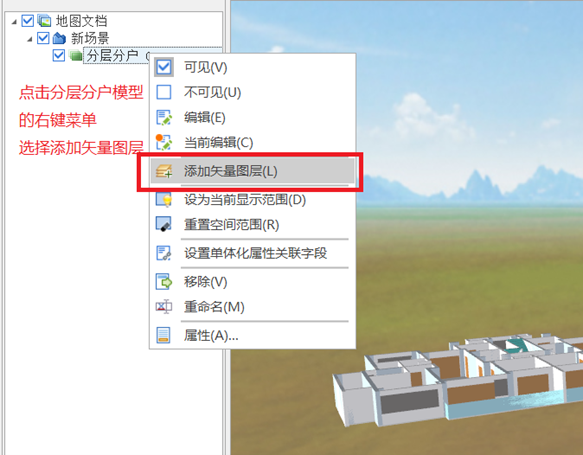
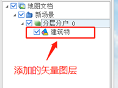
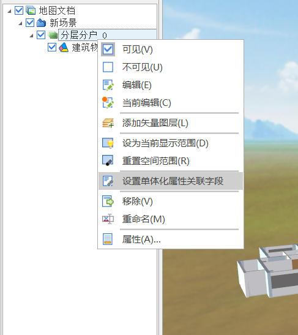
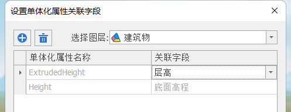

# Scene 场景

> mapgis-3d-scene-layer
> [点此跳转到示例](#example)

## 属性

| 名称                      | 类型    | 默认值    | 描述                                                                                                                                                                                                                                                                                                                                                                                                                                                                                     | 是否监听 |
| ------------------------- | ------- | --------- | ---------------------------------------------------------------------------------------------------------------------------------------------------------------------------------------------------------------------------------------------------------------------------------------------------------------------------------------------------------------------------------------------------------------------------------------------------------------------------------------- | -------- |
| vueKey                    | String  | default   | mapgis-web-scene 组件的 ID，当使用多个 mapgis-web-scene 组件时，需要指定该值，来唯一标识 mapgis-web-scene 组件 <br/> 同时 mapgis-web-scene 插槽中的组件也需要传入相同的 vueKey，让组件知道应该作用于哪一个 mapgis-web-scene。                                                                                                                                                                                                                                                            | 否       |
| vueIndex                  | Number  |           | 当 mapgis-web-scene 插槽中使用了多个相同组件时，例如多个 mapgis-3d-scene-layer 组件，用来区分组件的标识符。                                                                                                                                                                                                                                                                                                                                                                              | 否       |
| url**必传**               | String  |           | 场景服务 g3d 网络请求地址                                                                                                                                                                                                                                                                                                                                                                                                                                                                | 否       |
| layerId                   | String  |           | 图层过滤功能:**'show:0,1'**表示显示第 0,1 个图层，**'hide:0,2'**表示隐藏第 0,2 个图层                                                                                                                                                                                                                                                                                                                                                                                                    | 是       |
| opacity                   | Number  | 1         | 透明度                                                                                                                                                                                                                                                                                                                                                                                                                                                                                   | 是       |
| opacityLayersArray        | Array   | []        | 自图层 ID，用于修改指定图层透明度                                                                                                                                                                                                                                                                                                                                                                                                                                                        | 是       |
| autoReset                 | Boolean | true      | 自动跳跃到对应的空间范围                                                                                                                                                                                                                                                                                                                                                                                                                                                                 | 否       |
| showBoundingVolume        | Boolean | false     | 是否显示包围盒                                                                                                                                                                                                                                                                                                                                                                                                                                                                           | 否       |
| maximumScreenSpaceError   | Number  | 16        | 用于控制模型显示细节 值较大将会渲染更少的贴图,进而可以提高性能,而较低的值将提高视觉质量                                                                                                                                                                                                                                                                                                                                                                                                  | 否       |
| maximumCacheOverflowBytes | Number  | 536870912 | 用于缓存瓦片的 GPU 内存最大附加容量（以字节为单位）                                                                                                                                                                                                                                                                                                                                                                                                                                      | 否       |
| layers                    | String  |           | 图层过滤功能                                                                                                                                                                                                                                                                                                                                                                                                                                                                             | 是       |
| duration                  | Number  | 0         | 跳转时间，以秒为单位                                                                                                                                                                                                                                                                                                                                                                                                                                                                     | 否       |
| requestVertexNormals      | Boolean | false     | 是否激活地形法向量                                                                                                                                                                                                                                                                                                                                                                                                                                                                       | 否       |
| enablePopup               | Boolean | false     | 是否激活查询弹窗                                                                                                                                                                                                                                                                                                                                                                                                                                                                         | 否       |
| fillClip                  | Boolean | false     | 是否支持剖切封边                                                                                                                                                                                                                                                                                                                                                                                                                                                                         | 否       |
| hasSectionGeometry        | Boolean | false     | 是否会存在剖面几何,用于折线剖面                                                                                                                                                                                                                                                                                                                                                                                                                                                          | 否       |
| extensions                | Object  |           | 扩展属性。以支持通过对象的方式批量传入图层属性，但是优先级低于单个传入属性，即如果单个属性有传入值，优先使用传入的值，如果没有传入，但是 extensions 中有该属性，则使用 extensions 里对应的值。`优先级：单个传入值 > extensions 中的值 > 单个默认值`。即假如 maximumScreenSpaceError 传入了 24，则 maximumScreenSpaceError 直接使用 24；假如 maximumScreenSpaceError 没有传入 24，是默认值 16，但是 extensions 中有 maximumScreenSpaceError，值为 8，则 maximumScreenSpaceError 使用 8 面 | 否       |

## 事件

### `@loaded`

- **描述** 在 场景图层 的所有的子图层加载完毕后发送该事件
- **Payload** `{ g3d, component }`
- - `g3d` 组件对象 this
- - `component` 组件对象 this

### `@unload`

- **描述** 在 M3D 卸载完毕后发送该事件
- **Payload** `{ component }`
- - `component` 组件对象 this

<span id="example">## 示例</span>

```vue
<template>
  <mapgis-web-scene style="height:95vh">
    <mapgis-3d-scene-layer
      url="http://192.168.199.71:8089/igs/rest/services/CIMyanshi/倾斜临时/SceneServer"
    />
  </mapgis-web-scene>
</template>
<script>
export default {
  data() {
    return {};
  },
  methods: {},
};
</script>
<style lang="css"></style>
```

## 动态单体化数据制作教程

1. 启动三维场景构建工具。<br/>
   

2. 添加三维模型，右击新场景-添加模型缓存图层。<br/>
   

添加完成后如下图所示。<br/>


3. 添加模型数据对应的矢量图层。（要求模型数据与矢量数据的位置能够匹配）<br/>
   

添加矢量图层后如下图所示。<br/>


4. 点击三维模型右键菜单-设置单体化属性关联字段。<br/>

   > 注意上一步添加矢量图层时要点击三维模型右键添加矢量图层，不要点击新场景的右键菜单添加矢量图层，否则此步骤会出现`该图层没有可以关联的三维矢量图层`的错误提示。<br/>



ExtrudedHeight 关联每层楼的层高字段，Height 关联距离地面的高程字段。<br/>


5. 保存地图文档并发布。
