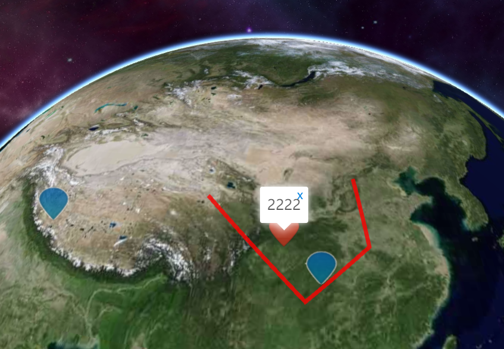
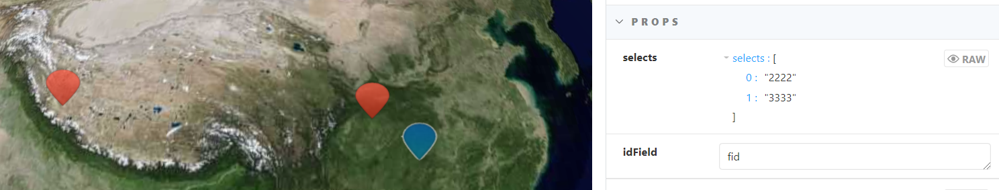

# 动态注记图层

> mapgis-3d-dynamic-marker-layer



## 属性

### `data`

- **类型:** `Object | String`
- **侦听属性**
- **描述:** Geojson 数据源
- **参考:** 目前只支持 FeatureCollection 的格式

### `layerStyle`

- **类型:** `Object`
- **非侦听属性**
- **描述:** 当前图层的显示样式，只能是 MarkerStyle
- **默认值**

```js
const DefaultInactiveImagePlotting =
  "data:image/png;base64,iVBORw0KGgoAAAANSUhEUgAAACYAAAAuCAYAAABEbmvDAAAAAXNSR0IB2cksfwAAAAlwSFlzAAASdAAAEnQB3mYfeAAABjNJREFUeJztWF1MFFcUnsSY8NjEmJj0xRfTJk19sEkfffGpsWn9Q5HFYX9nd9lZVkgb2/ovC11cRRRYQLYIrAK2WrUNVK3SqtFapU1t0xrTRK1UrEbEv/fT75thXWphf2DAh/YmX2Zn5t5zv3vOd86du4ryf5um9uTJkwWPHj3SHj58uHl4eLg5Cd7z+ePHj99++vTpnGkhw4k46YMHD768OXBb4ke/kffrD0tReL8s/iBuXEtqDsru7pNy5ervMjQ01E+iXMSUkSIhTvTpyQuyqLxZZi6pFmVprSjL6kRZ1STKymZcgZUxPNstyrvbZb6vXiIdPXL33j0hQUs9SGMM0ZnLv8jCtY2iLNlhEihoFcXWIUpRAtdRMO7x3NaGfi0G+bnqTsO79LQl3qMRGosdOiV5y6pNz3BCTl7cOYKuMTDyjv2K2kVZDYLvRKW4KiGDd/4S6m9SniKp8rrPjLAYxlV4ovhAipC9e3zwvaMrRbDgEyPEb5bsket/DEycHMMXSfQiFAidDUbtMO7oNCdzdo/gYBqM9GF/jlPpPXg7v04WlsUM3eUcVgr1SN9FmbEkIkrhKE/9g1QOMDx3wFycCnJLd4nj44ShuaxJcRXUwVw7PQVNqdCIYz8m6DLh7s4dybEuksMi18SRRBH54ttLwmzP2ltMcWVFDUjtA6mEadCFcLi6JoFOE1wkvVYQk/neWqPWZSwj7MDYzy5EBhahJNhhwAVD7k4LQUnQa9AtamFHz9nMXmOH/b1nRVmOLFQx0NFuGiI8ndYgScyOaBTWy1vrmjJrjZlYHMGgAlRuJwa68NsDQ95O60B7bsqjzYhKXn6lkaFpw0nmbwRBytaQIqYxlFYDxDyIhh1JsDwifd//NHZdI1uCQpxlQ4lQkY1ObDkaiSVMclbCzUi0mcRWRiV+7PTYOhshJvfv35eZS7eh5kD4rlZzsDdhPbhgFyJiR41cFZWart60xAyP5eVvxQBs1k6sRiOxDuuhIYweLNyxFx6rlr1HT6XPTGpsfgCFVcWnjKvFHOwluXaLAZseZL2bn0qVcvx8f/q9k1mp10IDRTsxEKvRMNgPI/52CwF7GmWChTtj8tKacOaspDt7zl3CKsIYiATQEE4fjPihB59FMGxhwR54a02NrKhoyVzHyBoJMDjXWQWdoWxo8JqfXgO5kn2TB+0QGmUCHReE5XDfhez2S4ZzW/sR1DKUDW9jilyg1Rr4Wsxo2GvlVV81K8FgVp/cFOHNgT9lVnEFsgZe88KID+QCIKe3ThwcT3gRQi/OBYWV0nD4hHEWyEhqtNc+iuPL1YaQerEL+GHMj5UG4hMHx/uxQB9LUY28pm/P/WORXrs9eEde1irhdpyESppMcjqM6/EJgIvaa9rRUIpWb5VDfedz89ZorzV8fhyZg5CW1ANYqQ5ypZgkFM8e7K9TClwcQuiMyqINddlr6/lGF3Pw6yEkgQd1LQCjOowHMUmoJXsER5HSamVm4Sa5eOXX7L9cx2p09bEz38kMdQu0hpDqSXLN2YP9Oc63BztKWEINB3L71h+rJfdPdTtC4oDecPQyJglhslIg1Dw+jPfsBwkEkUDaDplXUinU7qTOlclGl9+4NSBz3FsM40oQetMxUajRnDgtGs3+vhqZYdsoX124PDHBj9eYCG29p5EIm+C1XfACJgvFzInLmv4Ng3TM7BeABBwV4q9rz+7gkUtLJsLirUh1e9ic7Bk5oKwxheQzvtcRencEIaywLoTPN4b02vUbMtu9GYmAU1QpJg2RHMK6NpYC7/mc7/1RyVPXy7kff7Y2hM83hrT7a5yi1A3GpEoptqwykFjbkALv+dzH77qNUnuoZ/JZmKk9y9Id3IhReAOob6E9JpnyEVK853NXhSyvajAK6ZT+cZds1MnA7UGZF8AnuIa9VMeJvRSaC+02r7zHc75nNk+qkObaqJezP1yRvOIPkaXYGUpBJrjLvOKez/l+SnU1Vkv+dxY9eAwnqvUIHU7uwah5xT2f8/20/Tk8ulE31NuyKujKhfrmrTSuqyIxo15Ni67Ga9TbLejtFR0lRF0nC8rDcufu3ampV7k2eqb/t2syz/WeXL1+M/1p50W0oeHh/hfN4b/d/gYnm2n24iputAAAAABJRU5ErkJggg==";
let layerStyle = {
  marker: new MarkerStyle({
    symbol: DefaultInactiveImagePlotting
  })
};
```

### `highlight`

- **类型:** `Boolean`
- **描述:** 是否激活高亮
- **默认值** true

### `highlightStyle`

- **类型:** `Object`
- **非侦听属性**
- **描述:** 当前图层的高亮样式，如 MarkerStyle、PointStyle、LineStyle、FillStyle
- **默认值**

```js
let layerStyle = {
  marker: new MarkerStyle({
    symbol: DefaultActiveImagePlotting
  }),
  point: new PointStyle(),
  line: new LineStyle(),
  polygon: new FillStyle()
};
```

### `idField`

- **类型:** `String`
- **描述:** 要素唯一 id 字段，用来过滤、查询、高亮
- **默认值** fid

### `selects`

- **类型:** `Array`
- **描述:** 当前选中的要素 id 的数组，一旦设置则默认高亮激活对应的要素
- **默认值** []
- 

### `fitBound`

- **类型:** `Object`
- **描述:** 缩放当前视图到指定的的范围 { xmin, ymin, xmax, ymax }
- **默认值** {}

## 事件

### `map-bound-change`

- **载荷** {xmin, ymin, xmax, ymax}
- **描述** 当地图范围发生了改变时候，一般是动态改变 selects 后导致的自动缩放到对用的视图。
