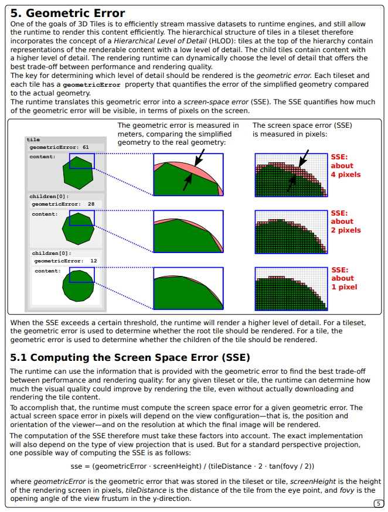

# 地图场景 mapgis-3d-igs-m3d

## 属性

### `vueKey`

- **Type**: `String`
- **non-synced** 非 watch 属性
- **Default:** `default`
- **Description:** 该 key 的主要作用市用来记录 Cesium 的 Source,primitive,entity 的内存中的引用数组的引用，从而避免 vue 对 cesium 的内存劫持

### `vueIndex`

- **Type**: `[String, Number]`
- **non-synced** 非 watch 属性
- **Default:** `cesium-${("" + Math.random()).split(".")[1]}`
- **Description:** 该 key 的主要作用市用来记录 Cesium 的 Source,primitive,entity 的内存中的引用数组的引用，从而避免 vue 对 cesium 的内存劫持

### `headers`

- **Type**: `Cesium.Resource.headers`
- **non-synced** 非-watch 属性
- **Description:** M3D 的验证头信息文件
- - example
  ```json
  {
    "szvsud-license-key": "3AE2IROq5nGn5K/+zQlUxSoHoNdjCoS1l5567rK5SKjHfRbQIvhtbInd7S9X6bFl"
  }
  ```

### `url`

- **Type**: `Object`
- **Required**
- **non-synced** 非-watch 属性
- **Description:** M3D 的 IGServer 的服务地址 Url

### `show`

- **Type**: `Boolean`
- **Fake-synced** 伪 watch 属性
- **Default:** `true`
- **Description:** 是否显示，这里很特别，其他一般的图层的 show 是来控制改图层的显示的，但是这个地方的 show 不论怎么设置在初始化的时候都是不`实际生效`的, 因为实际的 js 版本的 m3d 的加载时候是通过先解析 mapx 里面发布的 m3d 缓存模型数组来判断，如果如下所示，实际上 js 层的显示效果是只显示图层 1 的，如果后面触发了 watch 变化，则 Vue 组件这边是遍历该数组统改整体显示或者隐藏，因此这里的实现细节和 js 层面稍微有所不同。
  ```sh
    mapx
      |--- m3d-layer-1  勾选状态
      |--- m3d-layer-2  非勾选状态
  ```

### `autoReset`

- **Type**: `Boolean`
- **non-synced** 非-watch 属性
- **Default:** `true`
- **Description:** 加载完毕后是否飞到对应的范围

### `maximumScreenSpaceError`

- **Type**: `Number`
- **non-synced** 非-watch 属性
- **Default:** `16`
- **Description:** 这个最大屏幕几何异常 [英文原文](https://prismic-io.s3.amazonaws.com/cesium/5f705923-8ff1-410e-990a-0018157e8086_3d-tiles-overview.pdf)， [中文链接](https://www.cnblogs.com/onsummer/p/13357226.html)
- 

### `maximumMemoryUsage`

- **Type**: `Number`
- **non-synced** 非-watch 属性
- **Default:** `512`
- **Description:** 最大内存使用

### 其他 3d-tileset 通用属性

| 名称                                      | 类型    | 默认值  |
| :---------------------------------------- | :------ | :------ |
| cullWithChildrenBounds                    | Boolean | true    |
| cullRequestsWhileMoving                   | Boolean | true    |
| cullRequestsWhileMovingMultiplier         | Number  | 60.0    |
| preloadWhenHidden                         | Boolean | false   |
| preloadFlightDestinations                 | Boolean | true    |
| preferLeaves                              | Boolean | false   |
| dynamicScreenSpaceError                   | Boolean | false   |
| dynamicScreenSpaceErrorDensity            | Number  | 0.00278 |
| dynamicScreenSpaceErrorFactor             | Number  | 4.0     |
| dynamicScreenSpaceErrorHeightFalloff      | Number  | 0.25    |
| progressiveResolutionHeightFraction       | Number  | 0.3     |
| foveatedScreenSpaceError                  | Boolean | true    |
| foveatedConeSize                          | Number  | 0.1     |
| foveatedMinimumScreenSpaceErrorRelaxation | Number  | 0.0     |
| foveatedTimeDelay                         | Number  | 0.2     |
| skipLevelOfDetail                         | Boolean | false   |
| baseScreenSpaceError                      | Number  | 1024    |
| skipScreenSpaceErrorFactor                | Number  | 16      |
| skipLevels                                | Number  | 1       |
| immediatelyLoadDesiredLevelOfDetail       | Boolean | false   |
| loadSiblings                              | Boolean | false   |
| luminanceAtZenith                         | Number  | 0.2     |
| specularEnvironmentMaps                   | String  | ""      |
| debugHeatmapTilePropertyName              | String  | ""      |
| debugFreezeFrame                          | Boolean | false   |
| debugColorizeTiles                        | Boolean | false   |
| debugWireframe                            | Boolean | false   |
| debugShowBoundingVolume                   | Boolean | false   |
| debugShowContentBoundingVolume            | Boolean | false   |
| debugShowViewerRequestVolume              | Boolean | false   |
| debugShowGeometricError                   | Boolean | false   |
| debugShowRenderingStatistics              | Boolean | false   |
| debugShowMemoryUsage                      | Boolean | false   |
| debugShowUrl                              | Boolean | false   |

## 事件

### `@load`

- **Description:** 在 M3D 加载完毕后发送该事件
- **Payload** `{ component }`
- - `component` 组件对象

### `@unload`

- **Description:** 在 M3D 卸载完毕后发送该事件
- **Payload** `{ component }`
- - `component` 组件对象
