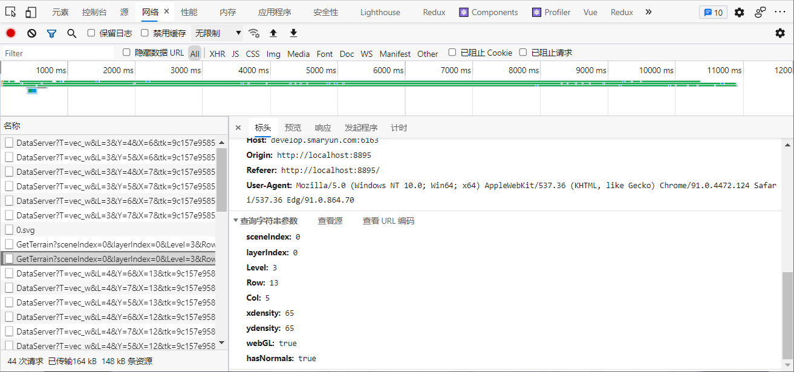

# IGServer 地形服务

> mapgis-3d-igs-terrain

## 属性

### `vueKey`

- **类型:** `String`
- **可选**
- **非侦听属性**
- **默认值:** `default`
- **描述:**
  > mapgis-web-scene 组件的 ID，当使用多个 mapgis-web-scene 组件时，需要指定该值，来唯一标识 mapgis-web-scene 组件，<br/>
  > 同时 mapgis-web-scene 插槽中的组件也需要传入相同的 vueKey，让组件知道应该作用于哪一个 mapgis-web-scene。

### `vueIndex`

- **类型:** `Number`
- **可选**
- **非侦听属性**
- **描述:**
  > 当 mapgis-web-scene 插槽中使用了多个相同组件时，例如多个 mapgis-3d-igs-doc-layer 组件，用来区分组件的标识符。

### `url`

- **类型**: `String`
- **必传**
- **侦听属性** 非-watch 属性
- - **描述** 地形的url地址 
    ``` 
    'http://develop.smaryun.com:6163/igs/rest/g3d/terrain'
    ```

### `show`
- **类型:** `Boolean`
- **可选**
- **非侦听属性**
- **默认值:** `true`
- **描述:** 控制地形是否显示

### `scale`
- **类型:** `Number`
- **可选**
- **非侦听属性**
- **默认值:** `1`
- **描述:** 地形的缩放比例

### `requestVertexNormals`
- **类型:** `Boolean`
- **可选**
- **非侦听属性**
- **默认值:** `false`
- **描述:** 服务端是否激活法向量
- 1. 该功能需要cesium.js主体和webclient-cesium-plugin2个文件同步配合才能正常使用
- 2. 该功能需要10.5.5以后的IGServer才能支持法向量出地形服务
   


