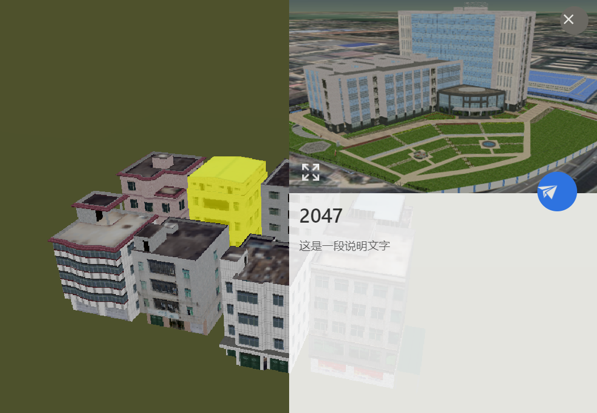

# 气泡

> mapgis-3d-feature-popup

## 属性

| 名称              | 类型    | 默认值                                                                                                                        | 描述                                                                                                                                                                                                                             | 是否监听 |
| ----------------- | ------- | ----------------------------------------------------------------------------------------------------------------------------- | -------------------------------------------------------------------------------------------------------------------------------------------------------------------------------------------------------------------------------- | -------- |
| vueKey            | String  | default                                                                                                                       | mapgis-web-scene 组件的 ID，当使用多个 mapgis-web-scene 组件时，需要指定该值，来唯一标识 mapgis-web-scene 组件， 同时 mapgis-web-scene 插槽中的组件也需要传入相同的 vueKey，让组件知道应该作用于哪一个 mapgis-web-scene。    | 否       |
| vueIndex          | Number  |                                                                                                                               | 当 mapgis-web-scene 插槽中使用了多个相同组件时，例如多个 mapgis-3d-igs-doc-layer 组件，用来区分组件的标识符。                                                                                                                    | 否       |
| position **必传** | Object  | {   entity: Cesium.Entity,   cartesian: Cesium.Cartesian3, longitude: 110, latitude: 30, height: 0  } | 显示位置，3 种不同的传参使用方式:  1. Cesium.Entity 绑定到 Cesium.Entity 上鼠标点击/移入弹出，鼠标移出消失  2.Cesium.Cartesian3 绑定到 Cesium.Cartesian3 笛卡尔坐标上  3.Cesium.long lat height 绑定到经纬度和高度上 | 是       |
| visible           | Boolean | true                                                                                                                          | 是否显示                                                                                                                                                                                                                         | 是       |
| properties        | Object  |                                                                                                                               | 属性值，eg: {  title: "测试名称",  content: "测试内容", images: ["http//..."]   }                                                                                                                                | 否       |
| popupOptions      | Object  | {  type: "default",  title: "name", popupType: "table", fullHeight: 900  }                                | popup 可选样式                                                                                                                                                                                                                   | 否       |

popupType 有下面三种：
| 属性表格 (table) | 卡片 (card) | 图文关联 (rich-text) |
| :------------------------------ | :------------------------- | :---------------------------------- |
|  |  |  |

## 事件

### `@change`

- **描述** 在 Popup 可见性控制改变后发送该事件
- **Payload**是否可见 true/false
