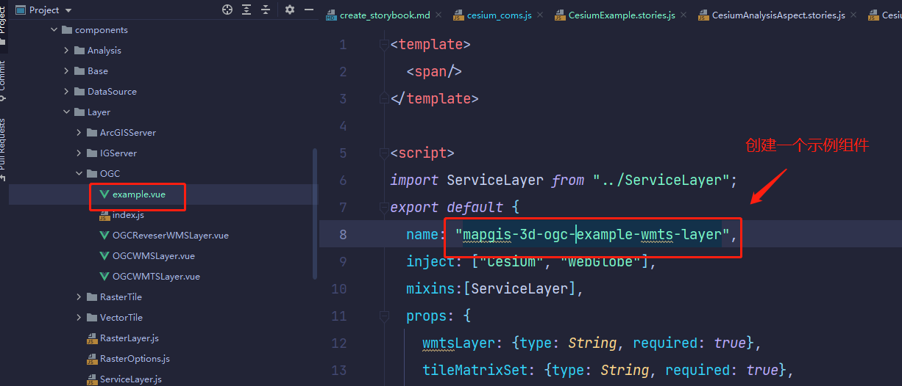
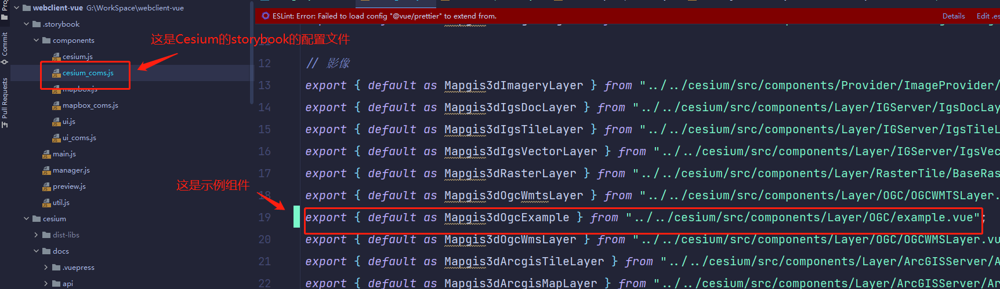
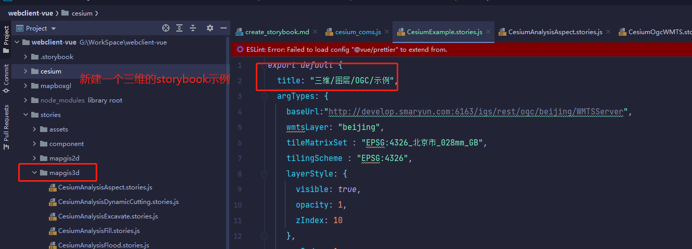
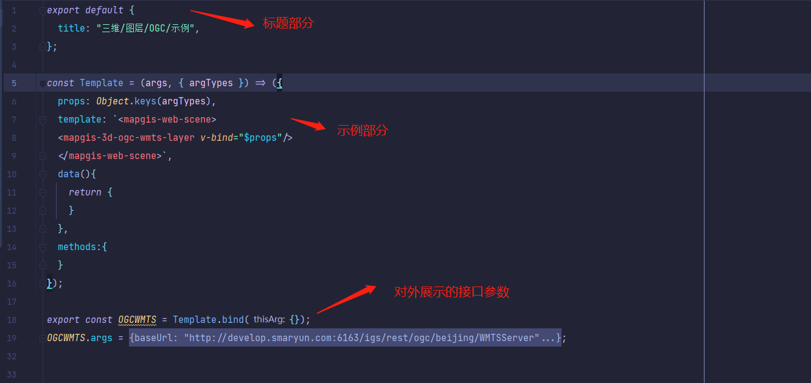
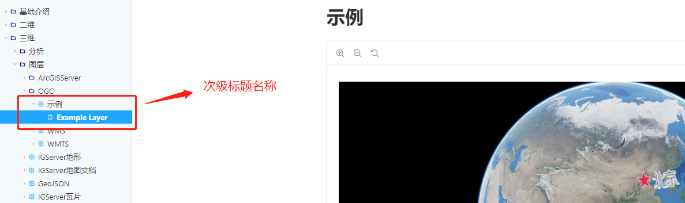
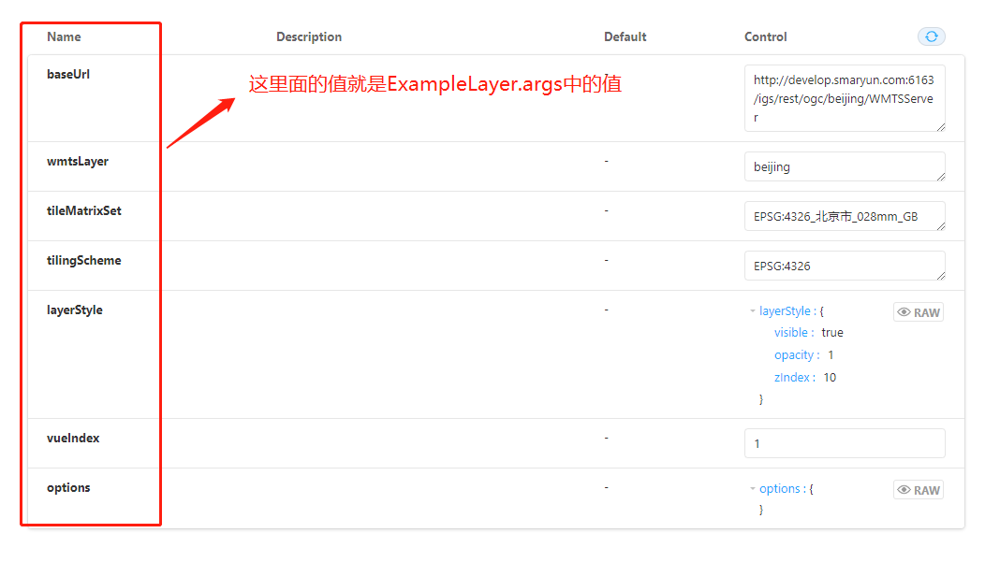
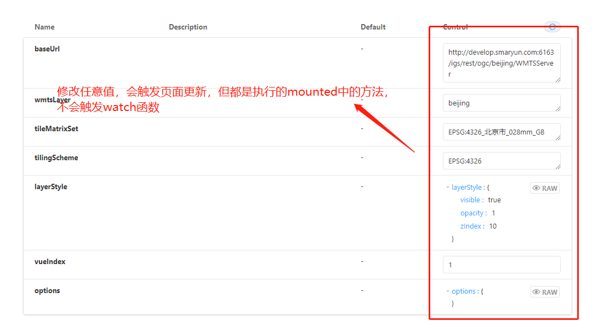
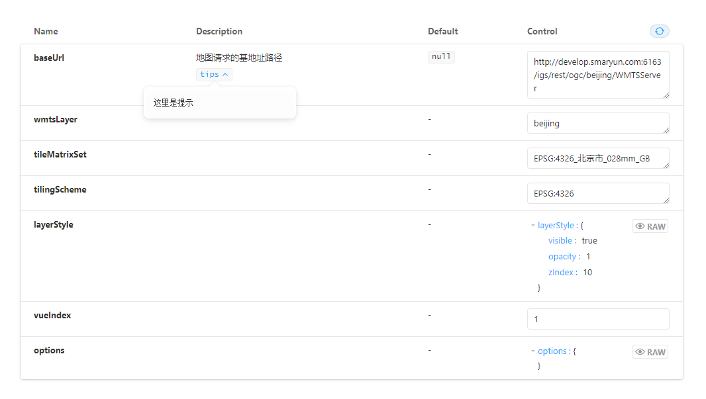
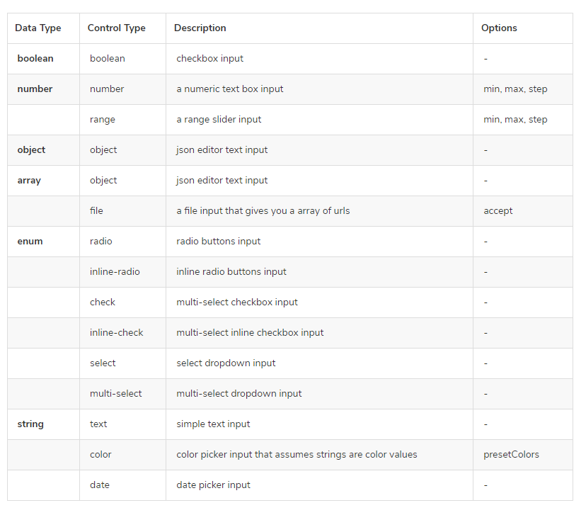
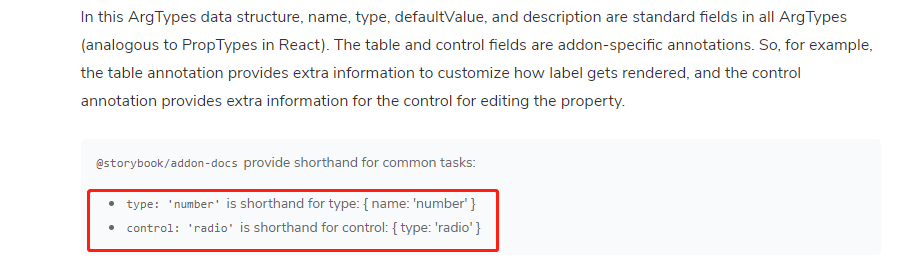

# 自定义组件

## 创建插件组件

### 概述

webclient-vue-cesium 是针对原始的 cesium 脚本的封装。很多额外的高效的插件也是项目开发中常常使用的。因此为了将常用的 cesium 的插件也通过 Vue 的方式使用，下面将介绍如何创建插件组件。

一个插件组件本质上还是通过 Vue 组件的方式，核心思想是通过获取 根组件`mapgis-web-scene`中的 `Cesium` 、 `CesiumZondy`和 `vueCesium` 以及 `component` 对象来进行对应的拓展功能。

webclient-vue-cesium 内部使用独立的 Vue 注入机制[provide/inject](https://vuejs.org/v2/api/#provide-inject)。

当`mapgis-web-scene`组件创建的时候，必须等到地图初始化加载完毕后，然后才会渲染子组件。同时通过 provide 的方式提供下面四个对象:

::: tip

1. `Cesium` @mapgis/cesium
2. `vueCesium` cesium 对象的存储管理器
3. `CesiumZondy` @mapgis/webclient-ceisum-plugin.js(后期不再使用)
4. `component` 当前 mapgis-web-scene 组件对象
   :::

只要是注入了上面的对象,你就可以添加地图要素或者执行对应的地图方法。 注入方法如下：

```js
inject: ["Cesium", "vueCesium","CesiumZondy", "viewer"], // viewer通过mapgis-web-scene组件对象：component.viewer获取
```

封装插件的核心思想是：保持 Vue 本身的声明规范，这样做可以容易封装额外的控制组件和图层组件。同时也容易封装第三方插件，适应不同的业务需求。

### 基本示例

**App 项目代码**

```vue
<template>
  <div class="custom-geojson-layer"></div>
</template>

<script>
export default {
  name: "mapgis-3d-custom-geojson-layer",
  inject: ["Cesium", "vueCesium", "viewer"],
  components: {},
  props: {
    // import VueOptions from '@components/Base/Vue/VueOptions'
    // ...VueOptions    // VueOptions就是下面的vueKey， vueIndex
    vueKey: { type: String, default: "default" },
    vueIndex: {
      type: String | Number,
      default: (Math.random() * 10000).toFixed(0),
    },
  },
  data() {
    return {};
  },
  created() {},
  mounted() {
    this.mount();
  },
  destroyed() {
    this.unmount();
  },
  methods: {
    createCesiumObject() {
      const { url } = this;
      return new Cesium.GeoJsonDataSource.load(url);
    },
    mount() {
      const { vueCesium, viewer, options, type, vueKey, vueIndex } = this;
      const { dataSources } = viewer;
      const vm = this;
      let datasource = this.createCesiumObject();
      // datasource这里绝对不能放到vue.data上
      // this.$_datasource = datasource; $_前缀也不行，还是会触发更新机制

      datasource.then(function (dataSource) {
        // viewer.zoomTo(dataSource);
        dataSources.add(dataSource).then(() => {
          let entities = dataSource.entities.values;
          // 可以认为是一个范式，在 @components/WebGlobe/manager.js中新增/使用对应的XXXManager对象
          // Cesium管理中心添加对应的记录，这段代码可以认为是对应的vue的mounted的生命周期中的初始化data属性
          vueCesium.GeojsonManager.addSource(vueKey, vueIndex, dataSource, {});
          this.$emit("load", vm);
        });
      });
    },
    unmount() {
      let { vueCesium, viewer, vueKey, vueIndex } = this;
      const { dataSources, scene } = viewer;

      // 这段代码可以认为是对应的vue的获取data属性
      let find = vueCesium.GeojsonManager.findSource(vueKey, vueIndex);
      if (find) {
        if (dataSources) {
          dataSources.remove(find.source, true);
        }
      }
      // 这段代码可以认为是对应的vue的获取destroyed生命周期
      vueCesium.GeojsonManager.deleteSource(vueKey, vueIndex);
      this.$emit("unload", this);
    },
  },
};
</script>
```

```javascript
  window.vueCesium.GeojsonManager = window.vueCesium.GeojsonManager || new GeojsonManager();
  export class GeojsonManager extends BaseManager {}
    constructor(vueKey) {
    this.default = [];
    this.vueKey = vueKey || "default";
  }

  // 添加数据
  addSource(vueKey, vueIndex, source, options) {
    vueKey = vueKey ? vueKey : this.vueKey;
    vueIndex = vueIndex ? vueIndex : this.vueIndex;
    vueIndex = `${vueIndex}`;
    if (!this[vueKey]) {
      this[vueKey] = [];
    }
    this[vueKey].push({
      key: vueIndex,
      source: source,
      options: options,
    });
  }

  // 删除数据
  deleteSource(vueKey, vueIndex) {
    let index = -1;
    vueIndex = `${vueIndex}`;
    this[vueKey].find((s, i) => {
      let result = false;
      if (s && s.key === vueIndex) {
        index = i;
        result = true;
      }
      return result;
    });
    if (index >= 0) {
      this[vueKey].splice(index, 1);
    }
  }

  // 获取指定vue组件数据
  findSource(vueKey, vueIndex) {
    vueKey = vueKey ? vueKey : this.vueKey;
    vueIndex = vueIndex ? vueIndex : this.vueIndex;
    vueIndex = `${vueIndex}`;
    let index = -1;
    let findSource = undefined;
    if (!this[vueKey]) return findSource;

    let find = this[vueKey].find((s, i) => {
      let result = false;
      if (s && s.key === vueIndex) {
        index = i;
        result = true;
      }
      return result;
    });
    if (find) {
      findSource = {
        ...find,
        index: index,
      };
    }
    return findSource;
  }

  // 获取全部vue组件数据
  findAllSource(vueKey) {
    vueKey = vueKey ? vueKey : this.vueKey;
    return this[vueKey];
  }
}
```

```json
{
  "default": [{...Layer1},{...Layer2}],
  "custom_key": [{...Layer1}]
}
```

::: warning
看完上面的源码分析，可能会存在一个疑问，为什么不采取 vue 的 data 属性来控制 Cesium 的图层对象，而是实现了一个 vueCesium.XXXXManager 来实现对应的生命周期管理。本质原因在于：

1. Cesium 的对象只能通过自身或者全局 window 来管理，一旦被 vue 框架管理，很容易出现 Cesuim 对象被 vue 自身的更新机制`反复强制更新`，这点在多屏联动以及 WebGL 渲染的时候尤其明显。
2. Vue 的内存占用其实很低，绝大部分的内存、CPU、GPU 资源都是被 Cesium 本身占据，Cesium 本身有自身的内存管理方式，因此不能将`Cesium的生命周期让Vue框架来托管`
3. 直接表现就是不类似这么处理，封装的 Cesium 组件在加载使用后会变得`异常卡顿`
   :::

::: tip 可以做如下理解：

> vue 组件`创建`cesium 某个对象的时候，vue 组件`mounted`中做 cesium 某个对象的存储。

```js
let datasource = `this.createCesiumObject()`; // 创建Cesium本身的对象
```

```js
// 可以认为是一个范式，在 @components/WebGlobe/manager.js中新增或使用对应的XXXManager对象
// 这段代码可以认为是对应的cesium对象的mounted的生命周期，初始化数据存储的作用。
vueCesium.GeojsonManager.addSource(vueKey, vueIndex, `dataSource`, {});
```

:::

::: tip

> vue 组件使用`data`属性的时候，通过下面的代码来类比 this.data 使用 cesium 某个对象

```js
let find = vueCesium.GeojsonManager.findSource(vueKey, vueIndex);
let value = find.source; // 获取mounted的时候存储的Cesium对象`dataSource`
```

:::

::: tip

> vue 组件`释放`cesium 对象的时候，vue 组件获取 data 的 cesium 对象进行对应的释放

```js
// 类比data属性，获取对应的资源
let find = vueCesium.GeojsonManager.findSource(vueKey, vueIndex);
```

```js
// 真正释放大量占用内存、GPU、CPU资源的地方
dataSources.remove(find.source, true);
```

```js
// Cesium管理中心删除对应的记录
// 释放真正占内存的cesium对象
vueCesium.GeojsonManager.deleteSource(vueKey, vueIndex);
```

:::

::: danger
上面的核心思想就一句话，通过 XXXManager 来`托管类比`实现 Vue 的创建、使用、销毁的生命周期,一定要实际实战一下才能体会到这样设计的原因
:::

## 创建 Storybook 示例

### 一、注册组件到 StoryBook

这里以一个 WMTS 组件为例，创建了一个新组件

<br>
将组建注册到 StoryBook 的配置文件中，配置文件路径如下：webclient-vue/.storybook/components/cesium_coms.js



### 二、创建一个 StoryBook 的 3D 组件示例

找到如下文件夹：webclient-vue/stories/mapgis3d，新建一个 storybook 的 3D 示例 CesiumExample.stories.js



### 三、stories 的结构解析

一个 storybook 示例包含如下三部分：标题、示例代码、接口展示


<br>
标题结构如下：

```vue
export default { title: "三维/图层/OGC/示例", argTypes: { baseUrl: {
description:'地图请求的基地址路径', table:{ type:{ summary: 'tips',detail:
"这是提示信息" }, defaultValue: { summary: 'null' }, }, control:'text' }, } };
```

title 里面每一个斜杠'/'，代表一个文件夹，最后一个斜杠'/'后面的文字就是最终的标题，这里的标题就是“示例”
<br>

示例代码结构如下：

```vue
const Template = (args, { argTypes }) => ({ props: Object.keys(argTypes),
template: `
<mapgis-web-scene>
    <mapgis-3d-ogc-example-wmts-layer v-bind="$props"/>
    </mapgis-web-scene>
`, data(){ return {} }, methods:{ } });
```

argTypes 代表对外展示的接口，所有的 argTypes 里面的值，都会展示到示例页面里

props、template、data。methods 就是标准的 vue 模板语法，可完全按照 vue 来编写
<br>

接口展示结构如下：

```vue
export const ExampleLayer = Template.bind({}); ExampleLayer.args = {
baseUrl:"http://develop.smaryun.com:6163/igs/rest/ogc/beijing/WMTSServer",
wmtsLayer: "beijing", tileMatrixSet : "EPSG:4326_北京市_028mm_GB", tilingScheme
: "EPSG:4326", layerStyle: { visible: true, opacity: 1, zIndex: 10 }, vueIndex:
1, options: {} };
```

请注意这句话 export const ExampleLayer = Template.bind({});
<br>

"ExampleLayer"这个名称就是次级标题的名称


<br>

ExampleLayer.args 里面的值将会展示在示例页面的 form 表单中


<br>

在展示示例的接口展示表单中修改接口的值，可以实时更新示例，但请注意，更新走的是初始化的方法，不会触发 watch 函数！！！！


<br>

编写接口描述信息，这里以 baseUrl 字段为例，展示如何编写 Description 以及 Default 的值

在 export default 中的 argTypes 添加一个 baseUrl 字段，如下所示

```vue
export default { title: "三维/图层/OGC/示例", argTypes: { //要描述的字段
baseUrl: { //描述信息，即页面上Description那一栏的值
description:'地图请求的基地址路径', table:{
//description描述信息下的提示框，可选，添加这一项就会在描述信息文字下生成一个提示信息按钮
//summary：提示按钮里的文字，detail：提示信息 type:{ summary: 'tips',detail:
"这里是提示" },
//默认值，即页面上Default那一栏的值，不在这里填写，则页面上不会有默认值
//如果加了detail,{ summary: 'null',detail: "这里是提示"
},则页面会多出一个描述信息的提示框 defaultValue: { summary: 'null' }, },
//Control这里一栏里面展示数据的方式，可以是input、textArean、boolean等，可选值如下
control:'text' }, } };
```


<br>

control 的可选值：
<br>





### 四、一个 stories 示例里面展示多个示例

```vue
//展示第一个图层 export const ExampleLayer = Template.bind({});
ExampleLayer.args = {
baseUrl:"http://develop.smaryun.com:6163/igs/rest/ogc/beijing/WMTSServer",
wmtsLayer: "beijing", tileMatrixSet : "EPSG:4326_北京市_028mm_GB", tilingScheme
: "EPSG:4326", layerStyle: { visible: true, opacity: 1, zIndex: 10 }, vueIndex:
1, options: {} }; //展示第二个图层，此处不会在展示接口面板 export const
ExampleLayerTwo = Template.bind({}); ExampleLayerTwo.args = {
baseUrl:"http://develop.smaryun.com:6163/igs/rest/ogc/beijing/WMTSServer",
wmtsLayer: "beijing", tileMatrixSet : "EPSG:4326_北京市_028mm_GB", tilingScheme
: "EPSG:4326", layerStyle: { visible: true, opacity: 1, zIndex: 10 }, vueIndex:
1, options: {} };
```

### 五、完整 storybook 示例

```vue
export default { title: "三维/图层/OGC/示例", argTypes: { //要描述的字段
baseUrl: { //描述信息，即页面上Description那一栏的值
description:'地图请求的基地址路径', table:{
//description描述信息下的提示框，可选，添加这一项就会在描述信息文字下生成一个提示信息按钮
//summary：提示按钮里的文字，detail：提示信息 type:{ summary: 'tips',detail:
"这里是提示" },
//默认值，即页面上Default那一栏的值，不在这里填写，则页面上不会有默认值
//如果加了detail,{ summary: 'null',detail: "这里是提示"
},则页面会多出一个描述信息的提示框 defaultValue: { summary: 'null' }, },
//Control这里一栏里面展示数据的方式，可以是input、textArean、boolean等，可选值如下
control:'text' } } }; //按照vue语法写即可 const Template = (args, { argTypes })
=> ({ props: Object.keys(argTypes), template: `
<mapgis-web-scene>
  <mapgis-3d-ogc-example-wmts-layer v-bind="$props"/>
  </mapgis-web-scene>
`, data(){ return {} }, methods:{} }); //展示第一个图层 export const
ExampleLayer = Template.bind({}); ExampleLayer.args = {
baseUrl:"http://develop.smaryun.com:6163/igs/rest/ogc/beijing/WMTSServer",
wmtsLayer: "beijing", tileMatrixSet : "EPSG:4326_北京市_028mm_GB", tilingScheme
: "EPSG:4326", layerStyle: { visible: true, opacity: 1, zIndex: 10 }, vueIndex:
1, options: {} }; //展示第二个图层，此处不会在展示接口面板 export const
ExampleLayerTwo = Template.bind({}); ExampleLayerTwo.args = {
baseUrl:"http://develop.smaryun.com:6163/igs/rest/ogc/beijing/WMTSServer",
wmtsLayer: "beijing", tileMatrixSet : "EPSG:4326_北京市_028mm_GB", tilingScheme
: "EPSG:4326", layerStyle: { visible: true, opacity: 1, zIndex: 10 }, vueIndex:
1, options: {} };
```
