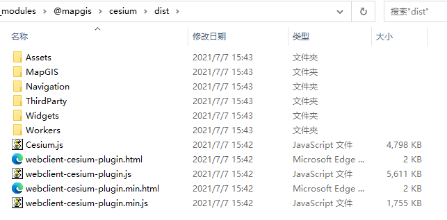

# 快速上手

本节将介绍如何在项目中使用，使用前请先确认是否 npm 安装，没有安装请先参考安装章节。

## 使用之前

在开始使用 webclient-vue-cesium 之前，请先确保开发者已经了解并掌握 vue 开发的基本操作，重点包含以下内容。

- [Vue 组件](https://cn.vuejs.org/v2/guide/components.html)
- [单文件组件](https://cn.vuejs.org/v2/guide/single-file-components.html)

webclient-vue-cesium 中涵盖以下 vue 的技术点，建议先掌握其使用方法。

- prop 传递数据
- slot 建立插槽，内容分发
- events $emit @click 事件

## 引入 webclient-vue-cesium

在 main.js 中全局引入组件，注意：下列四个文件缺一不可。

```js
import "@mapgis/webclient-vue-ui/dist-libs/webclient-vue-ui.css";
import "@mapgis/webclient-vue-cesium/dist-libs/webclient-vue-cesium.css";

import MapgisUi from "@mapgis/webclient-vue-ui";
import Mapgis3d from "@mapgis/webclient-vue-cesium";

Vue.use(MapgisUi);
Vue.use(Mapgis3d);
```

## Ceisum 库引入

webclient-vue-cesium 底层依赖 `@mapgis/cesium`，所以开发者需要拷贝@mapgis/cesium。

安装`@mapgis/webclient-vue-cesium`的时候会自动安装依赖`@mapgis/cesium`，在 node_modules 中找到`@mapgis/cesium`的包结构展示如下：



请将上述 cesium 文件夹统一拷贝到你的 vue 工程对应的 public 文件夹下的某个目录中，记录对应的路径为

```sh
# 主Cesium主体路径
public/cesium/dist/Cesium.js
# Cesium拓展插件路径
public/cesium/dist/webclient-cesium-plugin.min.js
```

> 如果在浏览器中 访问 `http://localhost:xxxx/public/cesium/dist/Cesium.js` 成功则说明整个 Cesium 的环境准备已经完毕。
> ::: tip
> 这里初始化的时候就需要传入`libPath`以及`pluginPath` 如果不传入则从司马云上自动下载对应的网络地址，没有互联网则无法下载

WebClient-Vue-Cesium 组件使用以上两个文件的方式如下所示:

```vue
<template>
  <mapgis-web-scene
    ref="webgloberef"
    libPath="cesium/dist/Cesium.js"
    pluginPath="cesium/dist/webclient-cesium-plugin.min.js"
  >
    <mapgis-3d-igs-tile-layer />
  </mapgis-web-scene>
</template>
```

:::

::: tip 为什么要使用@mapgis/cesium
由于 cesium 本身`涉及大量的纹理材质以及多线程Worker`， 公司内部修改版实现`M3D格式`， M3D`不是`3dtile，是中地数码自己独特的格式，与开源的 3dtile 不是一种格式。很多高级分析功能`只能作用于M3D`,而不支持 3d tile.
:::

::: tip 为什么要拷贝@mapgis/cesium
由于原生的 Cesium 在支持 Webpack 编译的时候也是采取的 copy 插件来执行对应的文件夹拷贝操作。 因此为了统一处理，这里`统一不采取`手动修改 webpack.config 的方式，而是将 cesium 的所有文件放在 public 或者 asset 的某个目录下，自己`手动实现`静态资料的拷贝
:::

### 示例：

通过在 main.js 全局引入组件和样式文件的方式，可以快速使用 webclient-vue-cesium 写出一个 vue 示例：

```vue
<template>
  <mapgis-web-scene
    libPath="cesium/dist/Cesium.js"
    pluginPath="cesium/dist/webclient-cesium-plugin.min.js"
    @load="handleLoad"
  />
</template>

<style lang="css">
.main {
  height: 600px;
  width: 100%;
}
</style>

<script>
import { MapgisWebScene } from "@mapgis/webclient-vue-cesium";

export default {
  components: {
    MapgisWebScene,
  },
  methods: {
    handleLoad(payload) {
      const { Cesium, vueCesium, CesiumZondy, component } = payload;
      this.Cesium = Cesium;
      this.vueCesium = vueCesium;
      this.CesiumZondy = CesiumZondy;
      let viewer = window.viewer; // 获取实例化的Cesium场景对象
    },
  },
};
</script>
```
