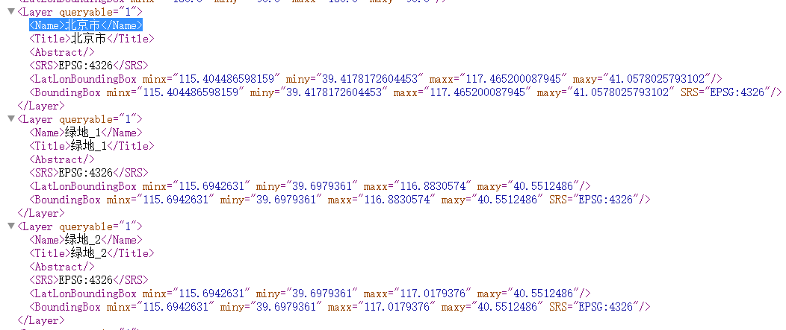
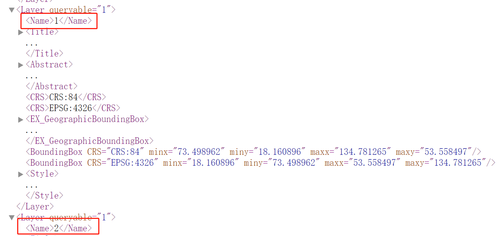

# 子图层控制

## 语义
::: tip layers 参数的语义
> 下面三类图层会设计子图层的可见性控制性，三者的参数都是通过 `layers` 参数来控制的
 1. OGC-WMS WMS图层,通过layers来控制子图层的`显示`  [OGC-WMS](/api/Layer/OGC/CesiumOgcWmsLayer.md#props)
 2. IGServer-Doc 地图文档,通过layers来控制子图层的`显示`、`隐藏`、`包含`、`排除`  [IGServer-Doc](/api/Layer/IGServer/IgsDocLayer.md#props)
 3. ArcServer-Map 地图文档,通过layers来控制子图层的`显示`、`隐藏`、`包含`、`排除`  [OGC-WMS](/api/Layer/ArcGISServer/ArcGISMapLayer.md#props)
:::

## 类型 
> 类型统一设置成 String 字符串类型

1. OGC使用的时候是`必须传入`
   1. mapgis发布的ogc-wms必须是图层名称,本质上是xml中Layer的Name属性
    
   2. ArcGIS发布的OGC通常是图层序号,本质上是xml中Layer的Name属性
   
2. IGS-Doc使用的时候是`可选传入`，不传则是显示全部, 使用`图层序号`
3. Arc-Map使用的时候是`可选传入`，不传则是显示全部, 使用`图层序号`

| OGC-wms | 二维                                                              | 三维                                                | 备注                                  |
| :------ | :---------------------------------------------------------------- | :-------------------------------------------------- | :------------------------------------ |
| OGC-wms | `1,2` 或者 '武汉,武昌区' 
 支持3857/4326                        | `1,2` 或者 '武汉,武昌区'   
 支持3857/4326        | layers为空 null undefined，不显示图层 |
| IGS-Doc | `show:1,2`, `hide:1`, `include:1`, `exclude:1`  
 支持3857/4326 | `show:1,2`, `hide:1`, `include:1`, `exclude:1` 
 只支持4326  | ~~三维原生库-doc只支持4326~~          |
| Arc-Map | `show:1,2`, `hide:1`, `include:1`, `exclude:1`  
 支持3857/4326         | `show:1,2` 
 支持3857/4326                                | 三维`只支持`show语法                      |

