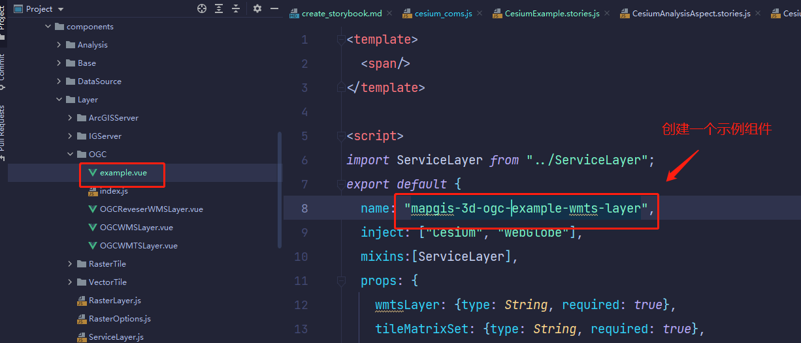
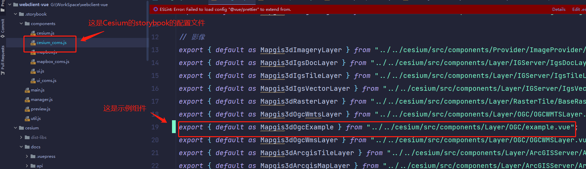
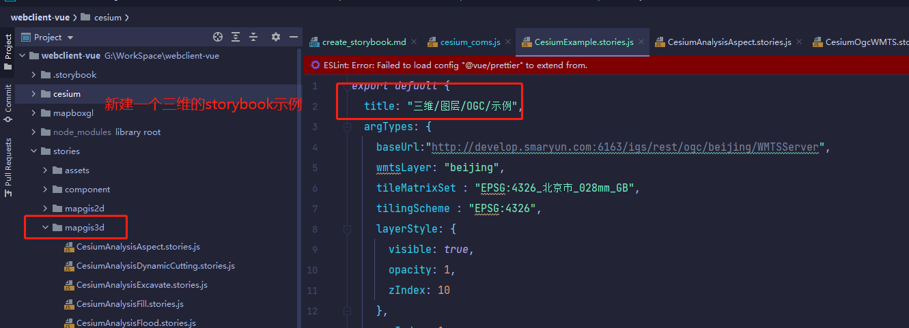
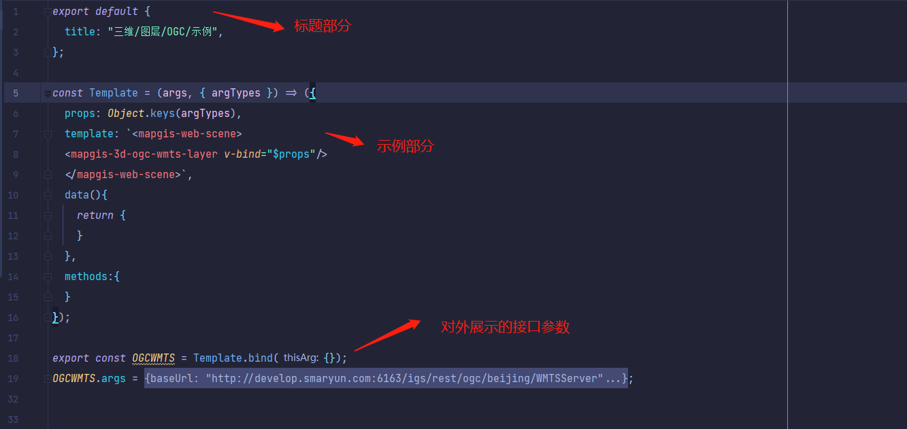
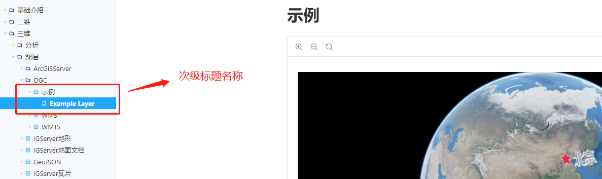
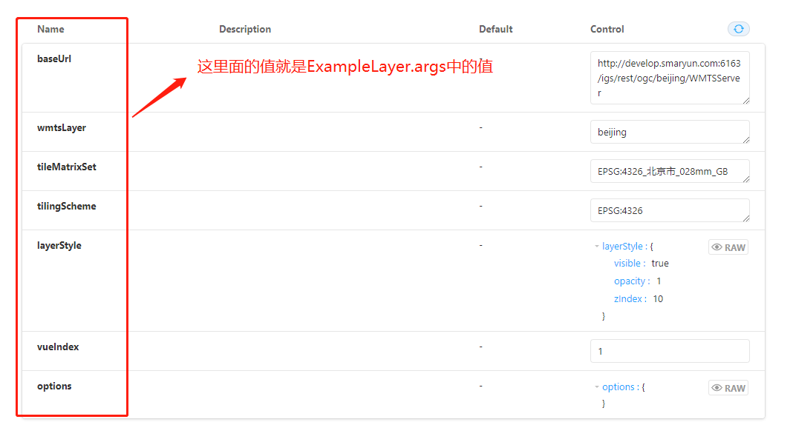
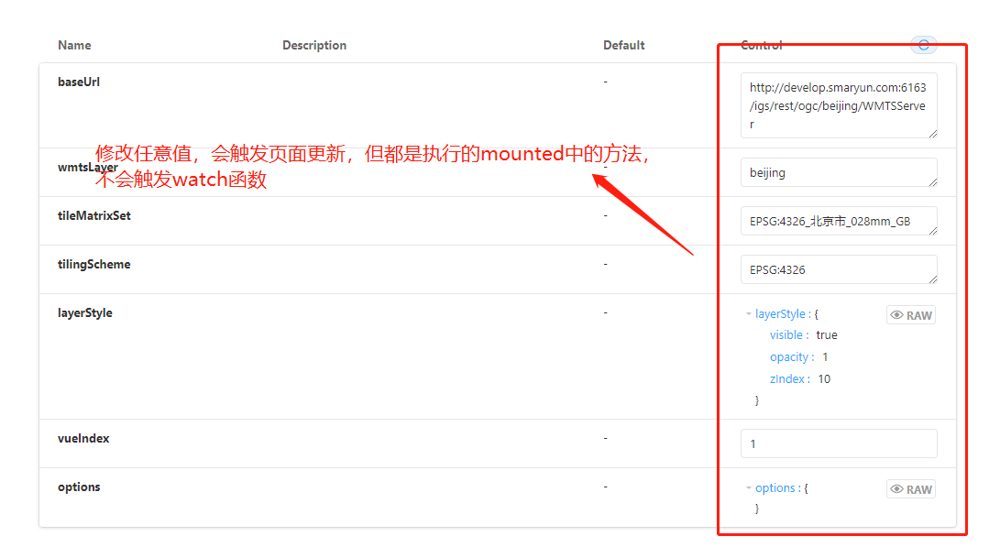
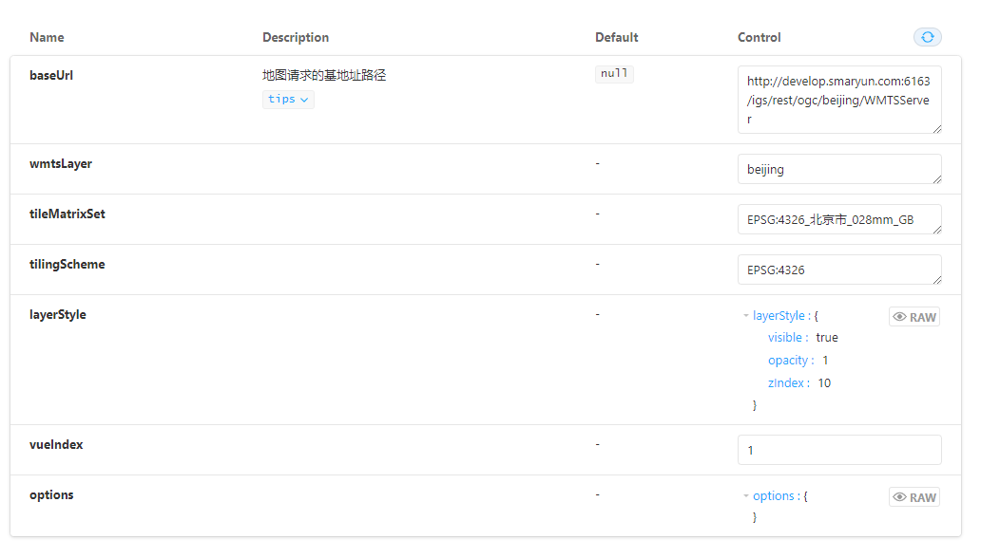
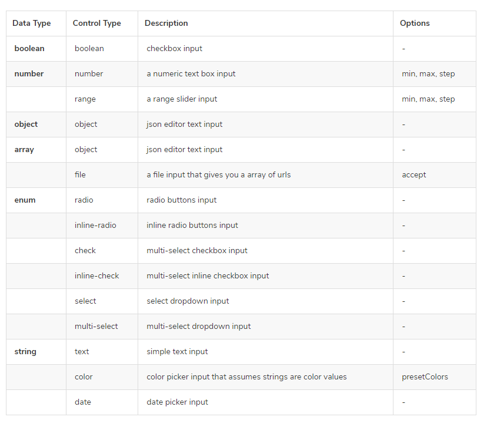
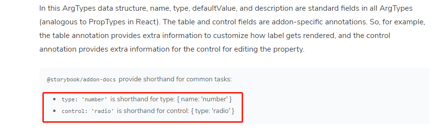

# 创建StoryBook示例

## 一、注册组件到StoryBook
这里以一个WMTS组件为例，创建了一个新组件


<br>
将组建注册到StoryBook的配置文件中，配置文件路径如下：webclient-vue/.storybook/components/cesium_coms.js



## 二、创建一个StoryBook的3D组件示例

找到如下文件夹：webclient-vue/stories/mapgis3d，新建一个storybook的3D示例CesiumExample.stories.js



## 三、stories的结构解析

一个storybook示例包含如下三部分：标题、示例代码、接口展示


<br>
标题结构如下：
```vue
  export default {
    title: "三维/图层/OGC/示例",
    argTypes: {
      baseUrl: {
        description:'地图请求的基地址路径',
        table:{
          type:{ summary: 'tips',detail: "这是提示信息" },
          defaultValue: { summary: 'null' },
        },
        control:'text'
      },
    }
  };
```

title里面每一个斜杠'/'，代表一个文件夹，最后一个斜杠'/'后面的文字就是最终的标题，这里的标题就是“示例”
<br>

示例代码结构如下：

```vue
  const Template = (args, { argTypes }) => ({
    props: Object.keys(argTypes),
    template: `<mapgis-web-scene>
    <mapgis-3d-ogc-example-wmts-layer v-bind="$props"/>
    </mapgis-web-scene>`,
    data(){
      return {}
    },
    methods:{
    }
  });
```

argTypes代表对外展示的接口，所有的argTypes里面的值，都会展示到示例页面里

props、template、data。methods就是标准的vue模板语法，可完全按照vue来编写
<br>

接口展示结构如下：

```vue
  export const ExampleLayer = Template.bind({});
  ExampleLayer.args = {
    baseUrl:"http://develop.smaryun.com:6163/igs/rest/ogc/beijing/WMTSServer",
    wmtsLayer: "beijing",
    tileMatrixSet : "EPSG:4326_北京市_028mm_GB",
    tilingScheme : "EPSG:4326",
    layerStyle: {
      visible: true,
      opacity: 1,
      zIndex: 10
    },
    vueIndex: 1,
    options: {}
  };
```

请注意这句话export const ExampleLayer = Template.bind({});
<br>

"ExampleLayer"这个名称就是次级标题的名称


<br>

ExampleLayer.args里面的值将会展示在示例页面的form表单中


<br>

在展示示例的接口展示表单中修改接口的值，可以实时更新示例，但请注意，更新走的是初始化的方法，不会触发watch函数！！！！


<br>

编写接口描述信息，这里以baseUrl字段为例，展示如何编写Description以及Default的值

在export default中的argTypes添加一个baseUrl字段，如下所示

```vue
export default {
  title: "三维/图层/OGC/示例",
  argTypes: {
    //要描述的字段
    baseUrl: {
    //描述信息，即页面上Description那一栏的值
    description:'地图请求的基地址路径',
    table:{
      //description描述信息下的提示框，可选，添加这一项就会在描述信息文字下生成一个提示信息按钮
      //summary：提示按钮里的文字，detail：提示信息
      type:{ summary: 'tips',detail: "这里是提示" },
      //默认值，即页面上Default那一栏的值，不在这里填写，则页面上不会有默认值
      //如果加了detail,{ summary: 'null',detail: "这里是提示" },则页面会多出一个描述信息的提示框
      defaultValue: { summary: 'null' },
    },
    //Control这里一栏里面展示数据的方式，可以是input、textArean、boolean等，可选值如下
    control:'text'
    },
  }
};
```


<br>

control的可选值：
<br>





## 四、一个stories示例里面展示多个示例

```vue
//展示第一个图层
export const ExampleLayer = Template.bind({});
ExampleLayer.args = {
  baseUrl:"http://develop.smaryun.com:6163/igs/rest/ogc/beijing/WMTSServer",
  wmtsLayer: "beijing",
  tileMatrixSet : "EPSG:4326_北京市_028mm_GB",
  tilingScheme : "EPSG:4326",
  layerStyle: {
    visible: true,
    opacity: 1,
    zIndex: 10
  },
  vueIndex: 1,
  options: {}
};
//展示第二个图层，此处不会在展示接口面板
export const ExampleLayerTwo = Template.bind({});
ExampleLayerTwo.args = {
  baseUrl:"http://develop.smaryun.com:6163/igs/rest/ogc/beijing/WMTSServer",
  wmtsLayer: "beijing",
  tileMatrixSet : "EPSG:4326_北京市_028mm_GB",
  tilingScheme : "EPSG:4326",
  layerStyle: {
    visible: true,
    opacity: 1,
    zIndex: 10
  },
  vueIndex: 1,
  options: {}
};
```

## 五、完整storybook示例

```vue
export default {
  title: "三维/图层/OGC/示例",
  argTypes: {
    //要描述的字段
    baseUrl: {
      //描述信息，即页面上Description那一栏的值
      description:'地图请求的基地址路径',
      table:{
        //description描述信息下的提示框，可选，添加这一项就会在描述信息文字下生成一个提示信息按钮
        //summary：提示按钮里的文字，detail：提示信息
        type:{ summary: 'tips',detail: "这里是提示" },
        //默认值，即页面上Default那一栏的值，不在这里填写，则页面上不会有默认值
        //如果加了detail,{ summary: 'null',detail: "这里是提示" },则页面会多出一个描述信息的提示框
        defaultValue: { summary: 'null' },
      },
      //Control这里一栏里面展示数据的方式，可以是input、textArean、boolean等，可选值如下
      control:'text'
    }
  }
};

//按照vue语法写即可
const Template = (args, { argTypes }) => ({
  props: Object.keys(argTypes),
  template: `<mapgis-web-scene>
  <mapgis-3d-ogc-example-wmts-layer v-bind="$props"/>
  </mapgis-web-scene>`,
  data(){
    return {}
  },
  methods:{}
});

//展示第一个图层
export const ExampleLayer = Template.bind({});
  ExampleLayer.args = {
    baseUrl:"http://develop.smaryun.com:6163/igs/rest/ogc/beijing/WMTSServer",
    wmtsLayer: "beijing",
    tileMatrixSet : "EPSG:4326_北京市_028mm_GB",
    tilingScheme : "EPSG:4326",
    layerStyle: {
      visible: true,
      opacity: 1,
      zIndex: 10
    },
    vueIndex: 1,
    options: {}
};

//展示第二个图层，此处不会在展示接口面板
export const ExampleLayerTwo = Template.bind({});
  ExampleLayerTwo.args = {
  baseUrl:"http://develop.smaryun.com:6163/igs/rest/ogc/beijing/WMTSServer",
  wmtsLayer: "beijing",
  tileMatrixSet : "EPSG:4326_北京市_028mm_GB",
  tilingScheme : "EPSG:4326",
  layerStyle: {
    visible: true,
    opacity: 1,
    zIndex: 10
  },
  vueIndex: 1,
  options: {}
};
```
