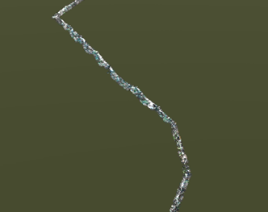
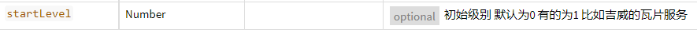

> 1.84去掉了WebSceneControl.js

# 数据支撑

| 功能   | 版本 | 数据地址                                                          | 应用文件                 |
| :----- | :--- | :---------------------------------------------------------------- | :----------------------- |
| 点云   | 1.0  | http://192.168.21.191:6163/igs/rest/g3d/m3d_点云                  | CesiumM3d.stories        |
| BIM    | 1.0  | http://192.168.21.191:6163/igs/rest/g3d/汉阳BIM                   | CesiumM3dControl.stories |
| 精模   | 2.0  | http://192.168.88.204:8089/M3D/2.0/M3DAttributeTest_BIN/zondy.mcj | CesiumM3d2.stories       |
| 多模态 | 2.0  | http://192.168.88.204:8089/M3D/2.0/zondy/zondy.mcj                | CesiumM3d2.stories       |
| 属性   | 2.0  | http://192.168.88.204:8089/M3D/2.0/20211105测试楼高_ty_result/20211105测试楼高_ty_result.mcj     | CesiumM3d2.stories       |


# 1.59支持 1.84不支持的功能
| 功能点                                     | 1.59 | 1.84   |
| :----------------------------------------- | :--- | :----- |
| M3D点云加载  | 支持 | 不支持 |
| 瓦片错级   | 支持 | 不支持 |

# 废弃的方法

##  WebSceneControl

1. flyTo 
    替换实现方式
    ``` js
    /**
     * 跳转到
     * @param  {Number} lon 经度
     * @param  {Number} lon 纬度
     * @param  {Number} height  视角高度
     * @param  {Number} duration 跳转持续时间
     */
    WebSceneControl.prototype.flyTo = function(lon, lat, height, duration) {
        if (height === null || height === '' || height === undefined) {
            var cameraHeight = Math.ceil(this.viewer.camera.positionCartographic.height);
            height = cameraHeight;
        }
        this.viewer.camera.flyTo({
            destination: Cartesian3.fromDegrees(lon, lat, height),
            duration: duration,
            orientation: {
                heading: CesiumMath.toRadians(0), //0 //绕垂直于地心的轴旋转 ,相当于头部左右转
                pitch: CesiumMath.toRadians(-90), ///-90  //绕经度线旋转， 相当于头部上下
                roll: CesiumMath.toRadians(0) //0         //绕纬度线旋转 ，面对的一面瞬时针转
            }
        });
    };
    ```

