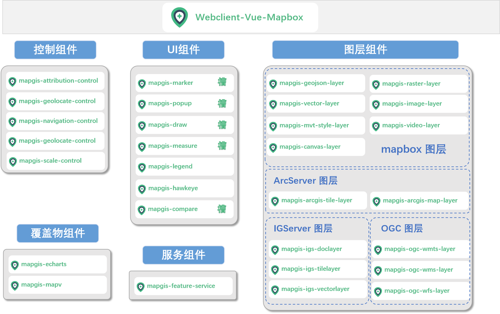
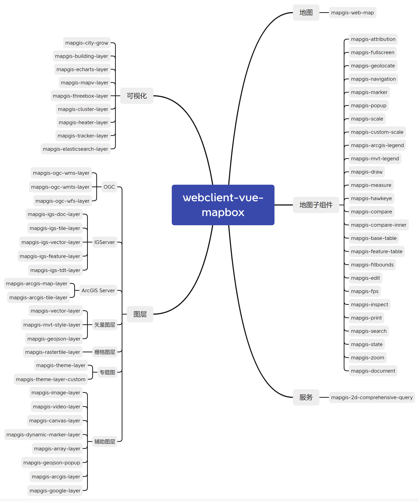

# Webclient-Vue-MapboxGL

---

## 简介

webclient-vue-mapboxgl是基于MapboxGL实现的vue组件开发库，提供构建Web二维GIS应用的常用vue组件。

### 核心框架



### 模块说明



### 特点

+ 组件式风格

通过 Vue 的组件方式调用 layers, markers, popups， 并且使用同步`synchronized props`来控制状态

+ Vue 控制

`面向对象编程`：地图元素拥有 Vue 的生命周期，将原生地图事件封装成 Vue 的事件

+ 同步的 Promise Actions

原先异步的地图操作变成`同步操作`，并且采取`Promise`的方式进行开发避免大量的地图事件回调导致代码逻辑混乱，能够清晰的知道是什么行为导致地图的变化。

---

## 安装

```bash
npm install --save @mapgis/webclient-vue-mapboxgl
# 或者
yarn add @mapgis/webclient-vue-mapboxgl
```

在 main.js 中全局引入组件和样式文件

```js
import "@mapgis/webclient-vue-ui/dist-libs/webclient-vue-ui.css";
import "@mapgis/webclient-vue-mapboxgl/dist-libs/webclient-vue-mapboxgl.css";

import MapgisUi from "@mapgis/webclient-vue-ui";
import Mapgis2d from "@mapgis/webclient-vue-mapboxgl";

Vue.use(MapgisUi);
Vue.use(Mapgis2d);
```

---

## 相关链接

+ [基本示例](http://develop.smaryun.com:8899/#/gallery/vue-mapboxgl)
+ [参考文档](http://120.78.82.242:8891/)
+ [项目源码](https://github.com/MapGIS/WebClient-Vue/tree/main/mapboxgl)

---

## 项目依赖

+ [Vue.js 2.5+](https://github.com/vuejs/vue)  
+ [MapGIS/Mapbox GL JS 0.54+](https://github.com/mapbox/mapbox-gl-js)  
+ [MapGIS/WebClient-MapboxGL](https://github.com/mapbox/mapbox-gl-js)
