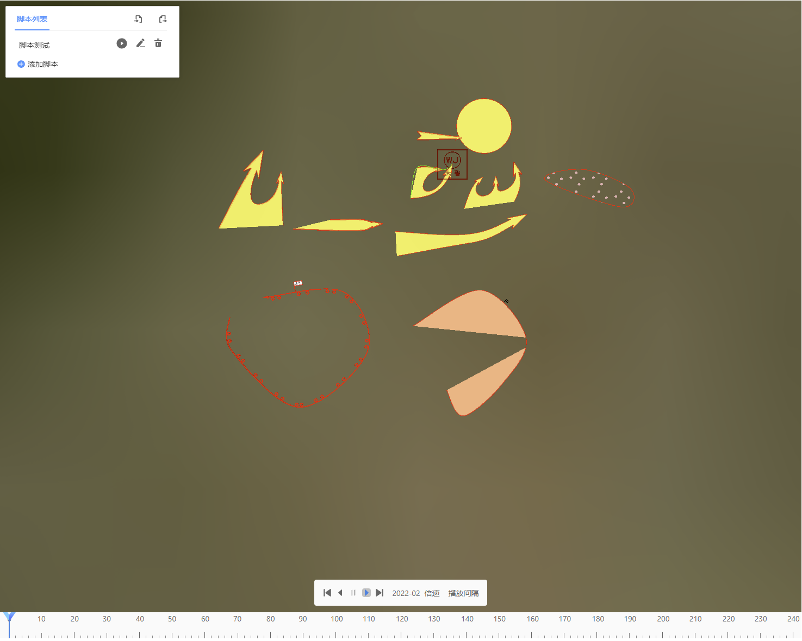

# PlotAnimation

> mapgis-2d-plot-animation <br>
> 态势推演组件
> [点此跳转到示例](#example)

## 缩略图



## 属性

| 名称     | 类型                      | 默认值    | 描述                                                                         | 是否监听 |
| -------- | ------------------------- | --------- | ---------------------------------------------------------------------------- | -------- |
| data     | String or Object or Array | 随机数    | 动画数据，可以为动画数据的 url，单个动画配置对象，或者多个动画配置组成的数组 | 是       |
| vueIndex | String or Number          | 随机数    | plotLayer 的唯一标识，随机生成的数字或字符串，不传则自动生成                 | 否       |
| vueKey   | String                    | 'default' | cesium 球体的唯一标识，默认值 default，当分屏时使用此对象标识多个球体        | 否       |

### <span id="data">data</span>

```javascript
//单个动画配置对象
let data = {
    //脚本名称
    "timeLineName": "脚本测试",
    //动画配置
    "animations": [
        {
            //闪烁动画
            //动画类型，attribute-animation：属性动画，grow-animation：生长动画
            //visible-animation：显隐动画，blink-animation：闪烁动画，
            //scale-animation：比例动画，path-animation：路径动画
            "animationType": "blink-animation",
            //持续时间
            "duration": 1000,
            //要执行动画的标绘图元ID，多个ID以逗号分隔
            "featureIds": "d1a27f94-51b6-44e9-9bbf-02e607d963e9",
            //动画名称
            "animationName": "某xx进攻路线_闪烁动画",
            //描述时间的不均匀变化，Linear：平滑，Sine：正弦，Circ：圆，Bounce：反弹
            "easing": "Linear",
            //动画开始时间延迟，单位毫秒
            "delay": 10,
            //动画结束时间延迟，单位毫秒
            "endDelay": 0,
            //动画循环播放次数
            "loop": 500,
            //动画整体延迟，单位毫秒
            "timelineOffset": 0,
            //闪烁时的颜色，颜色数组数量任意
            "blinkColors": ["#000000", "#ff0000"],
            //闪烁时颜色是否会进行渐变，例如，闪烁颜色设置为红蓝，isBlinkGrad设为否，
            //则颜色仅会进行红蓝亮色变化，设为true则是红色到蓝色的渐变
            "isBlinkGrad": true,
            //闪烁完成后事显示还是隐藏，true为显示，false为隐藏
            "endStatus": true
        },
        {
            //路径动画
            //参数同上，仅允许点类型添加
           ...,
            //绑在路径上的点符号ID，多个点符号以逗号分隔
            "symbolBindId": "25843cca-bd01-4585-8209-1da41166c83a",
            //路径点
            "animationCoords": [],
            //是否显示路径
            "showPath": true,
            //路径样式，参考SVG样式
            "pathStyle": { "fill": "none", "strokeStyle": "#00ff00", "lineWidth": 5 },
            //开始比例，即路径开始位置，[0~1],默认0
            "startPathRate": 0,
            //结束比例，即路径结束位置，[0~1],默认1
            "endPathRate": 1,
            //路径类型，目前仅有一个值spline：贝塞尔曲线，可不填
            "pathType": "spline"
        },
        {
            //生长动画，参数同上
            ...,
            //开始比例，即生长动画开始比例，[0~1],默认0
            "startRate": 0.15,
            //结束比例，即生长动画结束比例，[0~1],默认0
            "endRate": 1,
            //生长模式，spline：线性生长，center：中心生长
            "growMode": "spline"
        },
        {
            //比例动画，参数同上
            ...,
            //比例动画放大缩小系数，即开始为1倍放大到两倍，缩小至1倍，最后放大到15倍
            //时间不是平均分配的，例如总时长16秒，则1~2为1秒，2~1为1秒，1~15为14秒
            "scaleRateArr": [1, 2, 1, 15]
        },
        {
            //属性动画，参数同上
            ...,
            //以某个样式属性进行动画
            //这里以线颜色为例，attrName指定了在属性strokeStyle的基础上进行属性动画
            //ids指定了要给哪一个标绘图元进行属性动画，可附加多个图元ID，以逗号分隔
            //value表明了颜色会从#ff0000渐变为#cccccc，最后渐变为#ff0000
            //每个渐变同样不是平均分配的，会将颜色转换为数字，在根据间隔值，计算渐变时间
            "attrsItem":{
                "attrName":"strokeStyle",
                "ids":"path2578",
                "value":["#ff0000","#cccccc","#ff0000"]
            }
        },
        {
            //显隐动画，参数同上
            ...,
            //显隐动画完成后事显示还是隐藏，true为显示，false为隐藏
            "endStatus": false
        }
    ]
}
```

### 动画时间示意图


## <span id="example">示例</span>

```vue
<template>
  <mapgis-web-scene style="height:95vh">
    <mapgis-3d-plot-layer
      @loaded="handleLoaded"
      :dataSource="dataSource"
      :symbolUrl="symbolUrl"
    ></mapgis-3d-plot-layer>
    <mapgis-3d-plot-
      :data="data"
      :vueIndex="vueIndex"
      :vueKey="vueKey"
      v-if="vueKey && vueKey"
    />
  </mapgis-web-scene>
</template>
<script>
export default {
  data() {
    return {
      //行业标绘图层数据源
      dataSource: "",
      //vueIndex，用来获取标绘图层
      vueIndex: undefined,
      //vueKey，用来获取标绘图层
      vueKey: undefined,
      //符号配置的URL
      symbolUrl: "",
      //态势推演配置文件
      data: data,
    };
  },
  methods: {
    //图层加载完毕事件
    handleLoaded(e) {
      //返回vueIndex以及vueKey
      this.vueIndex = e.vueIndex;
      this.vueKey = e.vueKey;
    },
  },
};
</script>
<style lang="css"></style>
```
