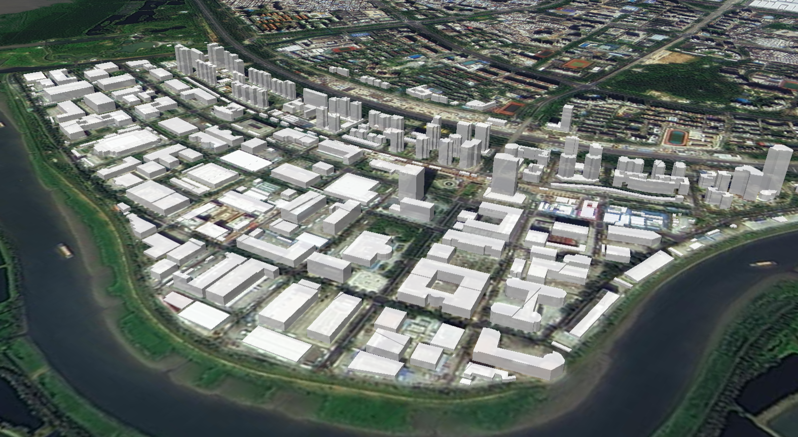
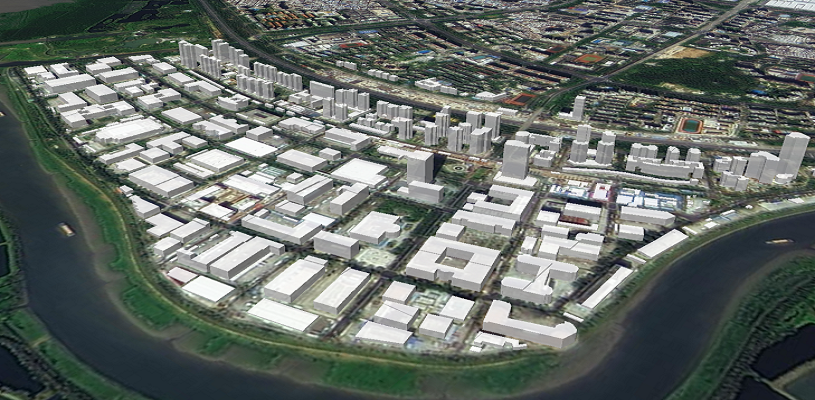
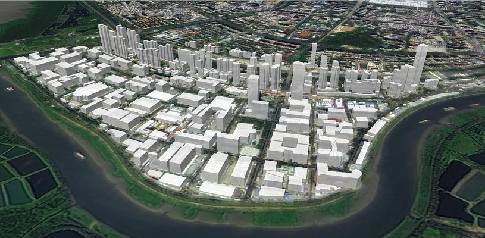

# 建筑白膜

> mapgis-building-layer



::: tip

1. 小数据量走 geojson
   ```vue
   <mapgis-web-map>
    <mapgis-building-layer geojson="http://localhost:8081/data/building-500.geojson"" field="height" :heightScale="2"/>
   </mapgis-web-map>
   ```
2. 大数据量走是矢量瓦片
   ```vue
   <mapgis-web-map>
    <mapgis-building-layer 
    :vectortile="buildingVectortile"
      field="height" 
      :heightScale="2"
    />
   </mapgis-web-map>
   ```
   ```json
   // buildingVectortile
   {
     "sourceLayer": "foushan_building_dissol",
     "url": "http://localhost:6163/igs/rest/mrms/tile/佛山白模/{z}/{y}/{x}?type=cpbf"
   }
   ```
   :::
   | 小数据量 GeoJSON | 大数据量-矢量瓦片 |
   | :------------------------- | :--------------------------------------- |
   |  |  |

## 属性

### `geojson`

- **类型:** `String | Object`
- **必传属性**
- **非侦听属性**
- **描述:** 聚类的 geojson 格式数据,必须是区数据
- **查看:** [官方白膜文档](https://docs.mapbox.com/mapbox-gl-js/example/3d-buildings/)

###

### `field`

- **类型:** `String`
- **非侦听属性**
- **默认值** `point_count`
- **描述:** 热力聚类字段

### `color`

- **类型:** `String`
- **非侦听属性**
- **默认值** `#ffffff`
- **描述:** 白膜颜色

### `heightScale`

- **类型:** `Number`
- **非侦听属性**
- **默认值** `1.0`
- **描述:** 高程缩放比

| 缩放比 1                                 | 缩放比 2                                 |
| :--------------------------------------- | :--------------------------------------- |
|  |  |

## 事件

### `@added`

事件载荷如下所示:

- `layerId` 当期白膜建筑显示的图层 id
- `map` 当前地图对象
- `component` 组件对象
