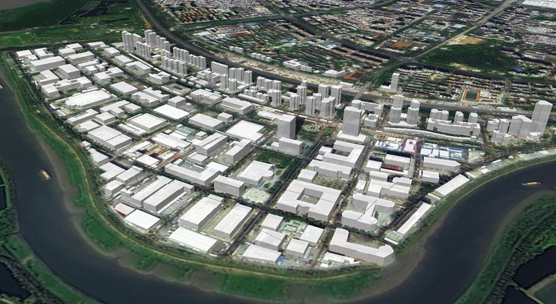
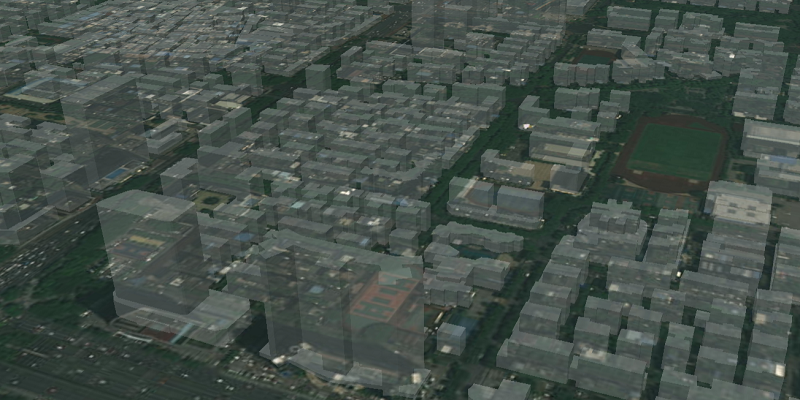

# 建筑白膜

> mapgis-building-layer



::: tip

1. 小数据量走 geojson
   ```vue
   <mapgis-web-map>
    <mapgis-building-layer geojson="http://localhost:8081/data/building-500.geojson"" field="height" :heightScale="2"/>
   </mapgis-web-map>
   ```
2. 大数据量走是矢量瓦片
   ```vue
   <mapgis-web-map>
    <mapgis-building-layer 
    :vectortile="buildingVectortile"
      field="height" 
      :heightScale="2"
    />
   </mapgis-web-map>
   ```
   ```json
   // buildingVectortile
   {
     "sourceLayer": "foushan_building_dissol",
     "url": "http://localhost:6163/igs/rest/mrms/tile/佛山白模/{z}/{y}/{x}?type=cpbf"
   }
   ```
   :::
   | 小数据量 GeoJSON | 大数据量-矢量瓦片 |
   | :------------------------- | :--------------------------------------- |
   |  |  |

## 属性

### `feature`

- **类型:** `Object`
- **V-Modal 属性**
- **描述:** 要素鼠标移入的时候查询对应的要素信息并返回给外部，该属性是`v-modal`属性， 改属性会随着人机交互实时变动
- **默认值**
  ```json
  {
    "geometry": {},
    "properties": { "属性名": "属性值" }
  }
  ```

### `geojson`

- **类型:** `String | Object`
- **必传属性**
- **非侦听属性**
- **描述:** 聚类的 geojson 格式数据,必须是区数据
- **查看:** [官方白膜文档](https://docs.mapbox.com/mapbox-gl-js/example/3d-buildings/)

###

### `field`

- **类型:** `String`
- **非侦听属性**
- **默认值** `point_count`
- **描述:** 热力聚类字段

### `color`

- **类型:** `String`
- **非侦听属性**
- **默认值** `#ffffff`
- **描述:** 白膜颜色
- 

### `opacity`

- **类型:** `Number | Object`
- **非侦听属性**
- **默认值** `0.85`
- **描述:** 白膜透明度
- 

### `heightScale`

- **类型:** `Number`
- **非侦听属性**
- **默认值** `1.0`
- **描述:** 高程缩放比

| 缩放比 1                                 | 缩放比 2                                 |
| :--------------------------------------- | :--------------------------------------- |
|  |  |

## 槽

### `default`

- **描述:** 自定义非聚类点的`popup槽`，当鼠标点击的时候触发对应的 popup 弹出事件
- **作用域** feature 选中要素的几何和属性信息


```vue
<template>
  <mapgis-building-layer
    field="Floor"
    :opacity="0.5"
    color="#ff0000"
    :heightScale="3"
    :vectortile="buildingVectortile"
    v-model="buildingfeature"
  >
    <mapgis-ui-border type="border5" class="mapgis-popup-custom">
      <mapgis-ui-row
        v-for="(f, i) in Object.keys(custerfeature.properties)"
        :key="i"
        class="mapgis-custom-row"
      >
        <mapgis-ui-col :span="12">
          {{ f }}
        </mapgis-ui-col>
        <mapgis-ui-col :span="12">
          {{ custerfeature.properties[f] }}
        </mapgis-ui-col>
      </mapgis-ui-row>
    </mapgis-ui-border>
  </mapgis-building-layer>
</template>
<script>
export default {
  data() {
    return {
      buildingfeature: { geometry: {}, properties: { 属性名: "属性值" } },
    }
  }
}
<script>
<style>
.mapgis-custom-row {
  height: 20px;
  background: #03b3c4;
}
</style>
```

## 事件

### `@added`

事件载荷如下所示:

- `layerId` 当期白膜建筑显示的图层 id
- `map` 当前地图对象
- `component` 组件对象
