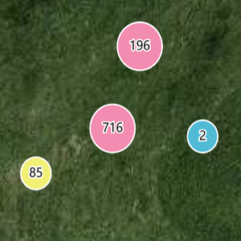
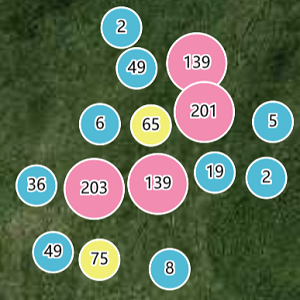
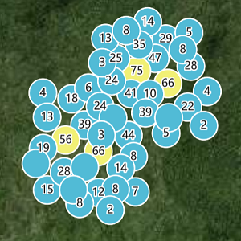

# 聚类

> mapgis-cluster-layer


```vue
<mapgis-web-map>
    <mapgis-cluster-layer geojson="http://localhost:8081/data/chinamobile_1000.geojson">
    </mapgis-cluster-layer>
</mapgis-web-map>
```

::: tip
该功能的聚类的文字显示需要在 mapgis-web-map 的 style 中设置如下信息 [地图样式]()

```json
 {
    version: 8,
    sources: {},
    layers: [ //自己的图层 ],
    sprite: "http://localhost:6163/igs/rest/mrms/vtiles/sprite",
    glyphs: "http://localhost:6163/igs/rest/mrms/vtiles/fonts/{fontstack}/{range}.pbf", //没有该字体信息无法显示聚类文字
}
```

:::

## 属性

### `geojson`

- **类型:** `String | Object`
- **必传属性**
- **非侦听属性**
- **描述:** 聚类的 geojson 格式数据,必须是点数据
- **查看:** [官方聚类文档](https://docs.mapbox.com/mapbox-gl-js/example/cluster/)

### `clusterMaxZoom`

- **类型:** `Number`
- **必传属性**
- **非侦听属性**
- **默认值** 14
- **描述:** 聚类的最大级别，超出该级别不进行聚类操作

### `clusterRadius`

- **类型:** `Number`
- **必传属性**
- **非侦听属性**
- **默认值** 50
- **描述:** 聚类的半径

| 半径 100                        | 半径 50                        | 半径 25                        |
| :------------------------------ | :----------------------------- | :----------------------------- |
|  |  |  |

### `min`

- **类型:** `Number`
- **非侦听属性**
- **默认值** 0
- **描述:** 聚类的最小值，如 1000 个数据按照聚类范围进行聚类，10 作为最小值表示 10 以下的聚类簇颜色半径不再单独出处理

### `max`

- **类型:** `Number`
- **非侦听属性**
- **默认值** 100
- **描述:** 聚类的最大值，如 1000 个数据按照聚类范围进行聚类，100 作为最小值表示 100 以上的聚类簇颜色和半径不再单独出处理

## 事件

### `@added`

事件载荷如下所示:

- `layerIds` 当期聚类显示的图层 id 数组
- `map` 当前地图对象
- `component` 组件对象
