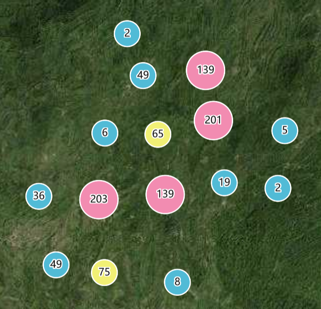
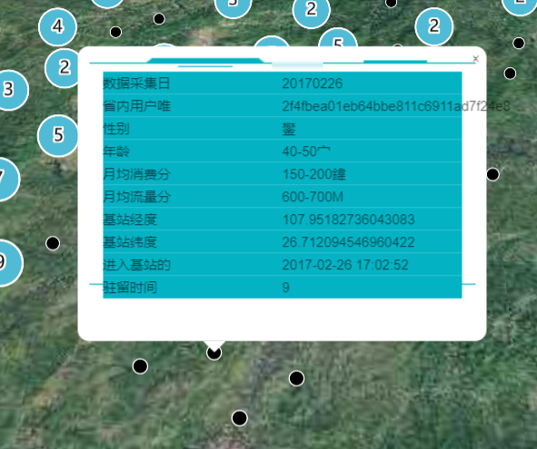

# 聚类

> mapgis-cluster-layer



```vue
<mapgis-web-map>
    <mapgis-cluster-layer geojson="http://localhost:8081/data/chinamobile_1000.geojson">
    </mapgis-cluster-layer>
</mapgis-web-map>
```

::: tip
该功能的聚类的文字显示需要在 mapgis-web-map 的 style 中设置如下信息 [地图样式]()

```json
{
  "version": 8,
  "sources": {},
  "layers": [
    /*自己的图层 */
  ],
  "sprite": "http://localhost:6163/igs/rest/mrms/vtiles/sprite",
  "glyphs": "http://localhost:6163/igs/rest/mrms/vtiles/fonts/{fontstack}/{range}.pbf" //没有该字体信息无法显示聚类文字
}
```

:::

## 属性

### `feature`

- **类型:** `Object`
- **V-Modal 属性**
- **描述:** 非聚类要素鼠标移入的时候查询对应的要素信息并返回给外部，该属性是`v-modal`属性， 改属性会随着人机交互实时变动
- **默认值**
  ```json
  {
    "coordinates": [0, 0],
    "properties": { "属性名": "属性值" }
  }
  ```

### `geojson`

- **类型:** `String | Object`
- **必传属性**
- **非侦听属性**
- **描述:** 聚类的 geojson 格式数据,必须是点数据
- **查看:** [官方聚类文档](https://docs.mapbox.com/mapbox-gl-js/example/cluster/)

### `clusterMaxZoom`

- **类型:** `Number`
- **必传属性**
- **非侦听属性**
- **默认值** 14
- **描述:** 聚类的最大级别，超出该级别不进行聚类操作

### `clusterRadius`

- **类型:** `Number`
- **必传属性**
- **非侦听属性**
- **默认值** 50
- **描述:** 聚类的半径

| 半径 100                        | 半径 50                        | 半径 25                        |
| :------------------------------ | :----------------------------- | :----------------------------- |
|  |  |  |

### `min`

- **类型:** `Number`
- **非侦听属性**
- **默认值** 0
- **描述:** 聚类的最小值，如 1000 个数据按照聚类范围进行聚类，10 作为最小值表示 10 以下的聚类簇颜色半径不再单独出处理

### `max`

- **类型:** `Number`
- **非侦听属性**
- **默认值** 100
- **描述:** 聚类的最大值，如 1000 个数据按照聚类范围进行聚类，100 作为最小值表示 100 以上的聚类簇颜色和半径不再单独出处理

### `uncluster`

- **类型:** `Number`
- **非侦听属性**
- **默认值**
  ```json
  {
    "paint": {
      "circle-color": "#000000",
      "circle-radius": 6,
      "circle-stroke-width": 1,
      "circle-stroke-color": "#fff"
    }
  }
  ```
- **描述:** 自定义非聚类的样式

## 槽

### `uncluster`

- **描述:** 自定义非聚类点的`popup槽`，当鼠标移入的时候触发对应的 popup 弹出事件
- **作用域** feature 选中要素的几何和属性信息



```vue
<template>
  <mapgis-cluster-layer
      :geojson="clusterGeojson"
      :clusterRadius="50"
      v-model="unclusterfeature"
    >
    <mapgis-ui-border type="border5" class="mapgis-popup-custom">
      <mapgis-ui-row
        v-for="(f, i) in Object.keys(unclusterfeature.properties)"
        :key="i"
        class="mapgis-custom-row"
      >
        <mapgis-ui-col :span="12">
          {{ f }}
        </mapgis-ui-col>
        <mapgis-ui-col :span="12">
          {{ unclusterfeature.properties[f] }}
        </mapgis-ui-col>
      </mapgis-ui-row>
    </mapgis-ui-border>
  </mapgis-cluster-layer>
</template>
<script>
export default {
  data() {
    return {
      clusterGeojson: "http://localhost:8080/data/chinamobile_1000.geojson",
      unclusterfeature: { coordinates: [0, 0], properties: { 属性名: "属性值" } },
    }
  }
}
<script>
<style>
.mapgis-custom-row {
  height: 20px;
  background: #03b3c4;
}
</style>
```

## 事件

### `@added`

事件载荷如下所示:

- `layerIds` 当期聚类显示的图层 id 数组
- `map` 当前地图对象
- `component` 组件对象
