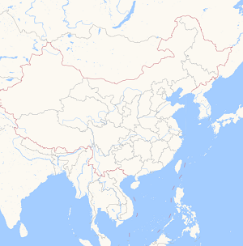
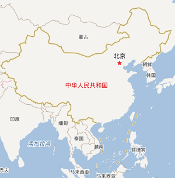
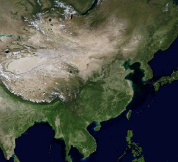

# 自定义栅格图层

1. 该图层的核心能力是兼容国内常见的互联网地图
2. 该图层是将原始的坐标为`百度BD09/高德GCJ02`坐标进行对应的统一反算成`WGS84`并叠加显示在 WGS84 的椭球上，因此`只能使用`WGS84 的地理数据进行对应的要素服务叠加。

> mapgis-custom-rastertile-layer

::: warning
大部分的互联网地图都是按照 Web 墨卡托投影(EPSG:3857)来处理的，只有天地图是 Web 墨卡托投影(EPSG:3857)/等分弧秒投影(EPSG:4326)。
因此强烈推荐使用该组件时，统一设置 Map 为 EPSG:3857

```js
<mapgis-web-map crs="EPSG:3857" />
```

:::

## 属性

### `layerId`

- **类型:** `String`
- **非侦听属性**
- **描述:** 栅格瓦片图层名

### `layerType`

- **类型:** `String`
- **非侦听属性**
- **描述:** 栅格瓦片图层自定义类型

| 高德-注记          | 高德-无注记              | 高德-遥感             | 百度-矢量          | 百度-遥感             |
| :----------------- | :----------------------- | :-------------------- | :----------------- | :-------------------- |
| 'GaoDe.Normal.Map' | 'GaoDe.Normal_NoTag.Map' | 'GaoDe.Satellite.Map' | 'Baidu.Normal.Map' | 'Baidu.Satellite.Map' |

| 高德-注记                   | 高德-无注记                         | 高德-遥感卫星                   |
| :-------------------------- | :---------------------------------- | :------------------------------ |
|  |  |  |

| 百度-矢量                          | 百度-遥感卫星                   |
| :--------------------------------- | :------------------------------ |
|  |  |

### `options`

- **类型:** `Object`
- **非侦听属性**
- **描述:** 保留字段，兼容后期的额外参数需求（key，跨域等）

| 名称    | 类型   | 示例                                |
| :------ | :----- | :---------------------------------- |
| url     | String | http://custom:49526/{z}/{x}/{y}.jpg |
| minzoom | Number | 0                                   |
| maxzoom | Number | 20                                  |

## 示例

```vue
<template>
    <mapgis-web-map crs="EPSG:3857" :center="[107.19, 26.85]" :zoom="3">
        <mapgis-custom-rastertile-layer layerId="gaode" layerType="GaoDe.Normal.Map" />
    </mapgis-web-map>
</template>
```


```vue
<template>
    <mapgis-web-map crs="EPSG:3857" :center="[107.19, 26.85]" :zoom="3">
        <mapgis-custom-rastertile-layer layerId="custom" layerType="Custom.WMTS.Map" 
          :options={ 
            url: "http://webrd01.is.autonavi.com/appmaptile?lang=zh_cn&size=1&scale=1&style=8&x={x}&y={y}&z={z}", 
            minzoom: 0, 
            maxzoom: 20
          } 
        >
        </mapgis-custom-rastertile-layer>
    </mapgis-web-map>
</template>
```