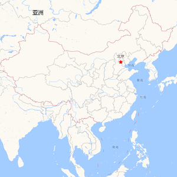

# 自定义栅格图层

1. 该图层的核心能力是兼容国内常见的互联网地图
2. 该图层是将原始的坐标为`百度BD09/高德GCJ02`坐标进行对应的统一反算成`WGS84`并叠加显示在WGS84的椭球上，因此`只能使用`WGS84的地理数据进行对应的要素服务叠加。

> mapgis-custom-rastertile-layer

::: warning
大部分的互联网地图都是按照Web墨卡托投影(EPSG:3857)来处理的，只有天地图是Web墨卡托投影(EPSG:3857)/等分弧秒投影(EPSG:4326)。
因此强烈推荐使用该组件时，统一设置Map为EPSG:3857
``` js
<mapgis-web-map crs="EPSG:3857" />
```
:::

## 属性

### `layerId`

- **类型:** `String`
- **非侦听属性**
- **描述:** 栅格瓦片图层名
  
### `layerType`

- **类型:** `String`
- **非侦听属性**
- **描述:** 栅格瓦片图层自定义类型

|高德-注记|高德-无注记|高德-遥感|百度-矢量|百度-遥感|
|:---|:---|:---|:---|:---|
|'GaoDe.Normal.Map'|'GaoDe.Normal_NoTag.Map'|'GaoDe.Satellite.Map'|'Baidu.Normal.Map'|'Baidu.Satellite.Map'|

|高德-注记|高德-无注记|高德-遥感卫星|
|:---|:---|:---|
||||


|百度-矢量|百度-遥感卫星|
|:---|:---|
|||

  
### `options`

- **类型:** `Object`
- **非侦听属性**
- **描述:** 保留字段，兼容后期的额外参数需求（key，跨域等）


## 示例

``` vue
<template>
  <div class="hello">
    <mapgis-web-map crs="EPSG:3857" :center="[107.19, 26.85]" :zoom="3">
        <mapgis-custom-rastertile-layer layerId="gaode" layerType="GaoDe.Normal.Map" />
    </mapgis-web-map>
</template>
```