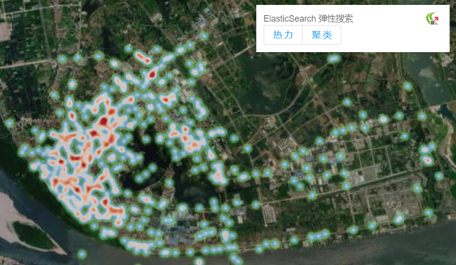

## ElasticSearch 弹性搜索

> mapgis-elasticsearch-layer

```vue
<mapgis-web-map>
    <mapgis-elasticsearch-layer :mode="elasticsearchMode" :buckets="buckets">
    </mapgis-elasticsearch-layer>
</mapgis-web-map>
```

| 弹性聚类                           | 弹性热力                          |
| :--------------------------------- | :-------------------------------- |
|  |  |

## 属性

### `buckets`

- **类型:** `Array`
- **侦听属性**
- **描述:** ElasticSearch 搜索出来的桶结果
- **默认值** []

### `mode`

- **类型:** `String`
- **非侦听属性**
- **描述:** 显示效果类型
- **默认值** heater

| mode = `cluster`                   | mode = `heater`                   |
| :--------------------------------- | :-------------------------------- |
|  |  |

### `heaterOptions`

- **类型:** `String`
- **非侦听属性**
- **描述:** 热力参数
- **参考** [热力参数](/api/Layers/Heater/heater.html#属性)

### `clusterOptions`

- **类型:** `Object`
- **非侦听属性**
- **描述:** 聚类的参数
- **参考** [聚类参数](/api/Layers/Cluster/cluster.html#属性)
