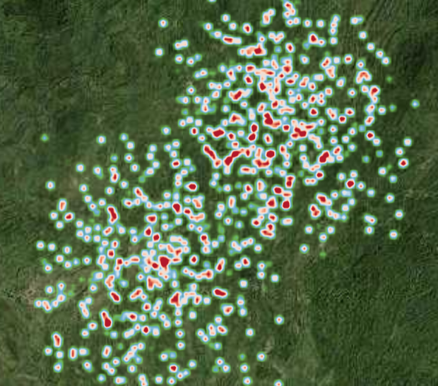
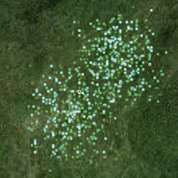
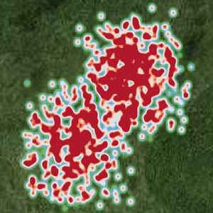
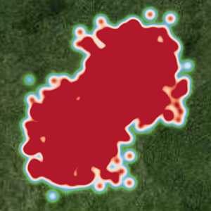

# 热力

> mapgis-heater-layer



```vue
<mapgis-web-map>
    <mapgis-heater-layer field="驻留时间" geojson="http://localhost:8081/data/chinamobile_1000.geojson">
    </mapgis-heater-layer>
</mapgis-web-map>
```

## 属性

### `geojson`

- **类型:** `String | Object`
- **必传属性**
- **非侦听属性**
- **描述:** 聚类的 geojson 格式数据,必须是点数据
- **查看:** [官方聚类文档](https://docs.mapbox.com/mapbox-gl-js/example/heatmap-layer/)

### `field`

- **类型:** `String`
- **非侦听属性**
- **默认值** `point_count`
- **描述:** 热力聚类字段

### `heaterRadius`

- **类型:** `Number`
- **必传属性**
- **非侦听属性**
- **默认值** 16
- **描述:** 热力的半径

| 半径 5                       | 半径 25                       | 半径 50                       |
| :--------------------------- | :---------------------------- | :---------------------------- |
|  |  |  |

### `min`

- **类型:** `Number`
- **非侦听属性**
- **默认值** 0
- **描述:** 热力的最小值，如 1000 个数据按照范围进行热力图，10 作为最小值表示 10 以下的热力权重是 0

### `max`

- **类型:** `Number`
- **非侦听属性**
- **默认值** 100
- **描述:** 热力的最大值，如 1000 个数据按照范围进行热力图，100 作为最大值表示 100 以上的热力权重是 1

## 事件

### `@added`

事件载荷如下所示:

- `layerId` 当期热力显示的图层 id
- `map` 当前地图对象
- `component` 组件对象
