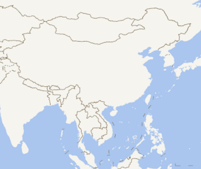
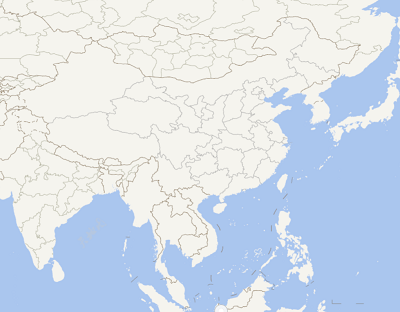

# OGC-WMTS

> mapgis-ogc-wmts-layer

## 属性

All common [layers props](/api/Layers/README.md#props)

### `baseUrl`

- **类型:** `String`
- **非侦听属性**
- **描述:** KVP 模式的基地址.
- **示例:** "http://develop.smaryun.com:6163/igs/rest/ogc/beijing/WMTSServer"

### `wmtsLayer`

- **类型:** `String`
- **默认值:** ""
- **侦听属性**
- **描述:** wmts 标准中的 layer 属性，即图层名称
  这里以司马云上发布的 WMTS 服务为例，ArcGis 同理，访问http://develop.smaryun.com:6163/igs/rest/ogc/beijing/WMTSServer?service=WMTS&request=GetCapabilities，获取地图元信息
  > 这里得到的是一个 XML 文档。<br/>
  > ... <br/> > \<Layer\> <br/> > \<ows:Title\>beijing\</ows:Title\> <br/> > \<ows:Identifier\>beijing</ows:Identifier\>//这个值 beijing 就是 wmtsLayer 属性所需要的值 <br/>
  > ... <br/> > \</Layer\> <br/>
  > ... <br/>
  > 全文搜索\<Layer\>关键字，在 Layer 下找到\<ows:Identifier\>属性，里面的值"beijing"就是 wmtsLayer 属性所需要的

### `tileMatrixSet`

- **类型:** `String`
- **默认值:** ""
- **侦听属性**
- **描述:** wmts 标准中的 TileMatrixSet 属性，即地图矩阵集合

  > 这里以司马云上发布的 WMTS 服务为例，ArcGis 同理，访问http://develop.smaryun.com:6163/igs/rest/ogc/beijing/WMTSServer?service=WMTS&request=GetCapabilities，获取地图元信息
  > 这里得到的是一个 XML 文档。<br/>
  > ... <br/> > <TileMatrixSet\> <br/> > \<ows:Title\>采用 arcgis 计算方式的瓦片块阵集\</ows:Title\> <br/> > \<ows:Abstract\>该块阵集使用 arcgis 标准计算的比例尺\</ows:Abstract\> <br/> > \<ows:Identifier\>EPSG:4326*北京市\_arcgis_GB\</ows:Identifier\>//这个值 EPSG:4326*北京市*arcgis_GB 就是 TileMatrixSet 属性所需要的值 <br/> > \<ows:SupportedCRS\>urn:ogc:def:crs:EPSG::4326\</ows:SupportedCRS\> <br/> > \<WellKnownScaleSet\>urn:ogc:def:wkss:OGC:1.0:GoogleCRS84Quad\</WellKnownScaleSet\> <br/>
  > ... <br/> > \<TileMatrixSet\> <br/>
  > ... <br/>
  > 全文搜索\<TileMatrixSet\>关键字，在\<TileMatrixSet\>下找到\<ows:Identifier\>属性，里面的值"EPSG:4326*北京市\_arcgis_GB"就是 tileMatrixSet 属性所需要的

- **注意:** 在 XML 文档中，一般有三种地图矩阵集，分别是 OGC 官方标准计算，arcgis 标准计算，以及 MapGIS 标准计算方式的矩阵集合，在事业部采用的瓦片裁剪的 MapGIS 桌面端版本是 10.2 之后的，三种矩阵集都可以任选其一使用。但 10.2 之前版本的 mapgis 版本裁剪的瓦片需要注意，若 wmts 图层需要和哪些图层（arcgis 还是天地图）叠加使用，就要用不同的矩阵集才不会出现重叠问题。

### `version`

- **类型:** `String`
- **默认值:** `1.0.0`
- **侦听属性**
- **描述:** wmts 服务版本号。

### `wmtsStyle`

- **类型:** `String`
- **默认值:** `default`
- **侦听属性**
- **描述:** wmts 标准中的 style 属性，即地图样式
  > 这里以司马云上发布的 WMTS 服务为例，ArcGis 同理，访问http://develop.smaryun.com:6163/igs/rest/ogc/beijing/WMTSServer?service=WMTS&request=GetCapabilities，获取地图元信息
  > 这里得到的是一个 XML 文档。 <br/>
  > ... <br/> > \<Style isDefault="true"\> <br/> > \<ows:Title\>Default Style\</ows:Title\> <br/> > \<ows:Identifier\>default\</ows:Identifier\>//里面的"default"就是 wmtsStyle 的值 <br/> > \</Style\> <br/>
  > ... <br/>
  > 全文搜索 Style 关键字，地图可以有多个 style，这里以 default，默认值为例，在\<Style isDefault="true"\>下找到\<ows:Identifier\>属性，里面的"default"就是 wmtsStyle 的值

### `format`

- **类型:** `String`
- **默认值:** `image/png`
- **侦听属性**
- **描述:** wmts 标准中的 format 属性，即请求的图片的返回格式
  > 这里以司马云上发布的 WMTS 服务为例，ArcGis 同理，访问http://develop.smaryun.com:6163/igs/rest/ogc/beijing/WMTSServer?service=WMTS&request=GetCapabilities，获取地图元信息
  > 这里得到的是一个 XML 文档。 <br/>
  > ... <br/> > \<Format\>image/png\</Format\> <br/>
  > ... <br/>
  > 全文搜索\<Format\>关键字，里面的值"image/png"就是 format 属性所需要的

### `zoomOffset`

- **类型:** `Number`
- **非侦听属性**
- **默认值** 0
- **描述:** 地图偏移级数，老版本的 Igserver 会使用到，或者在制图时设置了偏移。

### `layer`

- **类型:** `Object`
- **默认值:** `null`
- **侦听属性**
- **描述:**
  栅格瓦片图层可通过 layer 参数中的 paint、filter、layout 来修改图层样式属性，
  更多 raster 的属性参考官网

  > paint：
  > https://docs.mapbox.com/mapbox-gl-js/style-spec/layers/#raster）

  > layout：
  > https://docs.mapbox.com/mapbox-gl-js/style-spec/layers/#layout-property

  > filter：
  > https://docs.mapbox.com/help/glossary/filter/
  >
  > https://docs.mapbox.com/mapbox-gl-js/style-spec/layers/#filter
- **示例:**
  ```
  layer:{
           paint:{
             raster-opacity:0.5
           }
         }
  layer:{
           filter:["all", ["==", "mpginf_id", "1"]]
        }
  layer:{
           layout:{
             visibility:'visible'
           }
        }
  ```
### `tileSize`
 - **类型:** `Number`
- **默认值:** `512`
- **描述:** 加载瓦片的大小，如果数据瓦片本身是256大小的设置512大小会被强制拉伸至512大小。

| 512                     | 256                     |
| :---------------------- | :---------------------- |
|  |  |

::: tip 天地图模糊
请传入tileSize为256即可，2种方式
``` vue
<mapgis-ogc-wmts-layer :tileSize="256" />
```
``` vue
<mapgis-ogc-wmts-layer :source="{'tileSize': 256}" />
```
:::

``` vue
<template>
  <div class="hello">
    <mapgis-web-map crs="EPSG:4326" :center="[107.19, 26.85]" :zoom="3">
      <mapgis-ogc-wmts-layer v-bind="tdt"> </mapgis-ogc-wmts-layer>
    </mapgis-web-map>
</template>
<script>
export default {
  data() {
    return {
      tdt: {
        tileSize: 256,
        baseUrl: "http://t0.tianditu.gov.cn/vec_c/wmts",
        wmtsLayer: "vec",
        tileMatrixSet: "c",
        format: "tiles",
        layerId: "ogcwmts_layerId",
        sourceId: "ogcwmts_sourceId",
        token: {
          key: "tk",
          value: "f5347cab4b28410a6e8ba5143e3d5a35",
        },
      },
    }
  }
};
</script>
```
## 事件

All common layer [events](/api/Layers/#events)

## 示例

```vue
<template>
  <mapgis-web-map
    class="main"
    :accessToken="accessToken"
    :mapStyle="mapStyle"
    :zoom="mapZoom"
    :center="outerCenter"
    :crs="mapCrs"
  >
    <mapgis-ogc-wmts-layer
      :layer-id="layerWmtsId"
      :source-id="sourceWmtsId"
      :base-url="baseUrl"
      :tile-matrix-set="tileMatrixSet"
      :wmts-layer="wmtsLayer"
      :zoom-offset="zoomoffset"
    >
    </mapgis-ogc-wmts-layer>
  </mapgis-web-map>
</template>

<script>
export default {
  data() {
    return {
      mapStyle: {
        //设置版本号，一定要设置
        version: 8,
        //添加来源
        sources: {},
        //设置加载并显示来源的图层信息
        layers: []
      }, // 地图样式
      mapZoom: 8, // 地图初始化级数
      outerCenter: [116.39, 40.2], // 地图显示中心
      mapCrs: "EPSG:4326",
      wmtsLayer: "beijing",
      layerWmtsId: "ogcwmts_layerId",
      sourceWmtsId: "ogcwmts_sourceId",
      tileMatrixSet: "EPSG:4326_北京市_arcgis_GB",
      baseUrl:
        "http://develop.smaryun.com:6163/igs/rest/ogc/beijing/WMTSServer",
      //因为司马云是用的老版本的igs服务，因此offset必须传-1
      zoomoffset: -1
    };
  },

  created() {
    // 在组件中使用mapbox-gl.js的脚本库功能
    this.mapbox = Mapbox;
  }
};
</script>

<style lang="css">
.main {
  height: 600px;
  width: 100%;
}
</style>
```
