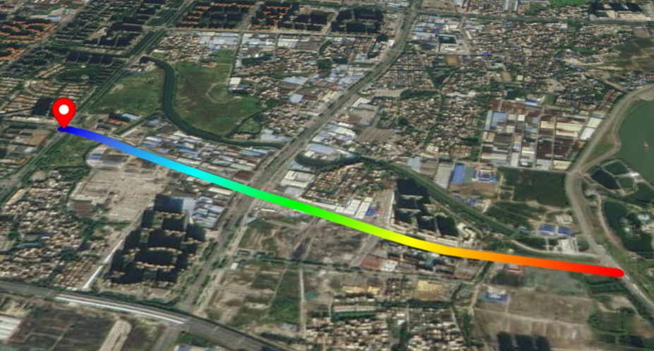
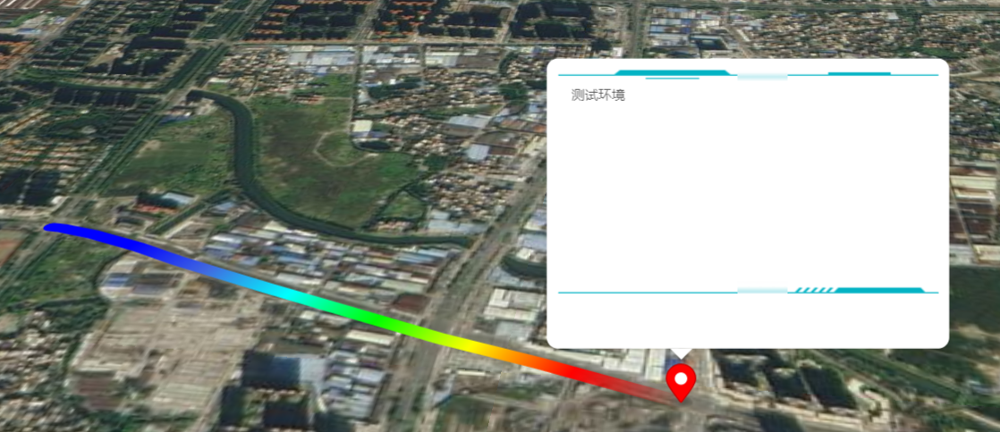
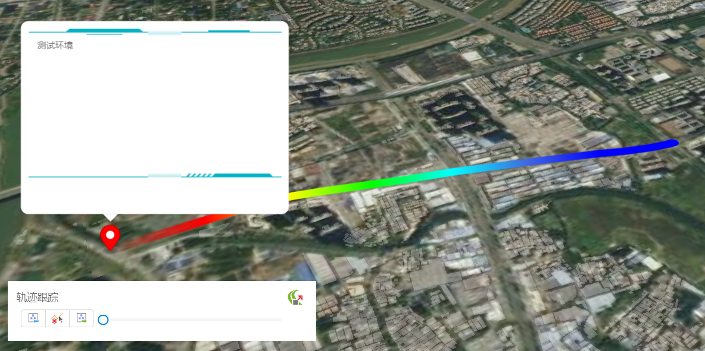

# 轨迹跟踪

> mapgis-tracker-layer



```vue
<mapgis-web-map>
    <mapgis-tracker-layer :geojson="http://localhost:8080/data/tracker.geojson" />
</mapgis-web-map>
```

## 自定义 Popup



```vue
<mapgis-tracker-layer geojson="url">
    <template slot="popup">
        <mapgis-ui-border type="border5" class="mapgis-popup-custom">
        测试环境
        </mapgis-ui-border>
    </template>
</mapgis-tracker-layer>
<style>
.mapboxgl-popup-content {
  background: transparent !important;
}
.mapboxgl-popup-anchor-right .mapboxgl-popup-tip {
  border-left-color: #03b3c4 !important;
}
.mapboxgl-popup-anchor-left .mapboxgl-popup-tip {
  border-right-color: #03b3c4 !important;
}
.mapboxgl-popup-anchor-top .mapboxgl-popup-tip {
  border-bottom-color: #03b3c4 !important;
}
.mapboxgl-popup-anchor-bottom .mapboxgl-popup-tip {
  border-top-color: #03b3c4 !important;
}
</style>
```

## 控制器



## 属性

### `geojson`

- **类型:** `String | Object`
- **必传属性**
- **非侦听属性**
- **描述:** geojson 格式数据,必须是线数据
- **查看:** [官方聚类文档](https://docs.mapbox.com/mapbox-gl-js/example/heatmap-layer/)

### `follow`

- **类型:** `Boolean`
- **非侦听属性**
- **默认值** `false`
- **描述:** 视角是否跟随

### `bearing`

- **类型:** `Boolean`
- **非侦听属性**
- **默认值** `false`
- **描述:** 第三人称视角旋转播放
