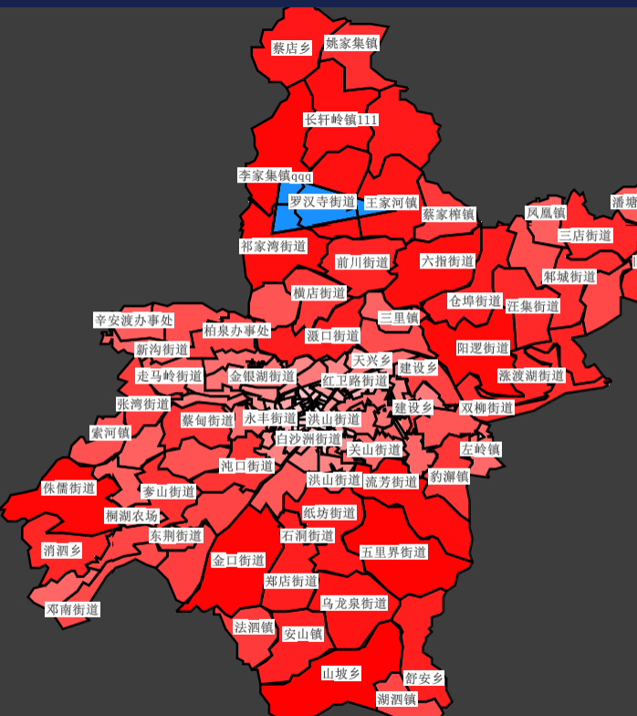

# MvtStyleLayer

::: tip
Mapbox GL JS Style:  
[Mapbox 矢量瓦片样式 MVT](https://docs.mapbox.com/help/glossary/style/)
:::

## 属性

### `mvtStyle`

- **类型:** `Object | String`
- **侦听属性** watch 属性
- **描述:** Mapbox 矢量瓦片样式.
- **查看:** `Mvt` in [Mapbox Style Spec](https://docs.mapbox.com/mapbox-gl-js/style-spec)

### `mode`

- **类型:** `String`
- **非侦听属性** 非 watch 属性
- **默认值** `merge`
- **描述:** 样式显示模式 ['merge', 'add', 'set']

  - `merge`-合并. 在当前样式上合并 Mvt 样式，内部会自动对比图层进行覆盖
    ```js
    mergeLayers(olds, news) {
      news = news || [];
      if (!olds) return [].concat(news);
      let merges = olds.map((layer) => {
        let find = news.find((l) => l.id === layer.id);
        return find && find.length > 0 ? find[0] : layer;
      });
      let unmerges = news.filter((layer) => {
        let find = merges.find((l) => l.id === layer.id);
        return find ? false : true;
      });
      return merges.concat(unmerges);
    },
    let mvtStyle = async compareStyle(mvtStyle) {
      let oldStyle = this.map.getStyle();
      let newStyle = await this.$_getStyleObject(mvtStyle);
      let style = {
        version: oldStyle.version || newStyle.version,
        sprite: oldStyle.sprite || newStyle.sprite,
        glyphs: oldStyle.glyphs || newStyle.glyphs,
        sources: { ...oldStyle.sources, ...newStyle.sources },
        layers: this.mergeLayers(oldStyle.layers, newStyle.layers);
      };
      return style;
    },
    this.map.setStyle(mvtStyle, { diff: true });
    ```
  - `add`-追加. 在当前样式上追加 Mvt 样式，内部会自动对比图层进行覆盖

    ```js
    addLayers(olds, news) {
      news = news || [];
      if (!olds) return [].concat(news);
      let filters = olds.filter((layer) => {
        let find = news.find((l) => l.id === layer.id);
        return find ? false : true;
      });
      return filters.concat(news);
    },
    let mvtStyle = async compareStyle(mvtStyle) {
      let oldStyle = this.map.getStyle();
      let newStyle = await this.$_getStyleObject(mvtStyle);
      let style = {
        version: oldStyle.version || newStyle.version,
        sprite: oldStyle.sprite || newStyle.sprite,
        glyphs: oldStyle.glyphs || newStyle.glyphs,
        sources: { ...oldStyle.sources, ...newStyle.sources },
        layers: this.addLayers(oldStyle.layers, newStyle.layers);
      };
      return style;
    },
    this.map.setStyle(mvtStyle, { diff: true });
    ```

  - `set`-覆盖.
    ```js
    this.map.setStyle(mvtStyle, { diff: true });
    ```

## 事件

### `@added`

- **描述:** 在矢量瓦片加载完毕后发送该事件
- **Payload** `{ this }`
- - `this` 当前组件自身引用

## 可见性控制 & 排序

### 可见性控制

| 原图        | √ 存在专题图 - 显示 | × 存在专题图 - 隐藏 | √ 不存在专题图 - 显示 | × 不存在专题图 - 隐藏 |
| :---------- | :------------------ | :------------------ | :-------------------- | :-------------------- |
| 原图层 A    | 可见，透明度 为 0   | 不可见              | 可见                  | 不可见                |
| 专题图层 A1 | 可见                | 不可见              | 不存在                | 不存在                |
| 专题图层 A2 | 可见                | 不可见              | 不存在                | 不存在                |
| 专题图层 A3 | 可见                | 不可见              | 不存在                | 不存在                |

### 场景模拟演示

武汉市

1. 激活专题图
   此时的场景是 
   1. 武汉市(原图层) 可见透明度为 0
   2. 武汉市\_单值专题图 可见
   3. 武汉市*单值专题图*线 可见
   4. 武汉市*单值专题图*注记 可见
2. 隐藏专题图 - 将图层武汉市的可见性设置为不可见
   此时的场景是 
   1. themelayer.hide()
      > 由于专题图的可见性控制是通过专题图组件的 show/hide 方式进行控制的，因此调用 hide 方法生成 ["武汉市(不可见)","武汉市_单值专题图(不可见)","武汉市_单值专题图_线(不可见)","武汉市_单值专题图_注记(不可见)]
   2. 此时的场景是 mergeLayers(olds, news)
      1. olds = ["背景","mapgis-default-empty","武汉市_单值专题图","武汉市_单值专题图_线","武汉市_单值专题图_注记] 全部可见
         > 由于"背景","mapgis-default-empty"是默认内置图层， XXX\_专题图是专题图控件维护的图层，MVT 组件本身不维护其内部的排序顺序。其内部顺序由维护它的组件独立维护。
      2. news = ["武汉市(不可见)" ]
         > news 对应的就是 mvt 组件维护的内部的图层数组，需要内部维护顺序，同时如果存在外部的类似专题图控件之类的图层组件，需要按照对应组件的业务进行图层重排序和合并操作。
      3. 合并后的图层 ["背景","mapgis-default-empty","武汉市(不可见)","武汉市_单值专题图(不可见)","武汉市_单值专题图_线(不可见)","武汉市_单值专题图_注记(不可见)]
3. 显示专题图 - 将图层武汉市的可见性设置为可见
   此时的场景是

### 排序

由于 add set 的排序方式较为简单 属于基本的尾部追加和原始替换，本文重点讲解 merge 合并的排序方式

1. 无专题图排序
   图层 A -> 图层 B
2. 有专题图排序
   1. 原始专题图排序
      B b: C a: null
      C b: A a:
