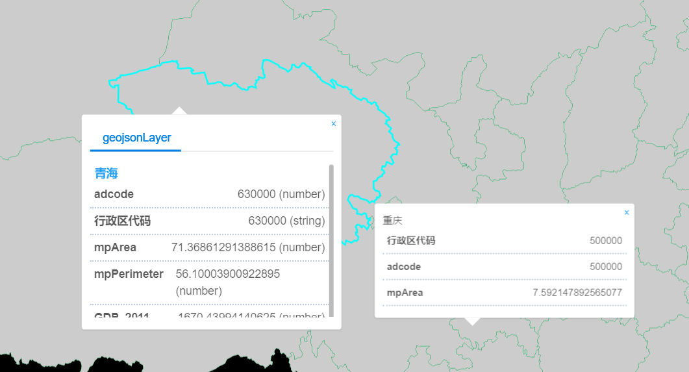
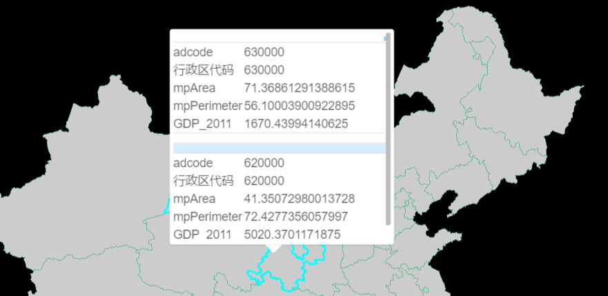
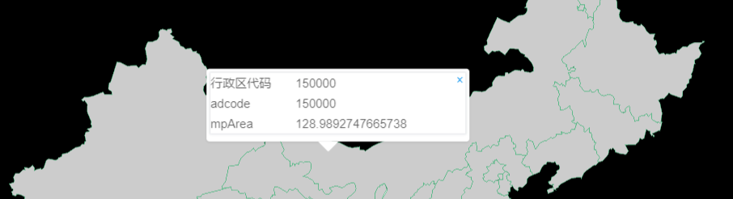
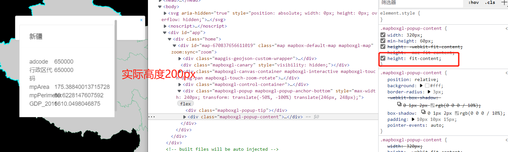
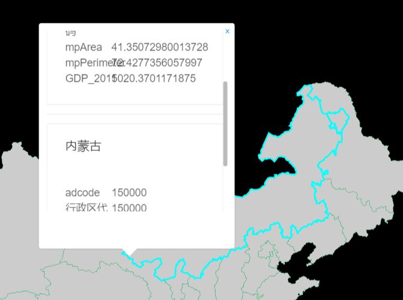

# GeoJSON 图层

> mapgis-geojson-layer



## 属性

公共属性 [layers props](/api/Layers/README.md#props)

### `data`

- **类型:** `Object | String`
- **非侦听属性** 必传项
- **描述:** A source containing GeoJSON or URL to it. source 的 data 值，GeoJSON 对象或者 GeoJSON 数据的 url
- **查看:** `GeoJSONSource` in [Mapbox API Docs](https://docs.mapbox.com/mapbox-gl-js/api/#geojsonsource)

### `layerId`

- **类型:** `String`
- **非侦听属性** 必传项
- **描述:** 图层的 id 值

### `enablePopup`

- **类型:** `Boolean`
- **非侦听属性**
- **描述:** 是否开启 popup 弹窗

### `popupOptions`

- **类型:** `Object`
- **非侦听属性**
- **描述:** popup 弹窗时的配置参数,popupOptions 对象中 title 指弹窗的标题，展示 geojson 数据中的某一个字段属性，fields 展示列表，由传参者决定展示哪些字段值
- **格式:**
  ```bash
  eg:
  popupOptions: {
  title: "name",
  fields: ["acroutes", "adcode"]
  }
  ```

### `enableTips`

- **类型:** `Boolean`
- **非侦听属性**
- **描述:** 是否开启 tooltip 弹窗

### `tipsOptions`

- **类型:** `Object`
- **非侦听属性**
- **描述:** tooltip 弹窗时的配置参数，tipsOptions 对象中 title 指弹窗的标题，展示 geojson 数据中的某一个字段属性，fields 展示列表，由传参者决定展示哪些字段值
- **格式:**

  ```bash
  eg:
  tipsOptions: {
  title: "name",
  fields: ["acroutes", "adcode"]
  }
  ```

  ### `customPopup`

- 
- **类型:** `Function`
- **描述:** JSX 风格的自定义 popup 样式内容, (features) => {}, features 为选中或者点击的样式
- 详情请看下面的示例
- **示例**

```vue
<template>
  <mapgis-web-map
    zoom:sync="zoom"
    class="map"
    v-bind="{ ...mapOptions }"
    :zoom.sync="zoom"
    :center.sync="center"
  >
    <mapgis-geojson-layer v-bind="{ ...geojson }" />
  </mapgis-web-map>
</template>

<script>
export default {
  name: "custom-popup",
  props: {
    msg: String
  },
  watch: {
    center: function(next) {
      this.rightmap && this.rightmap.setCenter(next);
    }
  },
  data() {
    return {
      zoom: 3,
      center: [117.4058, 38.914],
      orientation: "vertical",
      mapOptions: {
        zoom: 3,
        center: [117.4058, 38.914],
        crs: "EPSG:3857"
      },
      geojson: {
        layer: {
          type: "fill",
          source: "geojson_source_id", //必须和上面的geojsonCollections一致
          filter: ["==", "$type", "Polygon"], //关键点：$type是固定语法，类型是Point、LineString、Polygon
          layout: {
            visibility: "visible" //是否可见  visible / none
          },
          paint: {
            "fill-antialias": true, //抗锯齿，true表示针对边界缝隙进行填充
            "fill-color": "#FFFFFF", //颜色
            "fill-opacity": 0.8, //透明度
            "fill-outline-color": "#52B883" //边线颜色，没错,确实没有边线宽度这个选项
            //"fill-pattern":"picture_name", //线的拉伸图片类型，一定要与对应的样式库的图片名字一一对应
            //"fill-translate": [0,0] //表示显示位置基于原始位置上,再按照屏幕坐标进行偏移,这个应该绝大部分都用不上
          }
        },
        layerId: "geojsonLayer",
        data: "http://develop.smaryun.com/static/data/geojson/china.geojson",
        sourceId: "geojson_source_id",
        enablePopup: true,
        enableTips: false,
        popupOptions: {
          title: "name",
          fields: ["adcode", "行政区代码", "mpArea", "mpPerimeter", "GDP_2011"]
        },
        tipsOptions: {
          title: "name",
          fields: ["行政区代码", "adcode", "mpArea"]
        },
        customPopup: features => (
          <mapgis-ui-list class="custom-popup" item-layout="horizontal">
            {features.map(feature => {
              return (
                <mapgis-ui-list-item>
                  <mapgis-ui-div
                    title={feature.title}
                    style={{ width: "100%" }}
                  >
                    {Object.keys(feature.properties).map(p => {
                      return (
                        <mapgis-ui-row>
                          <mapgis-ui-col span={8}>{p}</mapgis-ui-col>
                          <mapgis-ui-col span={16}>
                            {feature.properties[p]}
                          </mapgis-ui-col>
                        </mapgis-ui-row>
                      );
                    })}
                  </mapgis-ui-div>
                </mapgis-ui-list-item>
              );
            })}
          </mapgis-ui-list>
        ),
        customTips: features => {
          if (features.length <= 0) {
            return <div class="custom-tips">未选中</div>;
          } else {
            return (
              <mapgis-ui-div class="custom-tips" title={features[0]}>
                {Object.keys(features[0].properties).map(p => {
                  return (
                    <mapgis-ui-row>
                      <mapgis-ui-col span={8}>{p}</mapgis-ui-col>
                      <mapgis-ui-col span={16}>
                        {features[0].properties[p]}
                      </mapgis-ui-col>
                    </mapgis-ui-row>
                  );
                })}
              </mapgis-ui-div>
            );
          }
        }
      }
    };
  },
  methods: {
    handleRightMap(e) {
      console.log("e", e);
      this.rightmap = e.map;
    }
  }
};
</script>

<style>
.map {
  height: 100vh;
  width: 100vw;
}
.custom-popup {
  position: absolute;
  z-index: 2000;
  height: 240px;
  overflow-y: scroll;
}
.mapboxgl-popup-content {
  width: 260px !important;
  height: 250px !important;
  padding: 4px !important;
}
</style>
```

### `customTips`

- 
- **类型:** `Function`
- **描述:** JSX 风格的自定义 tips 样式内容, (features) => {}, features 为选中或者点击的样式
- 详情请看下面的示例
- **示例**

```vue
<template>
  <mapgis-web-map
    zoom:sync="zoom"
    class="map"
    v-bind="{ ...mapOptions }"
    :zoom.sync="zoom"
    :center.sync="center"
  >
    <mapgis-geojson-layer v-bind="{ ...geojson }" />
  </mapgis-web-map>
</template>

<script>
export default {
  name: "custom-popup",
  props: {
    msg: String
  },
  watch: {
    center: function(next) {
      this.rightmap && this.rightmap.setCenter(next);
    }
  },
  data() {
    return {
      zoom: 3,
      center: [117.4058, 38.914],
      orientation: "vertical",
      mapOptions: {
        zoom: 3,
        center: [117.4058, 38.914],
        crs: "EPSG:3857"
      },
      geojson: {
        layer: {
          type: "fill",
          source: "geojson_source_id", //必须和上面的geojsonCollections一致
          filter: ["==", "$type", "Polygon"], //关键点：$type是固定语法，类型是Point、LineString、Polygon
          layout: {
            visibility: "visible" //是否可见  visible / none
          },
          paint: {
            "fill-antialias": true, //抗锯齿，true表示针对边界缝隙进行填充
            "fill-color": "#FFFFFF", //颜色
            "fill-opacity": 0.8, //透明度
            "fill-outline-color": "#52B883" //边线颜色，没错,确实没有边线宽度这个选项
            //"fill-pattern":"picture_name", //线的拉伸图片类型，一定要与对应的样式库的图片名字一一对应
            //"fill-translate": [0,0] //表示显示位置基于原始位置上,再按照屏幕坐标进行偏移,这个应该绝大部分都用不上
          }
        },
        layerId: "geojsonLayer",
        data: "http://develop.smaryun.com/static/data/geojson/china.geojson",
        sourceId: "geojson_source_id",
        enablePopup: false,
        enableTips: true,
        popupOptions: {
          title: "name",
          fields: ["adcode", "行政区代码", "mpArea", "mpPerimeter", "GDP_2011"]
        },
        tipsOptions: {
          title: "name",
          fields: ["行政区代码", "adcode", "mpArea"]
        },
        customPopup: features => (
          <mapgis-ui-list class="custom-popup" item-layout="horizontal">
            {features.map(feature => {
              return (
                <mapgis-ui-list-item>
                  <mapgis-ui-div
                    title={feature.title}
                    style={{ width: "100%" }}
                  >
                    {Object.keys(feature.properties).map(p => {
                      return (
                        <mapgis-ui-row>
                          <mapgis-ui-col span={8}>{p}</mapgis-ui-col>
                          <mapgis-ui-col span={16}>
                            {feature.properties[p]}
                          </mapgis-ui-col>
                        </mapgis-ui-row>
                      );
                    })}
                  </mapgis-ui-div>
                </mapgis-ui-list-item>
              );
            })}
          </mapgis-ui-list>
        ),
        customTips: features => {
          if (features.length <= 0) {
            return <div class="custom-tips">未选中</div>;
          } else {
            return (
              <mapgis-ui-div class="custom-tips" title={features[0]}>
                {Object.keys(features[0].properties).map(p => {
                  return (
                    <mapgis-ui-row>
                      <mapgis-ui-col span={8}>{p}</mapgis-ui-col>
                      <mapgis-ui-col span={16}>
                        {features[0].properties[p]}
                      </mapgis-ui-col>
                    </mapgis-ui-row>
                  );
                })}
              </mapgis-ui-div>
            );
          }
        }
      }
    };
  },
  methods: {
    handleRightMap(e) {
      console.log("e", e);
      this.rightmap = e.map;
    }
  }
};
</script>

<style>
.map {
  height: 100vh;
  width: 100vw;
}
.custom-popup {
  position: absolute;
  z-index: 2000;
  height: 240px;
  overflow-y: scroll;
}
.custom-tips {
  position: absolute;
  z-index: 9999;
  height: 80px;
  width: 90%;
}
.mapboxgl-popup-content {
  width: 260px !important;
  height: 90px !important;
  padding: 4px !important;
}
</style>
```

常见问题-样式溢出
| 修复前 | 修复后 |
| :--------------------------------------------------- | :------------------------------------------------------- |
|  |  |
::: warning
需要自己再应用层更具实际高度覆盖内部的样式

```css
.mapboxgl-popup-content {
  width: 260px !important;
  height: 300px !important;
}
```

:::

## 计算属性/方法

### `getSourceFeatures(filter?)`

- **参数**
  - `filter` `Array` A filter to limit query results.
- **描述:** Returns an array of GeoJSON Feature objects from assosiated source filtered by `filter`.
- **查看** `.querySourceFeatures()` [map method](https://docs.mapbox.com/mapbox-gl-js/api/#map#querysourcefeatures)

### `getRenderedFeatures(geometry, filter)`

- **参数**
  - `filter` `Array` A filter to limit query results.
  - `geometry` `Array | Object` The geometry of the query region.
- **描述:** Returns an array of visible GeoJSON Feature objects from assosiated source filtered by `filter`.
- **查看** `.queryRenderedFeatures()` [map method](https://docs.mapbox.com/mapbox-gl-js/api/#map#queryrenderedfeatures)

### `getClusterExpansionZoom(clusterId)`

- **参数**
  - `clusterId` `Number` The value of the cluster's cluster_id property.
- **描述:** For clustered sources, fetches the zoom at which the given cluster expands and returns `Promise` with zoom level as payload.
- **查看** `.getClusterExpansionZoom()` [GeoJSONSource method](https://docs.mapbox.com/mapbox-gl-js/api/#geojsonsource#getclusterexpansionzoom)

### `getClusterChildren(clusterId)`

- **参数**
  - `clusterId` `Number` The value of the cluster's cluster_id property.
  - `limit` `Number` The maximum number of features to return.
  - `offset` `Number` The number of features to skip (e.g. for pagination).
- **描述:** For clustered sources, fetches the original points that belong to the cluster and returns `Promise` with an `Array` of GeoJSON features as payload.
- **查看** `.getClusterChildren()` [GeoJSONSource method](https://docs.mapbox.com/mapbox-gl-js/api/#geojsonsource#getclusterchildren)

### `getClusterLeaves(clusterId, limit, offset)`

- **参数**
  - `filter` `Array` A filter to limit query results.
  - `geometry` `Array | Object` The geometry of the query region.
- **描述:** Returns `Promise` with an array of visible GeoJSON Feature objects from assosiated source filtered by `filter` in the payload.
- **查看** `.getClusterLeaves()` [GeoJSONSource method](https://docs.mapbox.com/mapbox-gl-js/api/#geojsonsource#getclusterleaves)

## 方法

### `setFeatureState(featureId, state)`

- **参数**
  - `featureId` `String | Number` Feature identifier.
  - `state` `Object` A set of key-value pairs. The values should be valid JSON types.
- **描述:** Sets the state of a feature. The state object is merged in with the existing state of the feature.
- **查看** `.setFeatureState()` [map method](https://docs.mapbox.com/mapbox-gl-js/api/#map#setfeaturestate)

### `getFeatureState(featureId)`

- **参数**
  - `featureId` `String | Number` Feature identifier.
- **描述:** Gets the state of a feature.
- **查看** `.getFeatureState()` [map method](https://docs.mapbox.com/mapbox-gl-js/api/#map#getfeaturestate)

### `removeFeatureState(featureId?, sourceLayer?, key?)`

- **参数**
  - `featureId` `String | Number` Feature identifier.
  - `sourceLayer` `string` Source layer id.
  - `key` `string` The key in the feature state to reset.
- **描述:** Removes feature state, setting it back to the default behavior. If no featureId or key is specified, removes all states of that source. If featureId is also specified, removes all keys for that feature's state. If key is also specified, removes that key from that feature's state.
- **查看** `.removeFeatureState()` [map method](https://docs.mapbox.com/mapbox-gl-js/api/#map#removefeaturestate)

## 事件

公共图层事件 [events](/api/Layers/#events)

## 示例

```vue
<template>
  <mapgis-web-map
    id="map"
    :map-style="mapStyle"
    :zoom="mapZoom"
    :center="outerCenter"
    :crs="mapCrs"
    v-on:load="handleMapLoad"
  >
    <mapgis-geojson-layer
      :data="dataUrl"
      :source-id="geojsonSourceId1"
      :layer="fillLayer"
      :layer-id="fillLayerId"
      :enablePopup="enablePopup"
      :popupOptions="popupContent"
      :enableTips="enableTips"
      :tipsOptions="tipsContent"
    >
    </mapgis-geojson-layer>
  </mapgis-web-map>
</template>

<script>
export default {
  name: "mapboxGeojsonMangerLayer",
  data() {
    return {
      layersIdArr: ["circleid", "fillid", "lineid"],
      mapStyle: {
        version: 8,
        sources: {},
        layers: []
      },
      mapZoom: 10,
      outerCenter: [114.3, 30.5],
      mapCrs: "EPSG:4326",
      layer: "img",
      tileMatrixSet: "c",
      format: "tiles",
      token: {
        key: "tk",
        value: "f5347cab4b28410a6e8ba5143e3d5a35"
      },
      enablePopup: true,
      enableTips: true,
      geojsonSourceId1: "geojsonCollections1",
      dataUrl: "http://localhost:8080/data/china.json",
      fillLayerId: "fillid",
      fillLayer: {
        type: "fill",
        source: "geojsonCollections1", //必须和上面的geojsonCollections一致
        // "filter": ["==", "$type", "Polygon"], //关键点：$type是固定语法，类型是Point、LineString、Polygon
        layout: {
          visibility: "visible" //是否可见  visible / none
        },
        paint: {
          "fill-antialias": true, //抗锯齿，true表示针对边界缝隙进行填充
          "fill-color": "#000", //颜色
          "fill-opacity": 0.8, //透明度
          "fill-outline-color": "#52B883" //边线颜色，没错,确实没有边线宽度这个选项
          //"fill-pattern":"picture_name", //线的拉伸图片类型，一定要与对应的样式库的图片名字一一对应
          //"fill-translate": [0,0] //表示显示位置基于原始位置上,再按照屏幕坐标进行偏移,这个应该绝大部分都用不上
        }
      },
      popupContent: {
        title: "name",
        fields: ["acroutes", "adcode"]
      },
      tipsContent: {
        title: "name"
      }
    };
  },
  methods: {
    handleMapLoad(payload) {
      let vm = this;
      this.map = payload.map;
      window.map = payload.map;
    }
  }
};
</script>

<style scoped></style>
```
