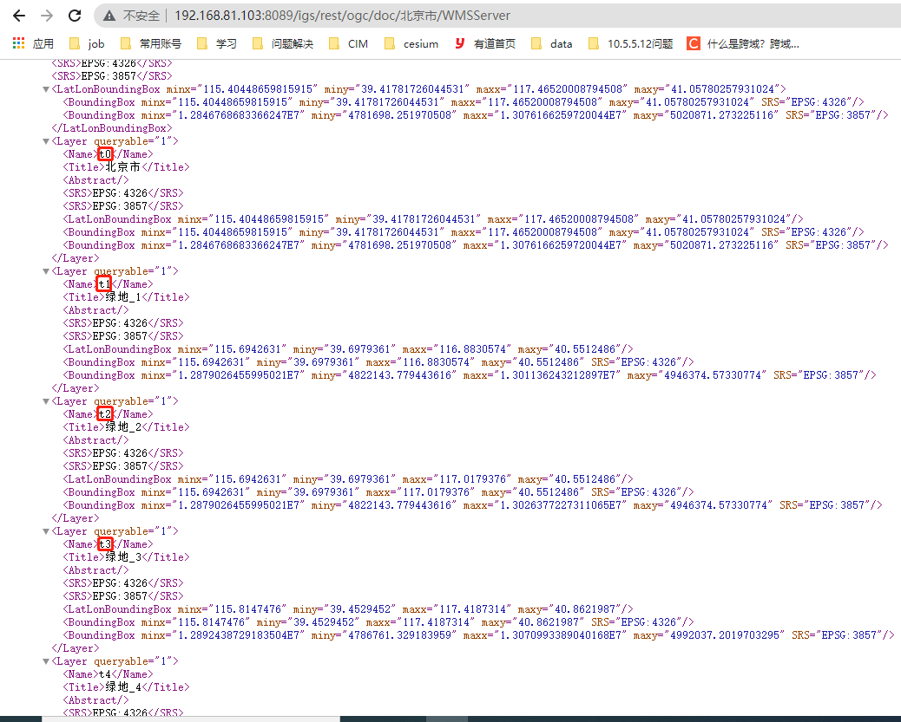

<!-- # IgsWmsLayer -->

## 属性

All common [layers props](/api/Layers/README.md#props)

### `source`

- **类型:** `Object | String`
- **非侦听属性**
- **描述:** A raster tile source.
- **参考:** `Raster source` in [Mapbox Style Spec](https://docs.mapbox.com/mapbox-gl-js/style-spec/#sources-raster)

### `url`

- **类型:** `String`
- **默认值:** `null`
- **非侦听属性**
- **Watch**
- **描述:** 完整的地图请求路径。当 url 不为空时，除了 tileSize，其他参数无效

### `tileSize`

- **类型:** `Number`
- **默认值:** `512`
- **非侦听属性**
- **描述:** 输出瓦片大小。

### `domain`

- **类型:** `String`
- **默认值:** `null`
- **非侦听属性**
- **描述:** igs 服务域名。(domain 和（protocol，ip，port）二选一)
- **示例:** `http://localhost:6163`

### `protocol`

- **类型:** `String`
- **默认值:** `location.protocol.split(":")[0] || "http"`
- **非侦听属性**
- **描述:** igs 服务网络协议。(domain 和（protocol，ip，port）二选一)

### `ip`

- **类型:** `String`
- **默认值:** `localhost`
- **非侦听属性**
- **描述:** igs 服务 ip。(domain 和（protocol，ip，port）二选一)

### `port`

- **类型:** `String`
- **默认值:** `6163`
- **非侦听属性**
- **描述:** igs 服务 port。(domain 和（protocol，ip，port）二选一)

### `serverType`

- **类型:** `String`
- **必传**
- **非侦听属性**
- **描述:** 服务类型。doc | layer,其中 doc 表示基于 IGServer 地图文档发布的 wms，layer 表示基于 IGServer 图层发布的 wms

### `serverName`

- **类型:** `String`
- **必传**
- **非侦听属性**
- **描述:** 服务名

### `layers`

- **类型:** `Array`
- **必传**
- **非侦听属性**
- **描述:** 请求的图层名集合
- **图层名获取方式**
  1. IGS发布的WMS服务。通过图层的基地址（如`http://192.168.81.103:8089/igs/rest/ogc/doc/北京市/WMSServer`），查询地图图层信息。其中图层信息中的 `Name` 字段即为传入layers中的图层名
  

### `version`

- **类型:** `String`
- **默认值:** `1.1.1`
- **非侦听属性**
- **描述:** 请求的版本号。1.1.1|1.3.0

### `crs`

- **类型:** `String`
- **默认值:** `EPSG:4326`
- **非侦听属性**
- **描述:** 空间坐标参考系。

### `format`

- **类型:** `String`
- **默认值:** `image/png`
- **非侦听属性**
- **描述:** 输出图象的类型。image/gif | image/png | image/jpeg

### `width`

- **类型:** `Number`
- **默认值:** `512`
- **非侦听属性**
- **描述:** 输出地图图片的象素宽

### `height`

- **类型:** `Number`
- **默认值:** `512`
- **非侦听属性**
- **描述:** 输出地图图片的象素高

## 事件

All common layer [events](/api/Layers/#events)

## 示例

### 中地格式

```vue
<template>
  <mapgis-web-map 
    class="main"
    :accessToken="accessToken"
    :mapStyle="mapStyle"
    :zoom="mapZoom"
    :center="outerCenter"
    :crs="mapCrs"
  >
    <mapbox-igs-wms-layer
      :layer="layer"
      :layerId="layerId"
      :sourceId="sourceId"
      :ip="igsWmsIp"
      :port="igsWmsPort"
      :serverType="igsWmsServerType"
      :serverName="igsWmsServerName"
      :layers="igsWmsLayers"
      :crs="mapCrs"
    >
    </mapbox-igs-wms-layer>
  </mapgis-web-map >
</template>

<script>
import "@mapgis/mapbox-gl/dist/mapbox-gl.css";
import Mapbox from "@mapgis/mapbox-gl";
import { MapgisWebMap, MapboxIgsWmsLayer } from "@mapgis/webclient-vue-mapboxgl";

export default {
  components: {
    MapgisWebMap,
    MapboxIgsWmsLayer
  },
  data() {
    return {
      accessToken:
        "pk.eyJ1IjoicGFybmRlZWRsaXQiLCJhIjoiY2o1MjBtYTRuMDhpaTMzbXhpdjd3YzhjdCJ9.sCoubaHF9-nhGTA-sgz0sA", // 使用mapbox样式需要的秘钥
      mapStyle: "mapbox://styles/mapbox/light-v9", // 地图样式
      mapZoom: 3, // 地图初始化级数
      outerCenter: [130, 30], // 地图显示中心
      mapCrs: "EPSG:3857",

      layerId: "igsLayer_layerId",
      sourceId: "igsLayer_sourceId",
      layer: {}, // 图层配置信息
      igsWmsIp: "localhost", // igs服务ip
      igsWmsPort: "6163", // igs服务port
      igsWmsServerType: "doc", // wms服务类型
      igsWmsServerName: "省级行政区3857", // wms服务名
      igsWmsLayers: ["省级行政区x"] // 请求的图层名集合
    };
  },

  created() {
    // 在组件中使用mapbox-gl.js的脚本库功能
    this.mapbox = Mapbox;
  }
};
</script>

<style lang="css">
.main {
  height: 600px;
  width: 100%;
}
</style>
```

### 标准 URL 传参

```vue
<template>
  <mapgis-web-map 
    class="main"
    :accessToken="accessToken"
    :mapStyle="mapStyle"
    :zoom="mapZoom"
    :center="outerCenter"
    :crs="mapCrs"
  >
    <mapbox-igs-wms-layer
      :layer="layer"
      :layerId="layerId"
      :sourceId="sourceId"
      :url="url"
    >
    </mapbox-igs-wms-layer>
  </mapgis-web-map >
</template>

<script>
import "@mapgis/mapbox-gl/dist/mapbox-gl.css";
import Mapbox from "@mapgis/mapbox-gl";
import { MapgisWebMap, MapboxIgsWmsLayer } from "@mapgis/webclient-vue-mapboxgl";

export default {
  components: {
    MapgisWebMap,
    MapboxIgsWmsLayer
  },
  data() {
    return {
      accessToken:
        "pk.eyJ1IjoicGFybmRlZWRsaXQiLCJhIjoiY2o1MjBtYTRuMDhpaTMzbXhpdjd3YzhjdCJ9.sCoubaHF9-nhGTA-sgz0sA", // 使用mapbox样式需要的秘钥
      mapStyle: "mapbox://styles/mapbox/light-v9", // 地图样式
      mapZoom: 3, // 地图初始化级数
      outerCenter: [130, 30], // 地图显示中心
      mapCrs: "EPSG:4326",

      layerId: "igsLayer_layerId",
      sourceId: "igsLayer_sourceId",
      url:
        "http://develop.smaryun.com:6163/igs/rest/ogc/doc/OGC_4326_CHINA/WMSServer?service=WMS&request=GetMap&layers=背景图,中国,省级行政区,首都点,省会城市&styles=&format=image/png&transparent=false&version=1.1.1&width=256&height=256&srs=EPSG:4326&bbox={bbox}"
    };
  },

  created() {
    // 在组件中使用mapbox-gl.js的脚本库功能
    this.mapbox = Mapbox;
  }
};
</script>

<style lang="css">
.main {
  height: 600px;
  width: 100%;
}
</style>
```
