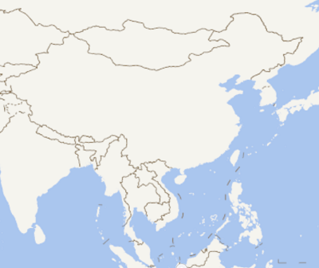

# 栅格图层/通用瓦片

[comment]: <> (# RasterLayer)

> mapgis-rastertile-layer

## 属性

All common [layers props](/api/Layers/README.md#props)

### `source`

- **类型:** `Object | String`
- **非侦听属性**
- **描述:** 栅格瓦片源
- **参考:** `Raster source` in [Mapbox Style Spec](https://docs.mapbox.com/mapbox-gl-js/style-spec/#sources-raster)
  
#### `source-tileSize`
 - **类型:** `Number`
- **默认值:** `512`
- **描述:** 加载瓦片的大小，如果数据瓦片本身是256大小的设置512大小会被强制拉伸至512大小。

| 512                     | 256                     |
| :---------------------- | :---------------------- |
|  |  |

::: tip 天地图模糊
请传入tileSize为256即可
``` vue
<mapgis-rastertile-layer :source="{'tileSize': 256}" />
```
:::

``` vue
<template>
  <div class="hello">
    <mapgis-web-map crs="EPSG:4326" :center="[107.19, 26.85]" :zoom="3">
        <mapgis-rastertile-layer
            layerId="tdt"
                :source="rastersource"
                url="http://t0.tianditu.com/DataServer?T=vec_c&L={z}&Y={y}&X={x}&tk=9c157e9585486c02edf817d2ecbc7752"
            />
    </mapgis-web-map>
</template>
<script>
export default {
    data() {
        return {
            rastersource: {
                tileSize: 256,
            },
        }
    }
}
</script>
```

## 事件

All common layer [events](/api/Layers/#events)
