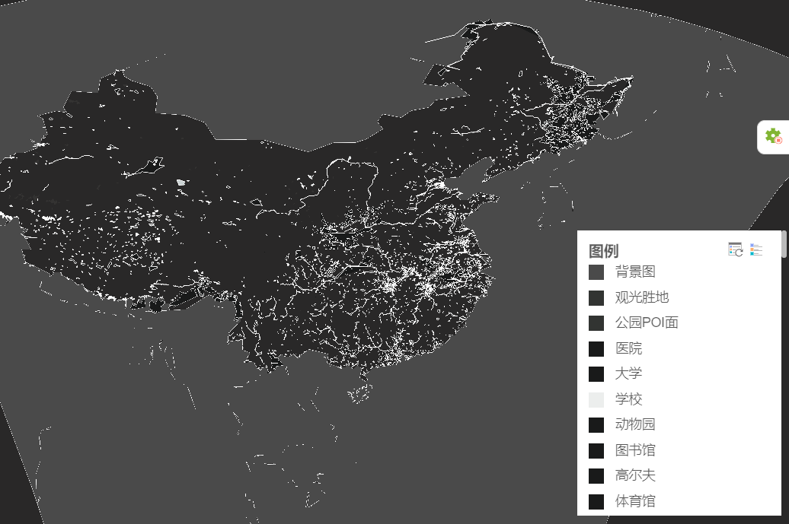

# 图例 - MVT 风格图例

> mapgis-mvt-legend



## 示例

::: demo

```html
<template>
  <mapgis-web-map class="mapgis-2d-map" v-bind="{ ...mapOptions }">
    <mapgis-mvt-legend :outStyle="legendStyle"></mapgis-mvt-legend>
  </mapgis-web-map>
</template>

<script>
  export default {
    components: {
      "mapgis-web-map": window.Mapgis2d.MapgisWebMap,
      "mapgis-mvt-legend": window.Mapgis2d.MapgisMvtLegend
    },
    data() {
      return {
        mapOptions: {
          crs: "EPSG:4326", //经纬度一定要设置crs参数
          maxBounds: [
            [-180, -90],
            [180, 90]
          ],
          zoom: 2,
          center: [110, 30],
          //设置地图样式信息
          mapStyle:
            "http://develop.smaryun.com:6163/igs/rest/mrms/vtiles/styles/OSM全中国经纬度.json"
        },
        legendStyle: {
          position: "absolute",
          zIndex: 900,
          right: "5px",
          bottom: "10px",
          maxHeight: "300px",
          width: "220px"
        }
      };
    }
  };
</script>

<style>
  .mapgis-2d-map {
    height: 300px;
  }
</style>
```

:::

## 属性

### `outStyle`

- **类型:** `Object`
- **默认值:** `{ left: "10px", top: "10px" }`
- **非侦听属性**
- **描述:** 图例默认显示位置与大小

### `visible`

- **类型:** `Boolean`
- **默认值:** `true`
- **非侦听属性**
- **V-Model 属性**
- **描述:** 显示可见性

| 浅色图例                        | 深色图例                       | 收缩状态                           |
| :------------------------------ | :----------------------------- | :--------------------------------- |
|  |  |  |

## 方法

### refresh

- **描述:** 强行刷新渲染图例
- 
