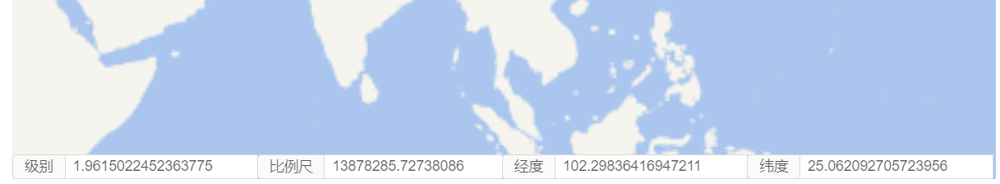

# 状态栏

> mapgis-state



## 示例

```vue
<template>
  <mapgis-web-map>
    <mapgis-state></mapgis-state>
  </mapgis-web-map>
</template>
```

## 属性

### `default`

- **类型:** `Boolean`
- **默认值:** `true`
- **非侦听属性**
- **描述:** 是否启用默认的 UI

### `scale`

- **类型:** `Boolean`
- **默认值:** `true`
- **非侦听属性**
- **描述:** 是否返回比例尺

### `level`

- **类型:** `Boolean`
- **默认值:** `true`
- **非侦听属性**
- **描述:** 是否返回级别

### `lng`

- **类型:** `Boolean`
- **默认值:** `true`
- **非侦听属性**
- **描述:** 是否返回经度

### `lat`

- **类型:** `Boolean`
- **默认值:** `true`
- **非侦听属性**
- **描述:** 是否返回纬度

## 槽

::: tip

> 自定义界面的时候一定要将 default 设置为`false`
> :::

改机制采取 [作用域插槽](https://cn.vuejs.org/v2/guide/components-slots.html#作用域插槽)机制

```vue
<template>
  <mapgis-web-map>
    <mapgis-state :default="false">
      <template v-slot:default="{ state }">
        <mapgis-ui-input-group
          size="small"
          :compact="compact"
          class="mapgis-test-2d-statebar"
        >
          <mapgis-ui-input
            addon-before="级别"
            :value="state.level"
            class="mapgis-test-2d-statebar-item"
          />
          <mapgis-ui-input
            addon-before="比例尺"
            :value="state.scale"
            class="mapgis-test-2d-statebar-item"
          />
          <mapgis-ui-input
            addon-before="经度"
            :value="state.lng"
            class="mapgis-test-2d-statebar-item"
          />
          <mapgis-ui-input
            addon-before="纬度"
            :value="state.lat"
            class="mapgis-test-2d-statebar-item"
          />
        </mapgis-ui-input-group>
      </template>
    </mapgis-state>
  </mapgis-web-map>
</template>

<style>
.mapgis-test-2d-statebar {
  width: 100%;
  position: absolute;
  left: 0px;
  bottom: 0px;
  z-index: 9999;
}

.mapgis-test-2d-statebar-item {
  width: 25%;
}
</style>
```
