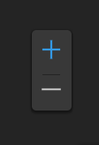
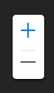
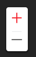

# 图例

> mapgis-zoom



## 示例

```vue
<template>
  <mapgis-web-map>
    <mapgis-zoom></mapgis-zoom>
  </mapgis-web-map>
</template>
```

## 多样化表达

::: tip
多样式表达的能力在 Mapgis-UI 中，请查看 Mapgis-UI 中主题切换的章节
:::

### 主题切换

| 黑暗                    | 浅色                     |
| :---------------------- | :----------------------- |
|  |  |

### 颜色切换

| 蓝色                     | 黄色                      | 红色                   |
| :----------------------- | :------------------------ | :--------------------- |
|  |  |  |
