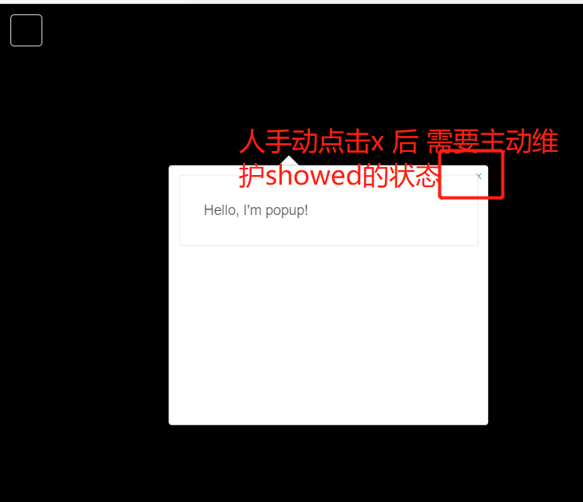

# 气泡

> mapgis-popup

## 属性

### `showed`

- **类型**: `Boolean`
- **非侦听属性**
- **描述:** If `true`, the popup showes immediately after the component is mounted.

- **特殊情况**

1. 常规状态下 showed 和 popup 的状态是同步的
2. 一旦人手动点击右上角的 x 关闭了 popup 此时的 showed 和 popup 的可视化状态是被破坏了
   

```vue
<template>
  <div class="hello">
    <mapgis-web-map class="test-map">
      <mapgis-draw :enable-control="true"> </mapgis-draw>
      <mapgis-ui-button @click="handlePopup" class="test-popup" />
      <mapgis-popup
        :coordinates="coordinates"
        anchor="top"
        :showed="showed"
        ref="popup"
        @close="handleClose"
      >
        <mapgis-ui-card class="box-card">
          <div>Hello, I'm popup!</div>
        </mapgis-ui-card>
      </mapgis-popup>
    </mapgis-web-map>
  </div>
</template>

<script>
export default {
  name: "HelloWorld",
  props: {
    msg: String
  },
  data() {
    return {
      showed: true,
      coordinates: [-111.549668, 39.014]
    };
  },
  methods: {
    handlePopup() {
      this.showed = !this.showed;
    },
    handleClose() {
      this.showed = false;
    }
  }
};
</script>

<style>
.test-map {
  height: 100vh;
}
.test-popup {
  position: absolute;
  top: 10px;
  left: 10px;
  z-index: 1000;
}
</style>
```

### `closeButton`

- **类型**: `Boolean`
- **描述:** If `true`, a close button will appear in the top right corner of the popup.
- **查看:** `closeButton` in [Popup](https://docs.mapbox.com/mapbox-gl-js/api/#popup)

### `closeOnClick`

- **类型**: `Boolean`
- **描述:** If `true`, the popup will closed when the map is clicked.
- **查看:** `closeOnClick` in [Popup](https://docs.mapbox.com/mapbox-gl-js/api/#popup)

### `anchor`

- **类型**: `String`
- **描述:** A string indicating the part of the Popup that should be positioned closest to the Popup location. Options are 'top' , 'bottom' , 'left' , 'right' , 'top-left' , 'top-right' , 'bottom-left' , and 'bottom-right' . If unset the anchor will be dynamically set to ensure the popup falls within the map container with a preference for 'bottom'.
- **查看:** `anchor` in [Popup](https://docs.mapbox.com/mapbox-gl-js/api/#popup)

### `offset`

- **类型**: `Number | Object | Array`
- **描述:** A pixel offset applied to the popup's location.

  - a single number specifying a distance from the popup's location
  - a PointLike specifying a constant offset
  - an object of Points specifing an offset for each anchor position Negative offsets indicate left and up.

- **查看:** `offset` in [Popup](https://docs.mapbox.com/mapbox-gl-js/api/#popup)

### `coordinates`

- **类型**: `Array`
- **描述:** Popup coordinates in format `[longitude, latitude]`
- **查看:** `setLngLat()` in [Popup](https://docs.mapbox.com/mapbox-gl-js/api/#popup#setlnglat)

### `onlyText`

- **类型**: `Boolean`
- **描述:** If `true` content of the Popup treated as plain text
- **查看:** `setText` in [Popup](https://docs.mapbox.com/mapbox-gl-js/api/#popup#settext)

## 槽

### `default`

- **描述:** Slot for Popup content. Can be plain text, HTML or Vue component. If `onlyText` set to `true` content in this slot treated as plaint text.

## 方法

### `.remove()`

- **描述:** Removes popup from the map.
- **返回值** `Popup` MapboxGL popup.
- **查看** [Popup.remove](https://docs.mapbox.com/mapbox-gl-js/api/markers/#popup#remove)

## 事件

### `@added`

- **描述:** Fires when popup added on the map.
- **Payload** `{ popup: Popup }` Object with MapboxGL `Popup` object

### `@removed`

- **描述:** Fires when popup removed the map.
- **Payload** `{ popup: Popup }` Object with MapboxGL `Popup` object

### `@open`

- **描述:** Fires when popup is opened on the map.
- **Payload** `{ popup: Popup }` Object with MapboxGL `Popup` object

### `@close`

- **描述:** Fires when popup is closed on the map.
- **Payload** `{ popup: Popup }` Object with MapboxGL `Popup` object
