# 制图综合

##  AST 语法树策略

### 公式策略

### 属性策略
| name | adccode | 治愈  |
| :--- | :------ | :---- |
| 武汉 | 字符串1 | 数值3 |
| 北京 | 字符串2 | 数值3 |

1. ["to-string", value]
2. ["to-number", value]
3. ["get", value]


``` js 公式组合
// rgb   r  g  b    
// 1. r = ["get", "死亡"] 
// 2. g = 0 
// 3. b = ["-", 100, ["get", "治愈"]]
{
    "fill-color":  [
        "rgb",
        ["get", "死亡"],      
        0,
        ["-", 100, ["get", "治愈"]]
    ]
}

{
   "circle-radius": ["*", 0.05, ["get", "方向"]],
   //  ["*", 0.05, ["to-number", ["get", "方向"]]],
}
```

``` js 属性分段
{
    "property": "治愈",
    "stops": [
        [
            0,
            "#ffffff"
        ],
        [
            10,
            "#ebb8be"
        ],
        [
            50,
            "#ec97a1"
        ],
        [
            100,
            "#f06262"
        ],
        [
            1000,
            "#e91717"
        ]
    ]
}

```

``` js 属性条件
case1 = ["<=", ["get", "某个字段名"], 0]
case2 = ["<=", ["get", "某个字段名"], 100]
case3 = ["<=", ["get", "某个字段名"], 200]

{
    "fill-color":  [
        "case",
        ["<=", ["get", "治愈"], 0],
        '#ff0000',
        ["<=", ["get", "治愈"], 100],
        '#00ff00',
        ["<=", ["get", "治愈"], 200],
        '#0000ff',
        '#ffffff'
    ]
}
```

### 相机策略
``` js
{
    "fill-color": {
      "stops": [
        [3, "rgba(229, 187, 187, 1)"],
        [7, "rgba(115, 9, 9, 1)"]
      ]
    }
}
```

### 组合策略
``` js
[
  "interpolate",
  ["linear"],
  ["zoom"],
  6,
  [
    "interpolate",
    ["exponential", 1],
    ["number", ["get", ""]],
    0,
    "#000000"
  ],
  10,
  [
    "interpolate",
    ["exponential", 1],
    ["number", ["get", ""]],
    0,
    "#000000"
  ]
]
```

## 专题图策略


## 制图策略

常见制图问题分类如下：
1. 道路交通
2. 注记-静态注记/动态注记
3. 符号

### 陆地交通

1. 虚线
   1. 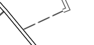
   2. 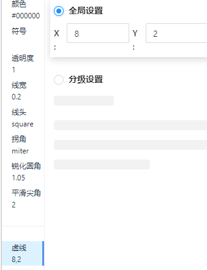
2. 双实线
   1. 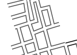
   2. 实现方式1 : 1个宽度为4的黑色底线 铺底 + 宽度为3的白色道路压盖在上层
   3. 实现方式2 : 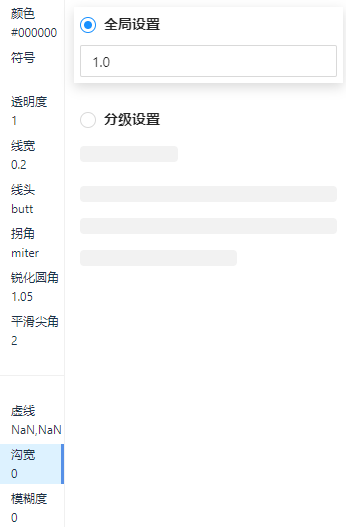 
3. 铺面与主路
   1. 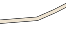
   2. 先生成1个宽度为4的黑色底线 
   3. 再生成1个宽度为3的棕色主路 


### 注记
#### 静态注记

#### 动态注记
1. 道路注记沿线显示
   1. 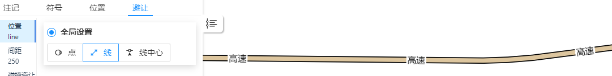
   2. 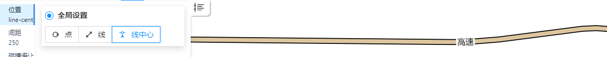
2. 道路注记间距
   1. 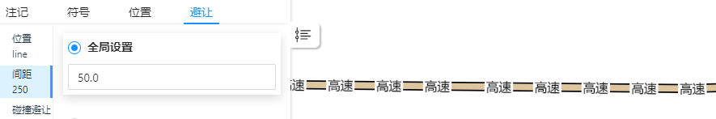
3. 道路注记文字换行
4. 注记避让
   1.   


### 符号

1. 旋转方向
   1. 
   2. 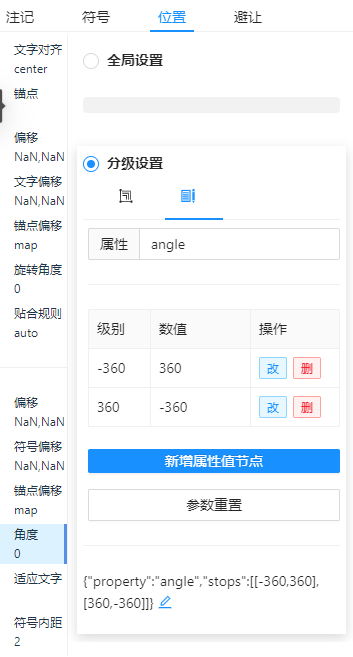
   3. 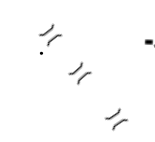

2. 旋转规则
   1. arcgis 地理旋转 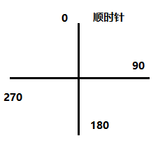
      1. 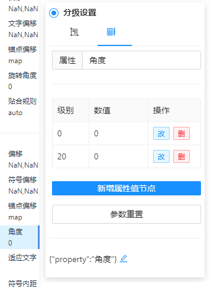
   2. arcgis 算数函数旋转 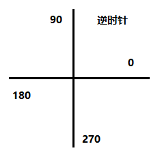
      1. 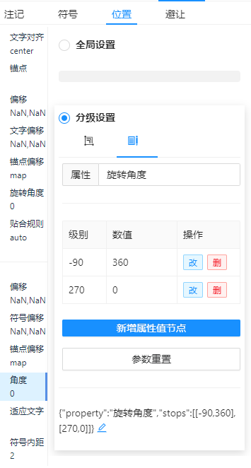
   3. mapbox旋转规则 - mapbox的旋转方式是通过顺时针旋转
   4. mapgis旋转规则 - mapgis的旋转规则是通过逆时针旋转 
      1. 