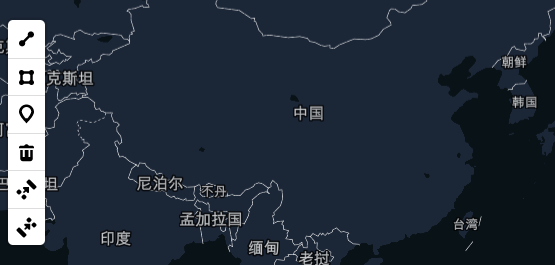
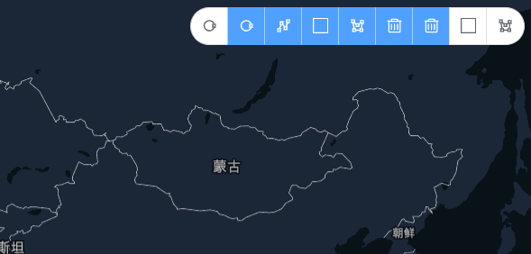

# 绘制&交互

绘制视图的属性请看[API](/api/UI/Draw/draw.md).

## 绘制视图



```vue
<template>
  <mapgis-web-map :accessToken="accessToken" :mapStyle.sync="mapStyle">
    <mapgis-draw
      class="custom-draw-wrapper"
      position="bottom-left"
      @added="handleAdded"
      @drawCreate="handleCreate"
    >
    </mapgis-draw>
  </mapgis-web-map>
</template>
<script>

export default {
  data() {
    return {
      accessToken: "some_token",
      mapStyle: "style_object"
    };
  }
};
</script>
```

## 交互视图

::: tip
交互视图实际上封装绘制视图的行为，按照不同的业务进行对应的处理
如拉框选择，实际上是调用绘制矩形框的绘制功能，把绘制好的矩形删除即实现了拉框选取。
详细请看下面的自定义控件
:::

```js
handleCreate(e) {
  if (this.mode == "QueryByRect" || this.mode == "QueryByPolygon") {
    this.drawer.delete(e.features[0].id);
    // 执行查询操作
  }
},
toggleQueryByRect(e) {
  this.drawer && this.drawer.changeMode("draw_rectangle");
  this.mode = "QueryByRect";
},
toggleQueryByPolygon(e) {
  this.drawer && this.drawer.changeMode("draw_polygon");
  this.mode = "QueryByPolygon";
}
```

## 自定义控件

::: danger
几乎可以肯定的是，官方的绘制控件往往和实际需求**不一致**，因此需要实现一个自己的样式的空间，实现自己的用户鼠标交互
:::



::: tip
实现自定义绘制组件的核心是 `<mapgis-draw>` 内部的插槽，这里提供了支持任意 UI 的插槽方式。
关键代码如下 3 处：

1. `<mapgis-draw>`组件监听 @added="handleAdded" 获取整个绘制组件的对象
1. `<mapgis-draw>`组件监听 @drawCreate="handleCreate" 获取整个绘制图元的对象
1. 自定义 UI 的 @click="toggleSimple" 触发绘制组建的方法
   :::

```js
handleAdded(e, data) {
  let { drawer, map } = e;
  this.drawer = drawer;
},
handleCreate(e) {
  if (this.mode == "QueryByRect" || this.mode == "QueryByPolygon") {
    this.drawer.delete(e.features[0].id);
    // 执行查询操作
  }
},
toggleSimple(e) {
  this.drawer && this.drawer.changeMode("simple_select");
}
```

```vue
<template>
  <mapgis-draw
    class="custom-draw-wrapper"
    position="bottom-left"
    :controls="controls"
    @added="handleAdded"
    @drawCreate="handleCreate"
    ref="drawref"
  >
    <!--  <mapgis-draw-item v-for="item in buttons"> -->
    <el-button-group>
      <el-tooltip
        v-for="item in buttons"
        class="item"
        effect="dark"
        :content="item.tip"
        placement="bottom"
      >
        <el-button circle size="small" :type="item.type" @click="item.click">
          <icon-font :type="item.icon" />
        </el-button>
      </el-tooltip>
    </el-button-group>
    <!--     </mapgis-draw-item> -->
  </mapgis-draw>
</template>

<style lang="scss">
.custom-draw-wrapper {
  position: absolute;
  top: 10px;
  right: 10px;
  z-index: 1000;
}
</style>

<script>
import IconFont from "@/components/IconFont/Icon";

export default {
  name: "CustomDraw",
  components: { IconFont },
  data() {
    return {
      buttons: [
        {
          icon: "iconvectorcirclevariant",
          type: "default",
          tip: "点选几何,按住shift可以框选",
          click: this.toggleSimple
        },
        /*  {
          icon: "iconbox",
          type: "default",
          tip: "框选几何",
          click: this.toggleDirect
        }, */
        {
          icon: "iconvectorcirclevariant",
          type: "primary",
          tip: "画点",
          click: this.togglePoint.bind(this)
        },
        {
          icon: "iconvectorpolyline",
          type: "primary",
          tip: "画线",
          click: this.togglePolyline
        },
        {
          icon: "iconbox",
          type: "primary",
          tip: "画矩形",
          click: this.toggleRect
        },
        {
          icon: "iconvector-polygon",
          type: "primary",
          tip: "画多边形",
          click: this.togglePolygon
        },
        {
          icon: "icontrash",
          type: "primary",
          tip: "删除选中图元",
          click: this.toggleDelete
        },
        {
          icon: "icontrash",
          type: "primary",
          tip: "删除全部",
          click: this.toggleDeleteAll
        },
        {
          icon: "iconbox",
          type: "default",
          tip: "矩形查询",
          click: this.toggleQueryByRect
        },
        {
          icon: "iconvector-polygon",
          type: "default",
          tip: "多边形查询",
          click: this.toggleQueryByPolygon
        }
      ],
      controls: {
        point: false,
        line_string: false,
        polygon: false,
        trash: false,
        combine_features: false,
        uncombine_features: false
      },
      mode: undefined
    };
  },
  methods: {
    enableDrawer() {
        const component = this.$refs.drawref;
        if (component) {
            component.enableDrawer();
        }
    },
    handleAdded(e, data) {
      let { drawer, map } = e;
      this.drawer = drawer;
    },
    handleCreate(e) {
      if (this.mode == "QueryByRect" || this.mode == "QueryByPolygon") {
        this.drawer.delete(e.features[0].id);
        // 执行查询操作
      }
    },
    toggleSimple(e) {
      this.enableDrawer();
      this.drawer && this.drawer.changeMode("simple_select");
    },
    toggleDirect(e) {
      this.drawer &&
        this.drawer.changeMode("direct_select", {
          featureId: "" // The id of the feature that will be directly selected (required)
        });
    },
    togglePoint(e) {
      this.enableDrawer();
      this.drawer && this.drawer.changeMode("draw_point");
    },
    togglePolyline() {
      this.enableDrawer();
      this.drawer && this.drawer.changeMode("draw_line_string");
    },
    toggleRect() {
      this.enableDrawer();
      this.drawer && this.drawer.changeMode("draw_rectangle");
    },
    togglePolygon() {
      this.enableDrawer();
      this.drawer && this.drawer.changeMode("draw_polygon");
    },
    toggleCombine() {},
    toggleUncombine() {},
    toggleDelete() {
      this.drawer && this.drawer.trash();
    },
    toggleDeleteAll() {
      this.drawer && this.drawer.deleteAll();
    },
    toggleQueryByRect(e) {
      this.enableDrawer();
      this.drawer && this.drawer.changeMode("draw_rectangle");
      this.mode = "QueryByRect";
    },
    toggleQueryByPolygon(e) {
      this.enableDrawer();
      this.drawer && this.drawer.changeMode("draw_polygon");
      this.mode = "QueryByPolygon";
    }
  }
};
</script>
```
