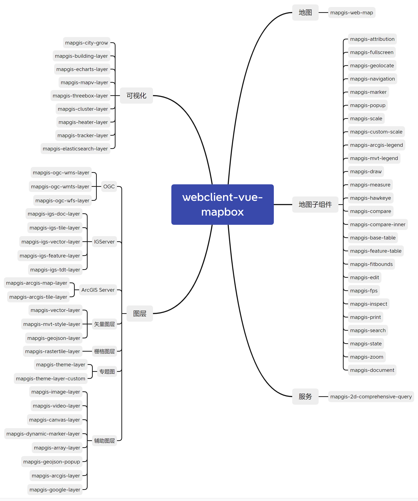

[comment]: <> (## 核心框架)

[comment]: <> (![核心框架]&#40;../images/framework/webclient-vue-mapboxgl.png&#41;)
# 模块说明
webclient-vue-mapboxgl 主要包含以下模块： 

- 地图（主模块） 
- 地图子组件（绘制、量测、卷帘、气泡等工具类） 
- 图层（OGC、IGServer、ArcGIS、矢量、栅格等相关图层） 
- 可视化（echarts、mapv、建筑白膜、轨迹跟踪等）
- 服务（综合查询）

