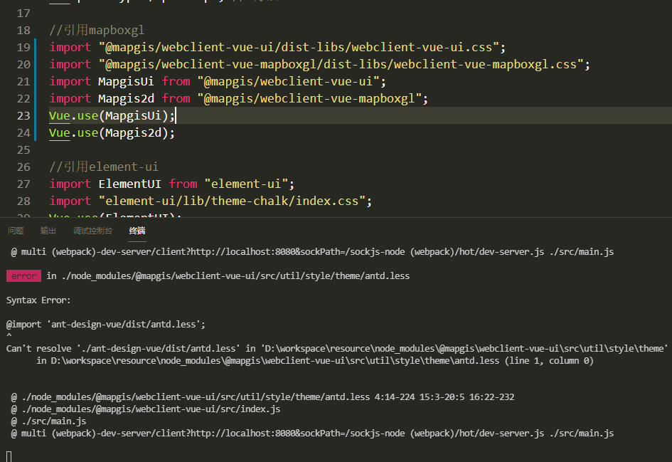

# 快速上手

本节将介绍如何在项目中使用，使用前请先确认是否 npm 安装，没有安装请先参考安装章节。

## 使用之前

在开始使用 webclient-vue-mapboxgl 之前，请先确保开发者已经了解并掌握 vue 开发的基本操作，重点包含以下内容。

- [Vue 组件](https://cn.vuejs.org/v2/guide/components.html)
- [单文件组件](https://cn.vuejs.org/v2/guide/single-file-components.html)

webclient-vue-mapboxgl 中涵盖以下 vue 的技术点，建议先掌握其使用方法。

- prop 传递数据
- slot 建立插槽，内容分发
- events $emit @click 事件


## 引入 webclient-vue-mapboxgl

在 main.js 中全局引入组件，注意：下列四个引入缺一不可。
```js
import "@mapgis/webclient-vue-ui/dist-libs/webclient-vue-ui.css";
import "@mapgis/webclient-vue-mapboxgl/dist-libs/webclient-vue-mapboxgl.css";

import MapgisUi from "@mapgis/webclient-vue-ui";
import Mapgis2d from "@mapgis/webclient-vue-mapboxgl";

Vue.use(MapgisUi);
Vue.use(Mapgis2d);
```

在实际项目中，当操作完以上步骤后，若运行时出现下列报错:

是由于 less 依赖未激活导致的，需要在项目的 vue.config.js 文件中配置激活 less

```js
module.exports = {
  lintOnSave: false,
  css: {
    loaderOptions: {
      less: {
        lessOptions: {
          modifyVars: {},
          javascriptEnabled: true
        }
      }
    }
  }
};
```

## 入门示例

完成上述的步骤之后，我们来通过加载一个地图熟悉使用组件的基本流程。

- 首先引入一个地图图层的容器 map 组件 mapgis-web-map

- 在容器 map 内部再放入地图图层组件 mapgis-ogc-wmts-layer

```vue
<template>
  <mapgis-web-map
    :map-style="mapStyle"
    :zoom="mapZoom"
    :center="outerCenter"
    :crs="mapCrs"
  >
    <mapgis-ogc-wmts-layer
      :layer-id="layerTdtId"
      :source-id="sourceTdtId"
      :base-url="tdturl"
      :tile-matrix-set="tileMatrixSetTdt"
      :wmts-layer="layer"
      :format="format"
      :token="token"
    >
    </mapgis-ogc-wmts-layer>
    <mapgis-ogc-wmts-layer
      :wmts-layer="layerWmts"
      :layer-id="layerWmtsId"
      :source-id="sourceWmtsId"
      :base-url="wmtsurl"
      :zoom-offset="offset"
      :tile-matrix-set="tileMatrixSet"
    >
    </mapgis-ogc-wmts-layer>
  </mapgis-web-map>
</template>

<script>
export default {
  name: "mapbox",
  data() {
    return {
      mapStyle: {
        //设置版本号，一定要设置
        version: 8,
        //添加来源
        sources: {},
        //设置加载并显示来源的图层信息
        layers: []
      }, // 地图样式
      mapZoom: 3, // 地图初始化级数
      outerCenter: [116.39, 40.2], // 地图显示中心
      mapCrs: "EPSG:4326",

      layerTdtId: "igsLayer_layerId",
      sourceTdtId: "igsLayer_sourceId",
      tdturl: "http://t0.tianditu.gov.cn/vec_c/wmts",
      layer: "vec",
      tileMatrixSetTdt: "c",
      format: "tiles",
      token: {
        key: "tk",
        value: "f5347cab4b28410a6e8ba5143e3d5a35"
      },

      layerWmts: "10wanZH",
      layerWmtsId: "ogcwmts_layerId",
      sourceWmtsId: "ogcwmts_sourceId",
      wmtsurl:
        "http://219.142.81.85/arcgis/rest/services/10wanZH/MapServer/WMTS",
      tileMatrixSet: "default",
      offset: -1
    };
  }
};
</script>
```

显示如下：


