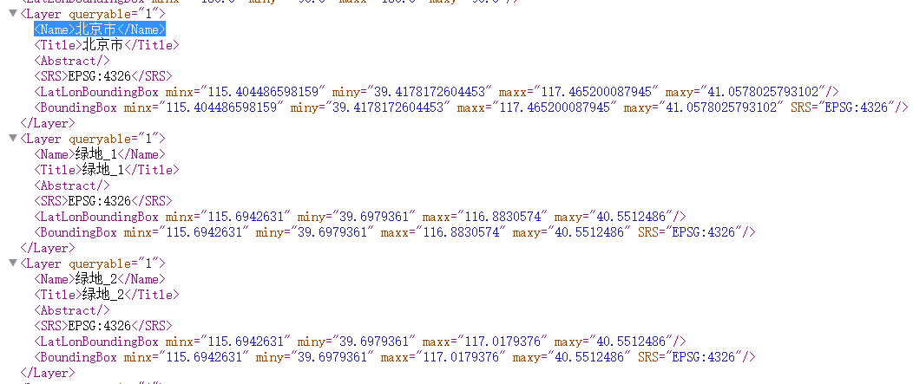
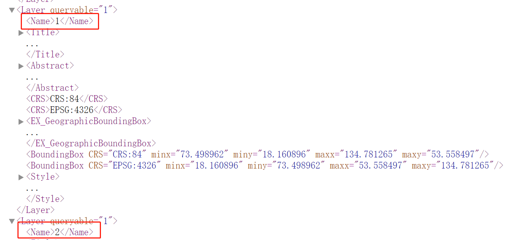

# 子图层控制

## 语义

::: tip layers 参数的语义

> 下面三类图层会设计子图层的可见性控制性，三者的参数都是通过 `layers` 参数来控制的

1.  OGC-WMS WMS 图层,通过 layers 来控制子图层的`显示` [OGC-WMS](/api/Layers/OGC/ogcWmsLayer.md#props)
2.  IGServer-Doc 地图文档,通过 layers 来控制子图层的`显示`、`隐藏`、`包含`、`排除` [IGServer-Doc](/api/Layers/igserver/igsDocLayer.md#props)
3.  ArcServer-Map 地图文档,通过 layers 来控制子图层的`显示`、`隐藏`、`包含`、`排除` [OGC-WMS](/api/Layers/ArcGISServer/ArcGISMapLayer.md#props)
    :::

## 类型

> 类型统一设置成 String 字符串类型

1. OGC 使用的时候是`必须传入`
   1. mapgis 发布的 ogc-wms 必须是图层名称,本质上是 xml 中 Layer 的 Name 属性
      
   2. ArcGIS 发布的 OGC 通常是图层序号,本质上是 xml 中 Layer 的 Name 属性
      
2. IGS-Doc 使用的时候是`可选传入`，不传则是显示全部, 使用`图层序号`
3. Arc-Map 使用的时候是`可选传入`，不传则是显示全部, 使用`图层序号`

| OGC-wms | 二维                                                               | 三维                                                            | 备注                                   |
| :------ | :----------------------------------------------------------------- | :-------------------------------------------------------------- | :------------------------------------- |
| OGC-wms | `1,2` 或者 '武汉,武昌区' 
 支持 3857/4326                       | `1,2` 或者 '武汉,武昌区' 
 支持 3857/4326                    | layers 为空 null undefined，不显示图层 |
| IGS-Doc | `show:1,2`, `hide:1`, `include:1`, `exclude:1` 
 支持 3857/4326 | `show:1,2`, `hide:1`, `include:1`, `exclude:1` 
 只支持 4326 | ~~三维原生库-doc 只支持 4326~~         |
| Arc-Map | `show:1,2`, `hide:1`, `include:1`, `exclude:1` 
 支持 3857/4326 | `show:1,2` 
 支持 3857/4326                                  | 三维`只支持`show 语法                  |
