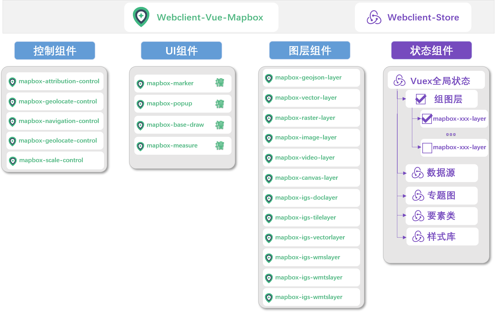

# 快速上手



## ES6 方式

### 中地版本安装 `建议使用`

> 由于 mapbox 本身`不支持 EPSG：4326`， 公司内部修改版实现`支持 EPSG：4326`

vue-mapboxgl 支持一层封装，除了本身需要安装以外，你还需要安装 mapbox-gl

```bash
# 支持 4326的坐标系的使用方式
npm install --save @mapgis/webclient-vue-mapboxgl @mapgis/mapbox-gl

# 原生mapbox-gl 的坐标系的使用方式, 不支持4326
npm install --save @mapgis/webclient-vue-mapboxgl  mapbox-gl
```

在 main.js 中加入样式文件

```js
import "@mapgis/mapbox-gl/dist/mapbox-gl.css";
```

### 开源版本安装 ~~建议不使用~~

vue-mapboxgl 支持一层封装，除了本身需要安装以外，你还需要安装 mapbox-gl

```bash
npm install --save vue-mapbox mapbox-gl
```

添加 mapbox CSS 样式文件到 Html 文件中的 `<head></head>`部分 (例如 `index.html`)

```html
<link
  href="https://api.tiles.mapbox.com/mapbox-gl-js/v0.53.0/mapbox-gl.css"
  rel="stylesheet"
/>
```

## 浏览器使用

### 安装

添加 vue, mapbox-gl, 和 vue-mapbox 脚本到页面中

> 由于公司的 cdn 包不在公网上发布，统一在[司马云](http://www.smaryun.com)上获取，下面展示的是开源的脚本

```html
<!DOCTYPE html>
<html>
  <head>
    <!-- ... -->
    <!-- Mapbox GL CSS -->
    <link
      href="https://api.tiles.mapbox.com/mapbox-gl-js/v0.53.0/mapbox-gl.css"
      rel="stylesheet"
    />
    <!-- Vue-mapbox CSS -->
    <link
      href="https://cdn.jsdelivr.net/npm/vue-mapbox@latest/dist/vue-mapbox.css"
      rel="stylesheet"
    />
    <!-- Mapbox GL JS -->
    <script src="https://api.tiles.mapbox.com/mapbox-gl-js/v0.53.0/mapbox-gl.js"></script>
    <!-- VueJS -->
    <script src="https://cdn.jsdelivr.net/npm/vue@latest/dist/vue.min.js"></script>
    <!-- Vue-mapbox -->
    <script
      type="text/javascript"
      src="https://cdn.jsdelivr.net/npm/vue-mapbox@latest/dist/vue-mapbox.min.js"
    ></script>
    <!-- ... -->
  </head>
</html>
```

所有的组件都是在 全局对象 VueMapbox 中， 如(`VueMapbox.MglMap` 等.)
