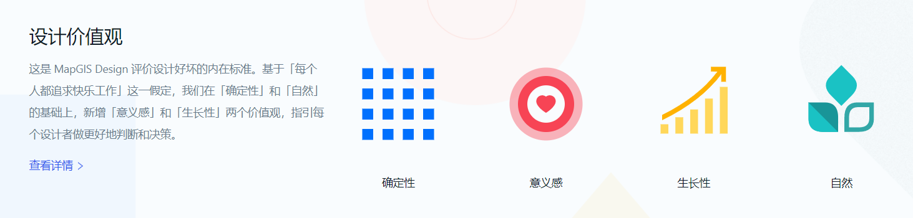

::: warning
~ 快速提示，刚接触一定要看完指南部分和自定义插件部分。 熟悉后可以直接查看 API。
:::

```javascript
// main.js
import "@mapgis/webclient-vue-ui/dist-libs/webclient-vue-ui.css";

import mapgisui from "@mapgis/webclient-vue-ui";
```

```vue
<template>
  <mapgis-ui-layout>
    <mapgis-ui-layout-header>Header</mapgis-ui-layout-header>
    <mapgis-ui-layout-content>Content</mapgis-ui-layout-content>
    <mapgis-ui-layout-footer>Footer</mapgis-ui-layout-footer>
  </mapgis-ui-layout>
</template>

<script>
export default {
  name: "App",
  data() {
    return {};
  }
};
</script>
```

::: tip 依赖
[Vue.js v2.5+](https://github.com/vuejs/vue)

[Node.js v8.9+](https://nodejs.org/zh-cn/download)[目前 node-sass 不支持 v17 版本]

[Less]
:::

::: warning 样式冲突

> 将你的工程下的样式依赖版本强行设置成下面依赖，再重新安装环境一般能够解决大部分的样式冲突问题

```json
"less": "^3.12.2",
"less-loader": "^7.0.2",
"node-sass": "^4.11.0",
"sass-loader": "^10.1.1",
```

:::

::: tip 目的

> 用于开发 Vue 版本的 MapGIS-UI 组件
> :::
