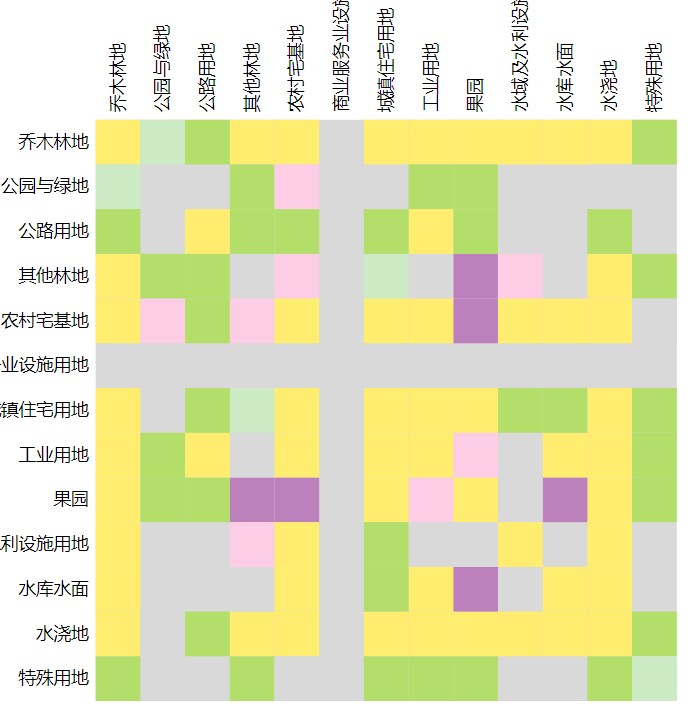
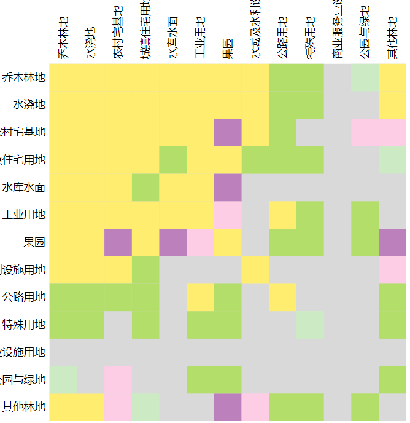
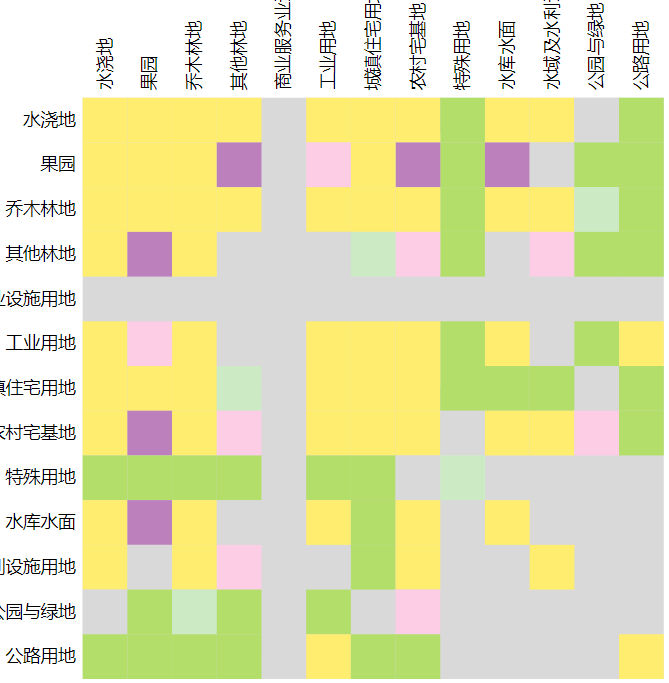

# 流向图表

> mapgis-ui-chart-flow

| 名称分析            | 频率分析             | 聚类分析               |
| :------------------ | :------------------- | :--------------------- |
|  |  |  |

## 属性
### `data`
- **类型:** `Object`
- **非侦听属性**
- **描述:** 数据格式，该数据格式必须满足2中条件 { nodes:[], links: []}
- **默认:** 
    ``` json
    {
        "nodes": [
            {
                "name": "水浇地",
                "id": "水浇地",
                "group": 1
            },
            {
                "name": "果园",
                "id": "果园",
                "group": 1
            }
        ],
        "links": [
            {  
                // 从水浇地流出，流入到水浇地的数值为212199.07
                "source":"水浇地",   
                "target":"水浇地",
                "value": 212199.07
            },
            {
                // 从水浇地流出，流入到果园的数值为25677.2853897   
                "source":"水浇地",
                "target":"果园",
                "value": 25677.2853897
            }
        ]
    }
    ```

### `domain`
- **类型:** `Array`
- **非侦听属性**
- **描述:** data数据中link中某一项的value的最小值以及最大值
- **默认:** [-25000, 25000]

### `outStyle`
- **类型:** `Object`
- **非侦听属性**
- **描述:** 外部传入的自定义样式
- **默认:** 
    ``` json
    {
        "width": "600px",
        "height": "600px",
        "color": "#1890ff",
        "right": "25px",
        "top": "25px"
    }
    ```

### `width`
- **类型:** `Number`
- **非侦听属性**
- **描述:** 图表的宽度
- **默认:** 600

### `height`
- **类型:** `Number`
- **非侦听属性**
- **描述:** 图表的高度
- **默认:** 600

### `margin`
- **类型:** `Object`
- **非侦听属性**
- **描述:** 图表的间距
- **默认:** 
    ``` json
    {
        "top": 135, 
        "right": 5, 
        "bottom": 0, 
        "left": 135
    }
    ```


## 事件

### hover  
鼠标移入事件
返回载荷 payload 
1. from 流出
2. to 流入
3. value 值

``` json
{
    "from": "乔木林地",
    "to": "公园与绿地",
    "value": 19094.4975442
}
```
